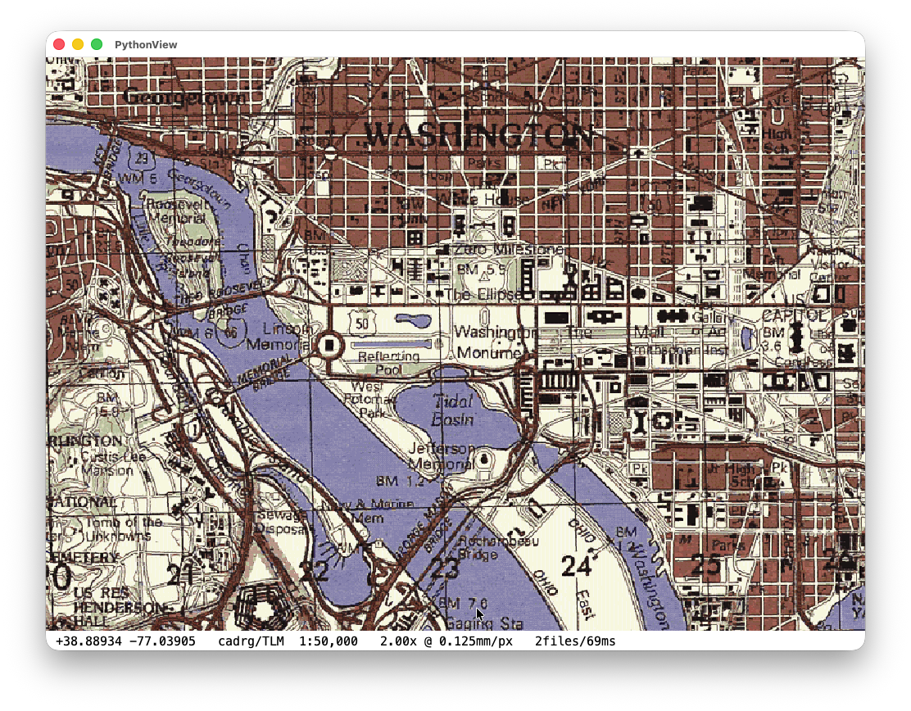
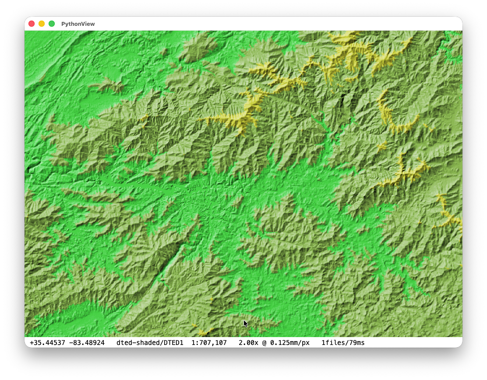
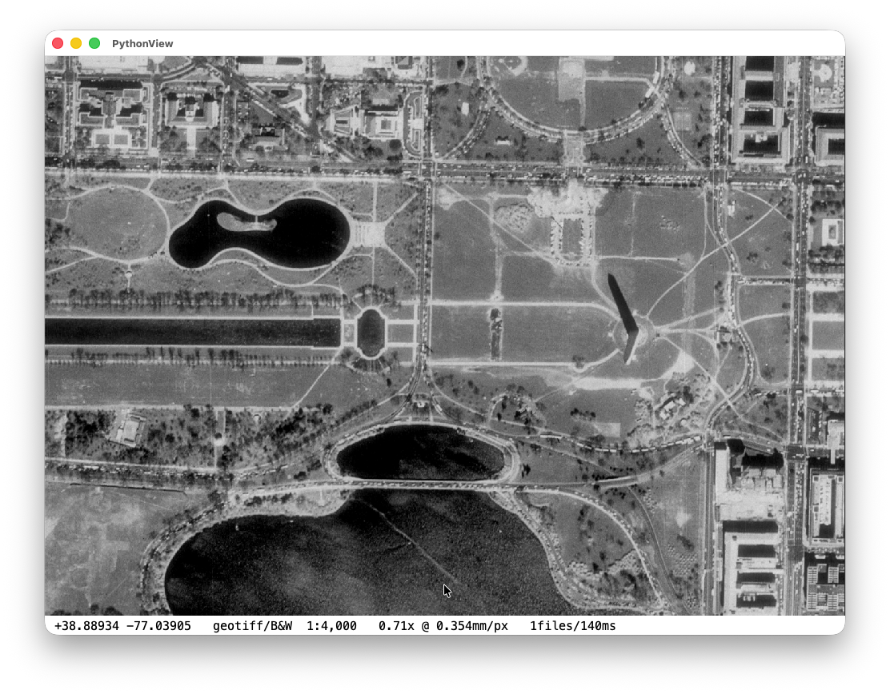
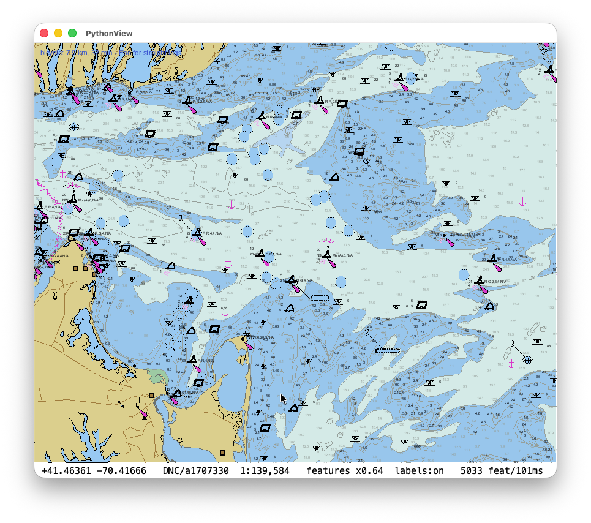
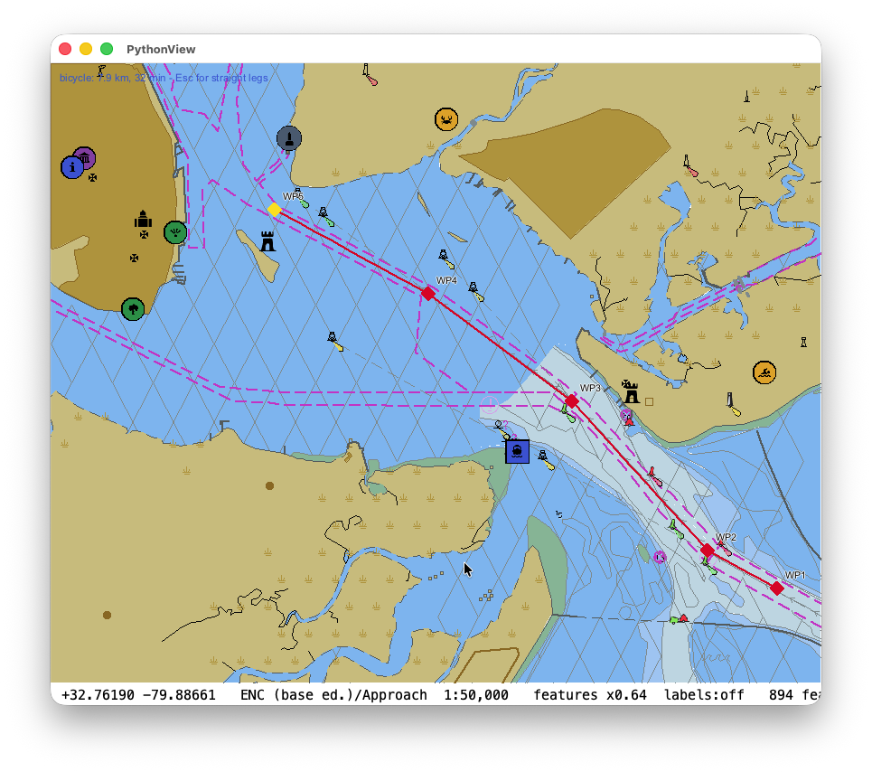

# Peregrine

A cross-platform port of [FalconView](https://en.wikipedia.org/wiki/FalconView),
the mapping application originally built for Windows in MFC/ATL/COM by Georgia
Tech Research Corporation.

Peregrine rebuilds FalconView's map-data core as **headless, portable C++17
libraries** that run on macOS and Linux, with Python bindings on top. It is an
incremental port: modules move over one at a time, each one compiler-driven,
test-pinned against real map data, and kept byte-faithful to the Windows
original.

Status: **the core raster and vector readers work headlessly, and there is now
an application layer over them.** You can render a georeferenced map to a PNG
from the command line, pan it interactively in the Python demo, read DNC, ENC
and OpenStreetMap vector data, stack and save overlays, and compute a road
route — all without Windows, MFC or COM.

## Build

Requires CMake ≥ 3.21, a C++17 compiler, and SQLite (system library; present
by default on macOS). Google Test is fetched automatically at configure time,
so the first configure needs network access. Python bindings additionally need
Python 3 development headers; pybind11 is fetched automatically.

```sh
cmake -B build          # configure
cmake --build build -j  # build
ctest --test-dir build  # run tests
```

Verified on macOS (Apple Silicon, AppleClang). See *Known limitations* for the
state of Linux.

Without sample map data you should see **565 tests passing, none failing**, of
which **235 skip themselves** at run time because they need real map data,
which is not distributed here (`ctest` reports a skipped test as passing; the
`(Skipped)` lines in its output show which).

## What works

| Layer | Capability |
|-------|-----------|
| Geodesy | Geoid separation, GEOTRANS datum/ellipsoid conversion, MGRS/UTM/DMS parsing, great-circle and rhumb-line geodesics |
| Raster formats | DTED elevation, DTED shaded relief (hill-shading, elevation/slope bands, contours, time-of-day sun), CADRG/RPF (VQ decode), GeoTIFF, TIROS, GeoPackage tile packs |
| Vector formats | VPF/DNC — libraries, coverages, tile grids, feature classes, and point/line/area features with face topology; ENC (S-57 over an ISO 8211 reader, base editions); OpenStreetMap vector tiles (MBTiles containers, Mapbox Vector Tile decode) |
| Symbology | GeoSym rule engine (ATTEXP conditions, COLOR/TEXT tables) and CGM symbol parsing, S-52 presentation library for charts, and a MapLibre style-JSON loader for OSM — all driving one vector renderer: styled strokes, area fills, depth-shaded bathymetry, point symbols, and labels set along a path |
| Identify | Click-to-identify over a pick index built from the primitives actually drawn, with VPF value dictionaries decoding codes to text |
| Catalog | SQLite + R-tree coverage catalog, scale-aware series selection, antimeridian-correct queries |
| Routing | A routable road graph built offline from raw `.osm`/`.osm.pbf` extracts: bidirectional Dijkstra, driving/walking/cycling profiles, turn restrictions, gated and tolled ways, ferries, and ordered via-stops; costs live in an editable JSON rule file that is reread while the app runs |
| Rendering | CPU canvas (scanline fill, lines, ellipses, blits, TrueType text), equal-arc projection at true physical scale, a map engine that resamples frames into a viewport, and geographic drawing (great-circle lines, symbol libraries) |
| App layer | Overlay stack with a type registry, session save/restore, editors and click-to-pick — the shell an interactive map application needs, headless and testable |
| File overlays | `.fvpoints` — a SQLite point document that carries its own PNG symbol artwork, so a file opens with its symbology anywhere |
| Bindings | `pyfvw` (pybind11) — zero-copy NumPy pixel buffers, Python-subclassable overlays, vector sources, style engines, routing and the app layer |
| Apps | `PythonView.py` — a desktop map viewer over the bindings (family menus, coverage overlay, identify, route editing) |
| Tools | `fvrender` renders a map to PNG; `fvpack` builds offline GeoPackage tile packs; `fvgraph` builds and queries road graphs |

Render a chart headlessly (needs map data — see *Test data* below):

```sh
export FVW_TESTDATA_DIR=/path/to/TestData
./build/port/fvkit/fvrender \
    --center "33 44 55.7 N 84 23 17.5 W" --scale 500000 --series LFC --out map.png
```

## Layout

```
port/                  all new Peregrine code (GPL-3.0-or-later)
  include/             portability layer: CString, MFC containers, Win32 idioms
  fvkit/               the portable map library (formats, catalog, canvas, engine, overlays)
  bindings/pyfvw/      Python bindings
  <Module>/            per-module CMake targets + tests, compiling fvw_core sources in place
  PORTING.md           the ledger: module status, decisions, preserved quirks  ← start here
fvw_core/              FalconView sources used by the port (LGPL-3.0-or-later, upstream)
third_party/           GEOTRANS 3.3, libjpeg
```

`port/PORTING.md` is the project's memory: what is ported, what was severed
from COM, and every original-behavior quirk that was deliberately preserved
rather than fixed. Read it before touching a module.

## How the port works

- **Headless core first.** COM interfaces are severed into plain C++ abstract
  interfaces; the COM wrappers stay behind on Windows and are not part of this
  tree. GDI drawing is replaced by an `ICanvas` abstraction.
- **Compile in place.** FalconView sources are compiled from `fvw_core/`
  unchanged wherever possible, with `#ifdef _WIN32` guards rather than forks,
  so the upstream Windows build keeps working from the same files.
- **Bit-faithful.** Numeric quirks and outright bugs in the original are
  preserved and pinned by tests, not silently fixed, so output still matches
  Windows. Each one is documented in place and in the ledger. The exception is
  undefined behavior, which is fixed — it has no defined behavior to be
  faithful to.
- **Win32 idioms get one shared implementation.** File mapping, directory
  enumeration and Win32 path semantics (backslashes, case-insensitive lookup)
  are emulated once in `port/include/`, so legacy call sites compile unmodified.

## PythonView (Python test App)

PythonView is a small Python / Tkinter GUI that exercises the bindings. It is a
desktop map viewer with coverage overlay and identify. It is not a full
FalconView clone, but it is a good test harness for the ported core. Build the
bindings, then run it from the repo root — it locates the built `pyfvw` next to
the checkout itself:

```sh
cmake --build build -j
python3 port/apps/PythonView.py
```

It needs NumPy and Tkinter at run time. `--help` lists the rest: `--scan` to
build the catalog, `--at`/`--series` to open somewhere specific, `--shot` to
render straight to a PNG.

### Screenshots






## Test data

No map data is included — the sample DTED, CADRG, GeoTIFF, DNC/VPF, ENC, OSM
and TIROS sets are large and separately distributed. Tests that need it skip
cleanly: a clone with no map data at all builds and runs the full suite green
(most of it skipping itself).

To run them, point `FVW_TESTDATA_DIR` at a tree laid out as:

```
TestData/
  dted/      w082/n30.dt1, ...
  rpf/       <type>/<zone>/<frame>     CADRG frames
  geotiff/   USGS DOQ quads
  vpf/dnc17/ DNC 17 database
  tiros3/    TIROS .WLD GeoJPEGs + .wld sidecars
  ENC/       S-57 base editions
  OSM/       map*.osm extracts, mbtiles/ vector-tile pyramids
```

The build passes this path to the tests automatically when the directory
exists.

## Known limitations

- **Linux is not yet verified.** The build is POSIX-clean and everything
  platform-specific is behind `port/include/`, but only macOS has been
  exercised. The known blocker is case sensitivity: FalconView sources include
  `"stdafx.h"` while the files on disk are `StdAfx.h`, which resolves on
  case-insensitive filesystems and will not on ext4. Data-file lookup already
  handles this (`fv_win32_path.h`); the `#include` spellings do not yet.
- Rendering is CPU-only; there is no GPU or native UI. The demo uses Tk.
- Polar CADRG frames report unsupported; only equal-arc zones are projected.
- Text rendering is ASCII-only.
- Several formats are read-only or not yet started — see the port queue in
  `port/PORTING.md`.

## License

Peregrine as a whole is **GPL-3.0-or-later** (`LICENSE`). It incorporates
FalconView, which is LGPL-3.0-or-later (`COPYING.LESSER`), plus third-party
components under their own terms.

See **[NOTICE.md](NOTICE.md)** for the full breakdown of what is licensed how,
including which files were extracted from FalconView and the basis for the
combined GPL license.

FalconView is a trademark of Georgia Tech Research Corporation. This project is
not affiliated with or endorsed by GTRC.
