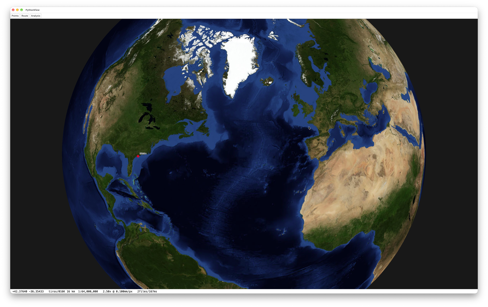
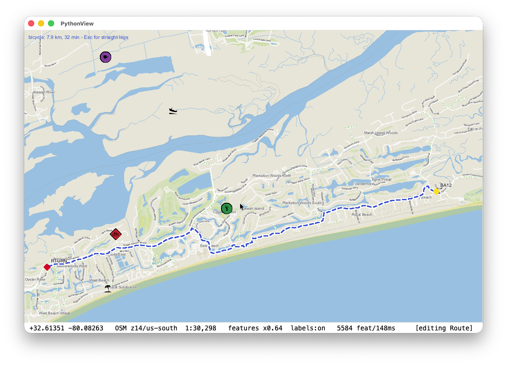
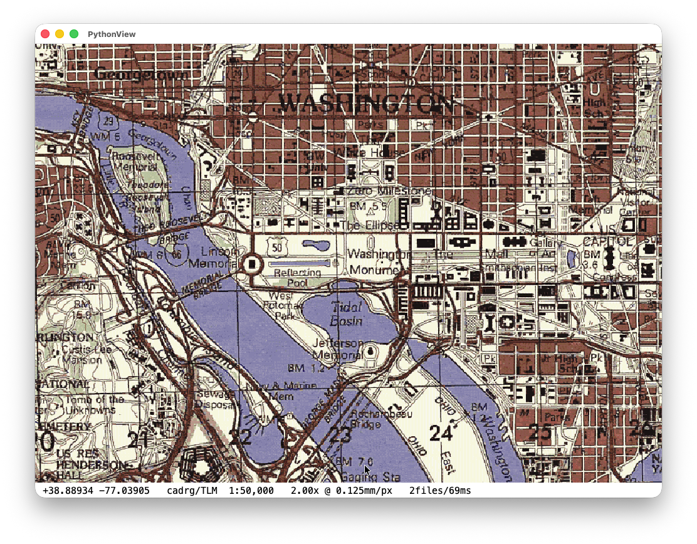
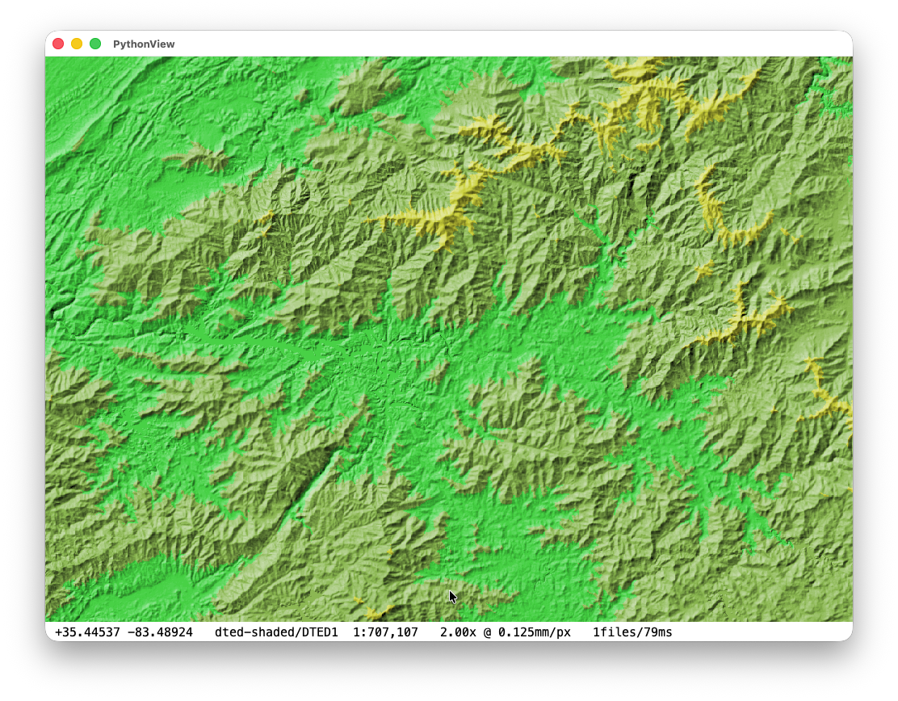
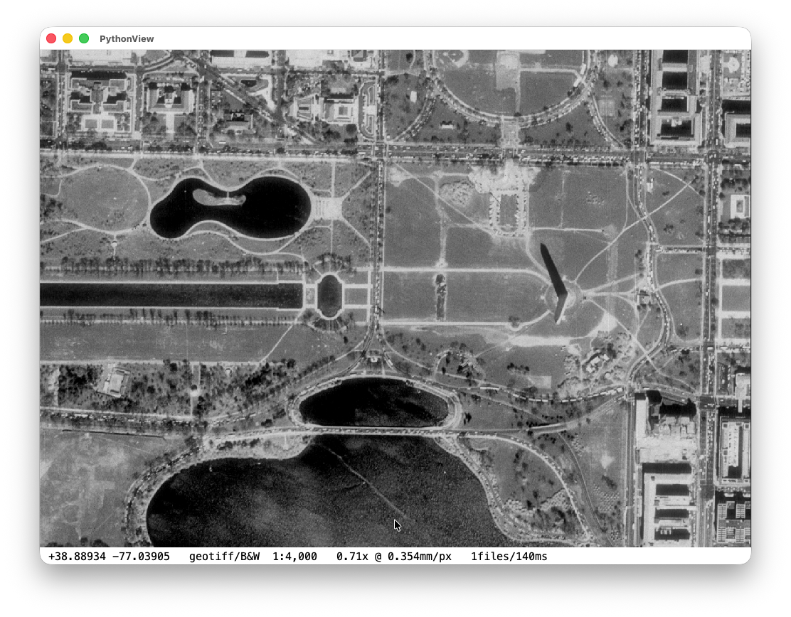
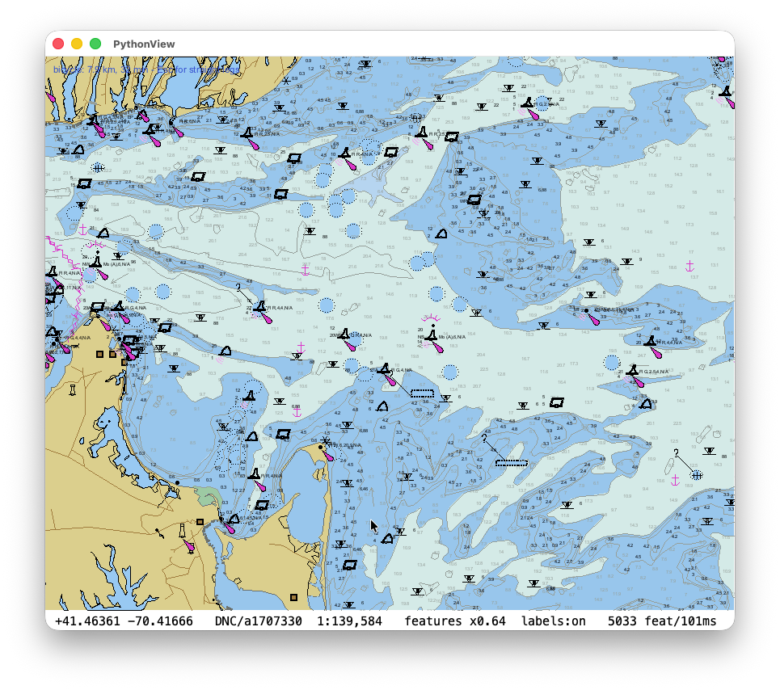
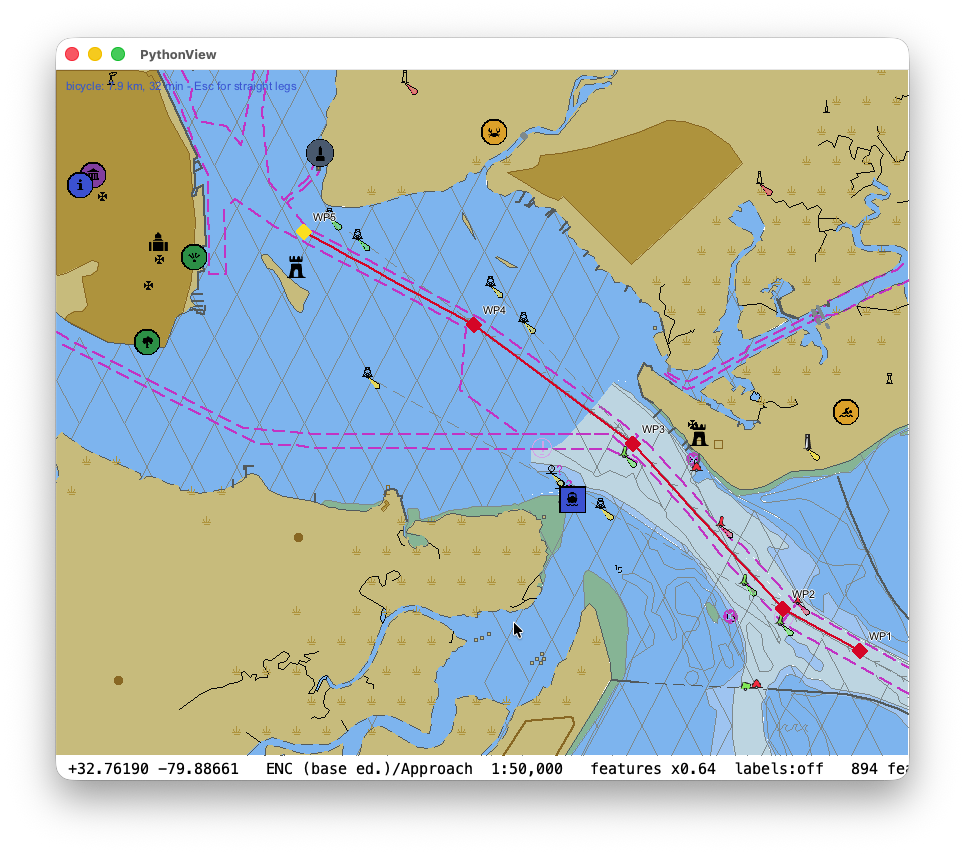
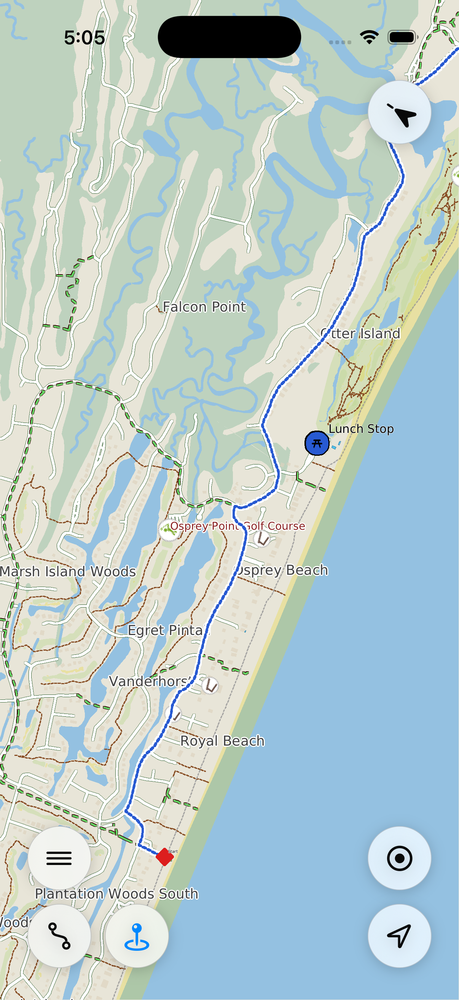

# Peregrine

A cross-platform port of [FalconView](https://en.wikipedia.org/wiki/FalconView),
the mapping application originally built for Windows in MFC/ATL/COM by Georgia
Tech Research Corporation.

Peregrine rebuilds FalconView's map-data core as **headless, portable C++17
libraries** that run on macOS and Linux, with Python bindings on top. It is an
incremental port: modules move over one at a time, each one compiler-driven,
test-pinned against real map data, and kept byte-faithful to the Windows
original.

Status: **the core raster and vector readers work headlessly, and there is now
an application layer over them.** You can render a georeferenced map to a PNG
from the command line, pan it interactively in the Python demo, read DNC, ENC
and OpenStreetMap vector data, stack and save overlays, and compute a road
route — all without Windows, MFC or COM. There is also an iOS application,
Pippin, built on the same core; see below.

## Build

Requires CMake ≥ 3.22, a C++17 compiler, SQLite (system library; present by
default on macOS) and Python 3 with its development headers for the `pyfvw`
bindings. Google Test, pybind11, expat, zlib, nlohmann/json, protozero and
vtzero are fetched from GitHub at configure time, so the first configure needs
network access.

```sh
cmake -B build          # configure
cmake --build build -j  # build
ctest --test-dir build  # run tests
```

`ctest` reports a skipped test as passing; the `(Skipped)` lines in its output
show which tests skipped and why. With the sample data in `testdata/` (see
*Test data*) the suite is **2396 tests on macOS, 179 of them skipped**, and
**2441 on Linux, 185 skipped**: the skips need map data too large to ship
(CADRG, DNC/GeoSym, the full OSM pyramid).

### macOS

Verified on Apple Silicon with AppleClang and the Xcode command-line tools.
The desktop app is an Xcode project; see `port/apps/Peregrine/README.md`.

### Linux

Verified on Ubuntu 24.04 (GCC 13, CMake 3.28). Install the toolchain, the
libraries, and what the tests use (Xvfb for the GTK app's screenshot tests,
NumPy, pytest and Tk for the Python suites, DejaVu fonts for the text goldens):

```sh
sudo apt-get install -y build-essential cmake ninja-build pkg-config git \
    libsqlite3-dev libgtkmm-4.0-dev xvfb fonts-dejavu-core \
    python3-dev python3-numpy python3-pytest python3-tk
cmake -B build -G Ninja
cmake --build build -j
xvfb-run -a ctest --test-dir build -j8
```

- `xvfb-run` around `ctest` gives the Tk tests of the Python app a display;
  without it they skip. The GTK app's own screenshot tests start their own
  Xvfb either way.
- `libgtkmm-4.0-dev` (gtkmm 4.10 or later) is needed only for the desktop app,
  `peregrine-gtk`; without it the configure prints a message and the rest of
  the tree builds and tests. See `port/apps/PeregrineGtk/README.md`.
- The Python bindings are built for the first `python3` on the `PATH`. If that
  is not the system interpreter the packages above installed into, point
  CMake at it: `cmake -B build -DPYTHON_EXECUTABLE=/usr/bin/python3`.
- To build without network access, download each dependency once and pass
  its directory, e.g. `-DFETCHCONTENT_SOURCE_DIR_GOOGLETEST=/src/googletest-1.17.0`;
  the versions are in the root `CMakeLists.txt` and
  `port/third_party/CMakeLists.txt`.

## What works

| Layer | Capability |
|-------|-----------|
| Geodesy | Geoid separation, GEOTRANS datum/ellipsoid conversion, MGRS/UTM/DMS parsing, great-circle and rhumb-line geodesics |
| Raster formats | DTED elevation, DTED shaded relief (hill-shading, elevation/slope bands, contours, time-of-day sun), CADRG/RPF (VQ decode), GeoTIFF, TIROS, GeoPackage tile packs |
| Vector formats | VPF/DNC — libraries, coverages, tile grids, feature classes, and point/line/area features with face topology; ENC (S-57 over an ISO 8211 reader, base editions); OpenStreetMap vector tiles (MBTiles containers, Mapbox Vector Tile decode) |
| Symbology | GeoSym rule engine (ATTEXP conditions, COLOR/TEXT tables) and CGM symbol parsing, S-52 presentation library for charts, and a MapLibre style-JSON loader for OSM — all driving one vector renderer: styled strokes, area fills, depth-shaded bathymetry, point symbols, and labels set along a path |
| Identify | Click-to-identify over a pick index built from the primitives actually drawn, with VPF value dictionaries decoding codes to text |
| Catalog | SQLite + R-tree coverage catalog, scale-aware series selection, antimeridian-correct queries |
| Routing | A routable road graph built offline from raw `.osm`/`.osm.pbf` extracts: bidirectional Dijkstra, driving/walking/cycling profiles, turn restrictions, gated and tolled ways, ferries, and ordered via-stops; costs live in an editable JSON rule file that is reread while the app runs |
| Route documents | A route as an editable document over that graph — waypoints, drag-to-reshape, undo/redo, and an overlay that draws the planned line and the road network behind it |
| Search | "Where is X", asked of every source at once: a geographic box or radius, a text match on each source's own primary label, and a name index over OSM tiles — geo-space and on-demand, so it finds what is off screen |
| Navigation | Moving-map camera (heading, slew, road snap), GPX and NMEA readers, a GPX recorder, and a trip computer — elapsed, speed, distance, distance remaining, ETA |
| Rendering | CPU canvas (scanline fill, lines, ellipses, blits, TrueType text), a map engine that resamples frames into a viewport at true physical scale, and geographic drawing (great-circle lines, symbol libraries) |
| Projections | Equal Arc, Mercator, Lambert Conformal Conic, Azimuthal Equidistant and Orthographic — FalconView's projectors ported to standard C++, with an adaptive raster warp for the non-linear ones (see *Map projections* below) |
| App layer | Overlay stack with a type registry, session save/restore, editors and click-to-pick — the shell an interactive map application needs, headless and testable |
| File overlays | `.fvpoints` — a SQLite point document that carries its own PNG symbol artwork, so a file opens with its symbology anywhere |
| Bindings | `pyfvw` (pybind11) — zero-copy NumPy pixel buffers, Python-subclassable overlays, vector sources, style engines, routing and the app layer |
| Apps | `PythonView.py` — a desktop map viewer over the bindings (family menus, coverage overlay, identify, route editing) |
| Tools | `fvrender` renders a map to PNG; `fvpack` builds offline GeoPackage tile packs; `fvgraph` builds and queries road graphs |
| Overlays | Overlay Architecture modeled after the FalconView Overlay Interfaces but implemented in portable C++17, with a type registry and a Python subclassable base class. The overlay stack is headless and testable, and can be used to build a map application shell without Windows dependancies. | 

Render a chart headlessly (CADRG LFC needs the full map data — see *Test
data* below):

```sh
export FVW_TESTDATA_DIR=/path/to/TestData
./build/port/fvkit/fvrender \
    --center "33 44 55.7 N 84 23 17.5 W" --scale 500000 --series LFC --out map.png
```

## Layout

```
port/                  all new Peregrine code (LGPL-3.0-or-later)
  include/             portability layer: CString, MFC containers, Win32 idioms
  fvkit/               the portable map library (formats, catalog, canvas, engine, overlays)
  bindings/pyfvw/      Python bindings
  <Module>/            per-module CMake targets + tests, compiling fvw_core sources in place
  apps/PythonView.py   the Tk desktop demo over the bindings
  apps/Pippin/         Pippin, the iOS app: SwiftUI shell, PippinKit, Xcode project
  PORTING.md           the ledger: module status, decisions, preserved quirks  ← start here
fvw_core/              FalconView sources used by the port (LGPL-3.0-or-later, upstream)
third_party/           GEOTRANS 3.3, libjpeg
```

`port/PORTING.md` is the project's memory: what is ported, what was severed
from COM, and every original-behavior quirk that was deliberately preserved
rather than fixed. Read it before touching a module.

## How the port works

- **Headless core first.** COM interfaces are severed into plain C++ abstract
  interfaces; the COM wrappers stay behind on Windows and are not part of this
  tree. GDI drawing is replaced by an `ICanvas` abstraction.
- **Compile in place.** FalconView sources are compiled from `fvw_core/`
  unchanged wherever possible, with `#ifdef _WIN32` guards rather than forks,
  so the upstream Windows build keeps working from the same files.
- **Bit-faithful.** Numeric quirks and outright bugs in the original are
  preserved and pinned by tests, not silently fixed, so output still matches
  Windows. Each one is documented in place and in the ledger. The exception is
  undefined behavior, which is fixed — it has no defined behavior to be
  faithful to.
- **Win32 idioms get one shared implementation.** File mapping, directory
  enumeration and Win32 path semantics (backslashes, case-insensitive lookup)
  are emulated once in `port/include/`, so legacy call sites compile unmodified.

## Map projections

The map engine draws in five projections, the same set FalconView offers:

| Projection | Notes |
|------------|-------|
| Equal Arc | The default, and still the fast path: frames are resampled with an affine blit, bit-identical to the output from before projections existed |
| Mercator | Limited to ±80° latitude, as in FalconView |
| Lambert Conformal Conic | Standard parallels chosen per viewport; switches to the Mercator equations near the equator; north is no longer "up" away from the centre meridian |
| Azimuthal Equidistant | A pole can be on screen, so map bounds open to the full longitude circle |
| Orthographic | The far hemisphere is not projectable; everything outside the globe's disc is left transparent |

Select one with `MapProjection::SetProjectionType()` in C++, or
`pyfvw.engine.ProjectionType` from Python; PythonView has a projection menu.

How it works:

- **One seam.** `MapProjection` (`port/include/fvkit/proj.h`) carries the
  projection type; `GeoToSurface`/`SurfaceToGeo` dispatch on it, and
  `IsAffine()` tells callers whether the old linear shortcuts still hold.
  Points on the far side of a projection report `kNotProjectable` rather than
  an error.
- **Adaptive raster warp.** Raster sources (CADRG, GeoTIFF, DTED, TIROS, …)
  are reprojected by `raster_warp` — a port of FalconView's
  `project_image_hlpr` that interpolates across a rectangle when the
  interpolated mapping lands within half a pixel of the exact one (checked at
  the centre and quarter points) and otherwise splits it into quadrants. Ties
  round to even, as the Windows engine does. Tests compare it against a brute-force per-pixel
  render in every projection, at rotation 0 and 30°.
- **Consumers that assumed a linear map were audited.** Label sizes, symbol
  orientation (grid convergence), the moving-map heading line and the
  terrain-avoidance mask use the local scale and convergence at the point
  being drawn (`LocalScaleAt`). The graticule is drawn as projected curves
  and breaks correctly at the antimeridian.
- **World scale works in every projection**, including views that wrap the
  antimeridian.
- The map scale bar overlay (`fv.scalebar`) measures geodesic distance along
  the screen's centre row and column through `SurfaceToGeo`, so it stays
  correct off Equal Arc.

Pippin stays on Equal Arc. `port/projection-plan.md` has the design and the
per-phase decisions.



## PythonView (Python test App)

PythonView is a small Python / Tkinter GUI that exercises the bindings. It is a
desktop map viewer with coverage overlay and identify. It is not a full
FalconView clone, but it is a good test harness for the ported core. Build the
bindings, then run it from the repo root — it locates the built `pyfvw` next to
the checkout itself:

```sh
cmake --build build -j
python3 port/apps/PythonView.py
```

It needs NumPy and Tkinter at run time. `--help` lists the rest: `--scan` to
build the catalog, `--at`/`--series` to open somewhere specific, `--shot` to
render straight to a PNG.

### Screenshots








## Pippin (iOS app)

Pippin is an offline cycling map for iPhone built on the same core: a SwiftUI
shell over `PippinKit`, an Objective-C++ layer that wraps FvKit. It does moving
map with GPS, course-up follow, road-snapped routing with turn guidance, a
point overlay, search, a trip computer and GPX ride recording, plus NOAA tide
predictions, sunrise and sunset, and routes that ride or walk the beach when the
tide allows — all against a bundled data pack. A ride keeps tracking with the
screen off, with the next turn on the lock screen and a paired watch, and
following can tilt into a 2.5D view. A pack covers one region; a second region
(Atlanta) builds as a separately installed app. The network is used for two
things only: the wind forecast from api.weather.gov for a fixed point on the
pack's beach, and resolving a place link shared in from Apple or Google Maps.
See `port/apps/Pippin/TIDES_AND_WEATHER.md`.

The source is complete here but you currently need to provide your own data pack so
a clone builds and tests Pippin's C++ out of the box and needs its own data
before the app has a map to draw.  In the long run I would like to build tools to assist in gathering OSM data and creating a data pack, but for now you can use the `fvpack` tool to build one from your own OSM extracts.  The tools are generally available in this repository but it is a bit piecemeal and not yet documented.  The `fvpack` tool is the most useful for creating a data pack from OSM extracts.

```sh
cmake --build build -j                     # includes Pippin's C++ tests
cmake --preset ios-sim && cmake --build --preset ios-sim   # the core, for a phone
```

`port/apps/Pippin/BUILDING.md` is the step-by-step; `port/apps/Pippin/README.md`
is the design. The tracked Xcode project signs against no team — set
`PP_DEVELOPMENT_TEAM`, along with the app's display name and support address,
in a git-ignored `local/Local.xcconfig` (`Pippin.xcconfig` documents all three).

## Test data

`testdata/` is a small sample set (about 60 MB) centred on Kiawah Island and
Charleston SC, plus whole-world TIROS: DTED level 1, a Charleston orthophoto,
eight NOAA ENC cells, OpenStreetMap vector tiles, a routing graph and XML
exports, NOAA tide predictions and a recorded GPX ride. The build points the
tests at it automatically. Tests pinned to larger data (CADRG, DNC/VPF, the
full OSM US-south pyramid, the original Chesapeake and FAA GeoTIFF sheets)
skip themselves. Sources and terms for each set are in `testdata/README.md`.

`port/tools/make_sampledata.py` rebuilds the set from a full test tree laid
out the same way.

## Known limitations

- **The Linux desktop app is behind the macOS one.** The whole suite runs
  green on Ubuntu 24.04, and `peregrine-gtk` has the map window, menus,
  toolbar, shortcuts, file and question dialogs, and Map Data Sources, but no
  options windows yet: Map ▸ Options and Overlay ▸ Options do nothing on Linux.
- Rendering is CPU-only; there is no GPU. The desktop demo uses Tk; Pippin
  composites the CPU canvas into a SwiftUI view.
- Pippin ships without its data pack, so a clone cannot run the app until it
  cuts one from its own map data.
- Polar CADRG frames report unsupported; only equal-arc zones are projected.
- Text rendering is ASCII-only.
- Several formats are read-only or not yet started — see the port queue in
  `port/PORTING.md`.

## License

Peregrine as a whole is **LGPL-3.0-or-later** (`COPYING.LESSER`, with the
GPLv3 text in `COPYING` alongside it, because LGPL-3.0 is written as a set of
additional permissions on top of it). That is the same license FalconView
itself carries, so no layer of this tree relicenses another: the port's own
code, the FalconView sources it compiles, and the files extracted from
FalconView all name LGPL-3.0-or-later. Third-party components keep their own
terms.

The practical consequence of LGPL rather than GPL is §4, *Combined Works*: an
application may link this library without being made a derivative of it.

See **[NOTICE.md](NOTICE.md)** for the full breakdown of what is licensed how,
including which files were extracted from FalconView and the linking terms.

FalconView is a trademark of Georgia Tech Research Corporation. This project is
not affiliated with or endorsed by GTRC.
