# Pippin — the iOS shell

Pippin is the third shell over the Peregrine core, after PythonView and the CLIs: offline
cycling and walking navigation on Kiawah Island. The plan is `port/pippin-plan.md`; the
requirements are `port/apps/Pippin_requirements.md`.

> **To BUILD it, read [BUILDING.md](BUILDING.md), not this file.** That is the procedure, in
> order, from a fresh checkout to a signed `.ipa`: the core, the data pack, the app, the
> archive, and the checks worth running before an upload. What is below is why each piece is
> the shape it is — the reference for when something behaves oddly, and the place the build
> sections at the end of this file explain themselves in.

**Built so far: P1 (the data pack and the cross-build), P2 (the app, PippinKit, and a
styled Kiawah on screen), P3 (a map you can touch), P4 (a ship on it), P5 (the route,
moved to C++), P6 (the route on the phone) and P7 (GPS mode, where the map follows
it), P8 (the trip computer, and the ride bar showing the RIDE's numbers) and P12 (the units:
an authored pixel is a POINT, and the map opens FILLING the screen).** P9 is built too (the
points, then the compass), and so is **P11** — the pick button and the two Location rows name
the nearest road or path a rider could actually use instead of printing a lat/lon. **P10
(record and share) went in on 2026-08-21** — a ride is written to `Documents/trips/` as it
happens and shared from the Rides sheet, and a single point goes out as a `.gpx` plus an Apple
Maps link. **P14 (2026-08-21) receives a place shared IN** from Apple Maps or Google Maps, through
a share extension of its own. **P15, P16 and P17 (2026-08-25) are the battery three** — the screen
stays up while the phone has a job, a fix whose ship nobody can see no longer costs a full render,
and a receiver nobody is reading drops to a tier that lets the GNSS chip rest.
**P19 (2026-08-25) closed the last one**: a pick that overlaps a feature any overlay drew now
takes that feature's exact position. It is a capability of the overlay interface
(`fv::app::SnapTo`, which the base class has always had an accessor for) and not a points
feature — the point set and the route's waypoints are the two implementers, and a third needs no
change above them. **P20 (2026-08-30) is search, and the route dialog redesigned around it**: the dialog opens on a search box, a chosen result becomes the destination with the rider's own position as the start, and every stop's `⋯` carries the same search above *Current location* and *Pick on map*. No search engine was written — the seam has existed since S1–S4 and nothing on the phone had called it. **Every session P1–P20 is built.**

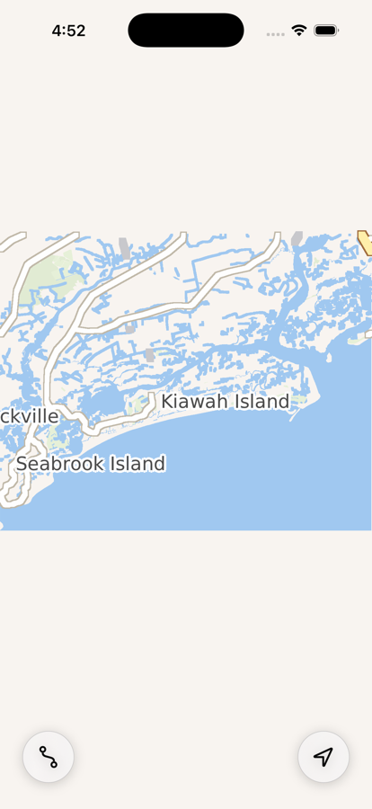
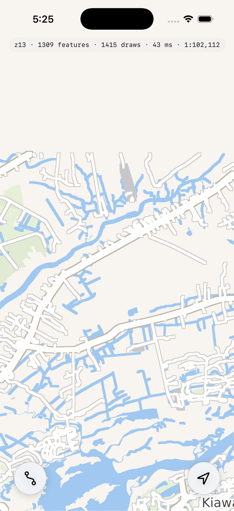
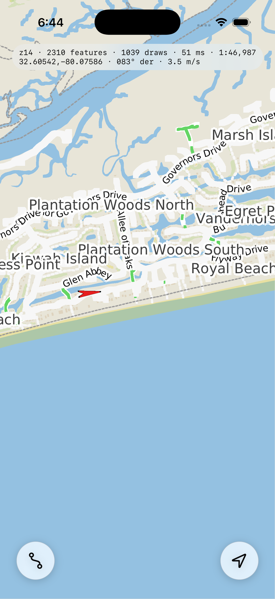
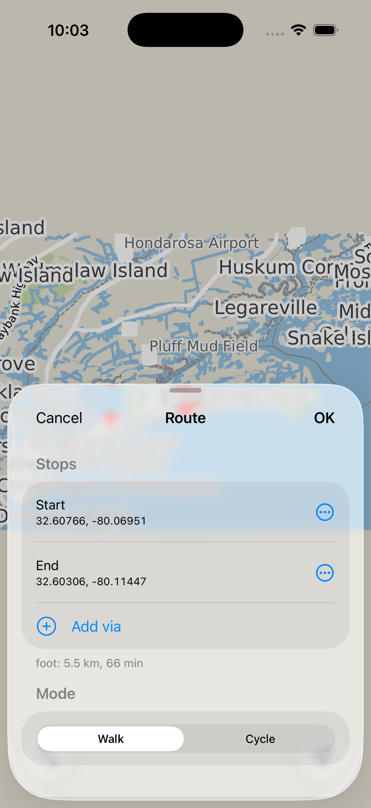
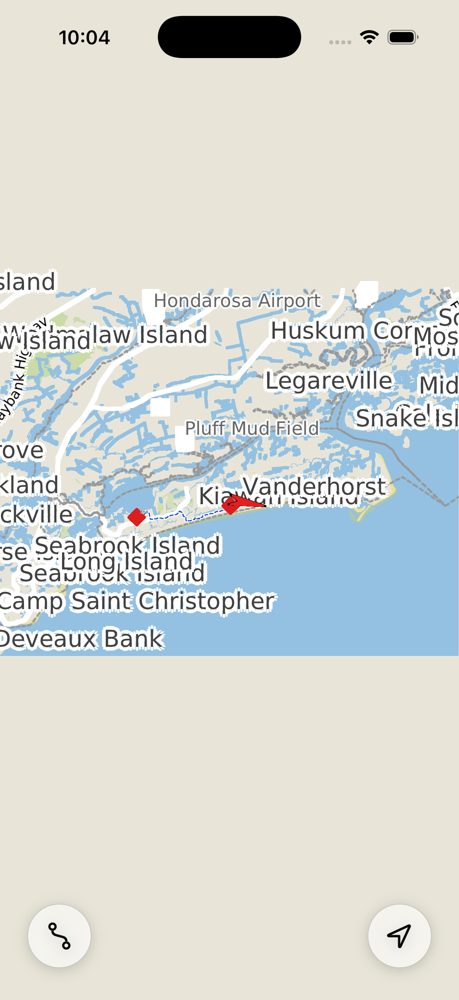
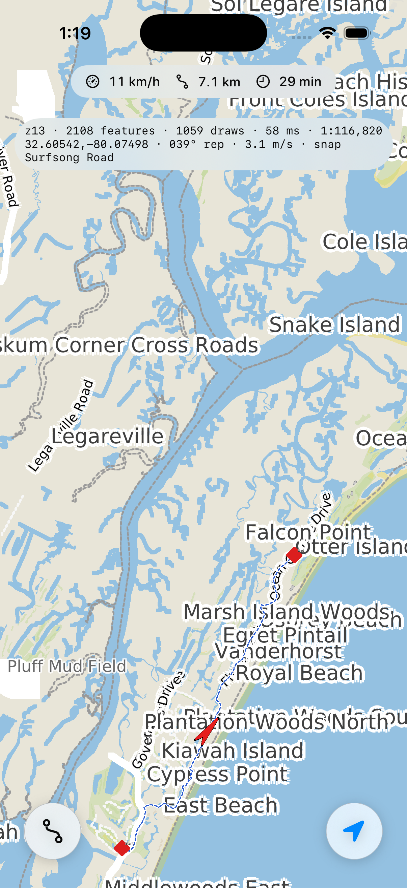
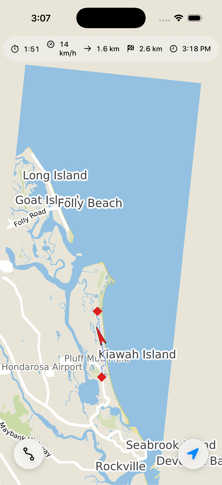
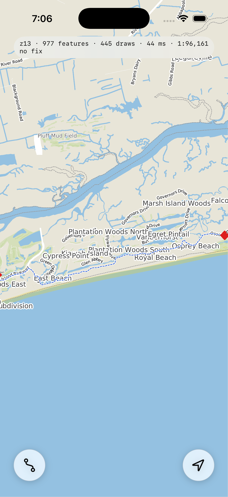
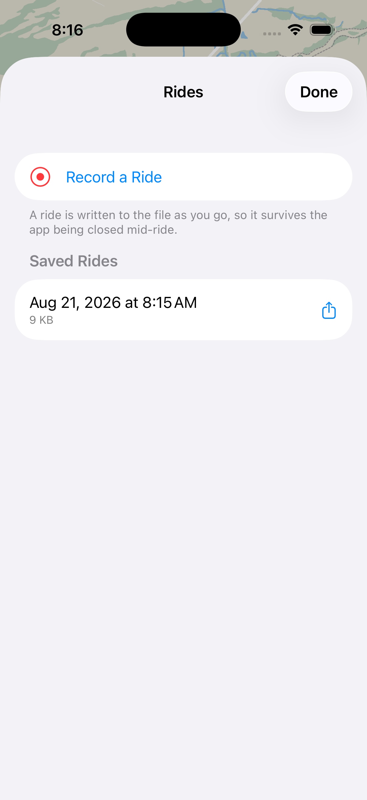
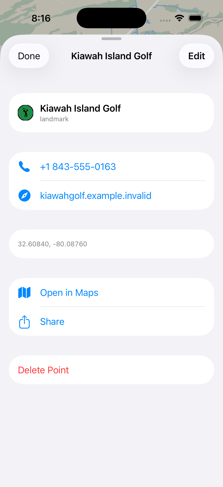

The screenshots above P12 were taken before it, so the roads in them are five times too wide
and the opening view fits the pack instead of filling the screen — they are kept as they were
taken, and [the units](#the-units-p12) is where that is explained.

```sh
python3 port/apps/Pippin/stage_data.py                 # 1. the offline data pack
cmake --preset ios-sim && cmake --build build-ios-sim -j   # 2. the core, for the phone
xcodebuild -project port/apps/Pippin/Pippin.xcodeproj -scheme Pippin \
    -sdk iphonesimulator -destination 'platform=iOS Simulator,name=iPhone 17 Pro' build
```

Or open `Pippin.xcodeproj` and press Run — steps 1 and 2 are checked by a build phase that
fails with the command to type, rather than by a stack trace at launch.

## The shape of it

```
Pippin        (SwiftUI app)     PippinApp · MapScreen · MapModel · MapGestureView
                                RouteSheet · RouteDraft · PickOverlay
                                PointSheet: PointDraft · PointInfoSheet ·
                                            PointEditSheet · PointShapeMark
                                PlaceLink · RenderGate · LocationPolicy
                                ViewportProbe · PixelProbeScreen
PippinKit     (ObjC++ framework) PPMap · PPViewport · PPFrame · PPOwnship
                                PPLocationSource · PPFix · PPRoute · PPWaypoint
                                PPMapPoint · PPTrip · PPPixelProbe
                                [+ PPPixelBridge, PPLocationFix, PPRouteStore,
                                   PPPointStore, PPCameraFit, PPFollowCadence,
                                   PPViewport+Internal, PPFix+Internal,
                                   PPRoute+Internal, PPPoint+Internal,
                                   PPTrip+Internal: private]
libpippin_core.a                the whole Peregrine core, 22 archives merged (P1)
```

**The boundary rule: nothing UIKit or Foundation below PippinKit, nothing `std::` above it.**
The framework's public headers are plain Objective-C; everything behind them is the C++17 the
mac test bed already exercises. It is pyfvw's arrangement, for pyfvw's reason.

**PippinKit is a DYNAMIC framework, and that is an LGPL-3.0 §4d obligation rather than a
preference** — a user has to be able to relink Pippin against their own build of the
FalconView-derived core. Doing it now costs nothing; retrofitting it later would not.
`COPYING` and `COPYING.LESSER` ship inside the .app for the same section's sake.

## PPMap and PPViewport, which are the whole bridge

Two classes, split along a thread boundary (P3). **`PPMap`** owns the data pack, the OSM
source + style engine + renderer, the overlay stack the later sessions add to, and the
canvas: hand it a viewport, get a frame. **`PPViewport`** is where the map looks — an
immutable value carrying the camera, the surface and the pack's limits, which is what makes
the hand-off free:

```
main thread          render queue
  PPViewport  ──────────▶  PPMap.render(_:)
  (a value)    ◀──────────  PPFrame  =  CGImage + the viewport it was drawn at
```

`PPMap` is not thread-safe and does not pretend to be; it belongs to the render queue and
nothing else touches it. That is affordable precisely because both things crossing the
boundary are values — and the frame's image was already a copy, because `CpuCanvas` reuses
its buffer. **The memcpy P2 recorded as a cost turned out to be the ownership boundary.**

One departure from the plan's sketch remains: **no `MapEngine`.** The engine is a catalog
plus a raster compositor, and the pack has no raster in it — it would be an empty catalog and
a `RenderBaseMap` that draws nothing. PythonView's own vector path drives a bare
`MapProjection` for exactly this reason. When Pippin bundles a raster chart the engine goes
in beside the projection the viewport already carries.

## Gestures and the render loop (P3)

**Drag pans, pinch zooms about the fingers, a tap picks, and — since P9's compass half —
two fingers turn the chart.** P3 left rotation unwired on purpose and said why: a chart that
shrugs off an accidental twist on a bike is a feature. Both halves of that survive, because
what makes the twist safe is not the absence of the recognizer but the **twelve-degree dead
zone** in front of it — a pinch that drifts a few degrees moves nothing, and a turn somebody
meant starts from where their fingers are rather than jumping by twelve degrees when it arms.
It is also **off in GPS mode**, where the rotation belongs to the camera; that gate is
`MapModel.rotate`'s, not the recognizer's. `MapGestureView` is a bare `UIView` with UIKit's
own recognizers on it, because a map needs three things SwiftUI's gestures do not hand over
cleanly: the pinch centroid every frame, incremental deltas, and the gesture state.

All the arithmetic is in `PPViewport`, and all of it goes through `MapProjection` — a pan is
"which position is under this pixel now", a pinch is "keep this position under this finger".
Nothing re-derives equal-arc geometry in Swift, so **every gesture is already rotation-aware**
and P7 gets its turned chart for free.

**The loop**: a `CADisplayLink` on the main thread drains a dirty flag, at most one render is
in flight, and the link **pauses itself** when there is nothing to do — a map that is not
moving costs no frames. While a render is in flight the last frame is **transformed** to
match the live camera: the difference between two viewports is exactly a scale, a turn and an
offset, so the preview has no drift by construction rather than by tuning.

One deliberate departure from the plan: the plan renders only on gesture *settle*, and Pippin
also renders *during* a gesture whenever the queue is idle and the last frame came in under
40 ms. The preview covers the in-flight interval exactly, so a live frame costs nothing in
correctness and buys what settle-only rendering cannot — no empty margin creeping in from the
edge of a long pan. A device that cannot keep up falls back to the plan's behaviour on its
own, on a **measurement of the last frame** rather than a guess about the device.

**Zoom limits come from the data.** How far in is the pyramid's own maxzoom drawn at one tile
pixel per point, plus five levels of overzoom (the source clamps the read zoom and lets the
style keep going, which is documented there): **1:1,614** on this pack, about 100 m across a
phone. It was three levels and 1:6,456 until P13 — the scale a rider READS at, which turned
out not to be the scale a rider standing at a junction INSPECTS at (measured on the phone:
1:1,614, z14 tiles, 23 features, 104 ms). How far out is two levels past the view that
CONTAINS the pack (which since P12 is not the view it opens at) — 1:1,317,288, about 82 km
— with the file's minzoom as the outer bound. And the **centre may not leave the pack's box**,
so there is no way to drag into an empty ocean and no way home.

## The ownship (P4)

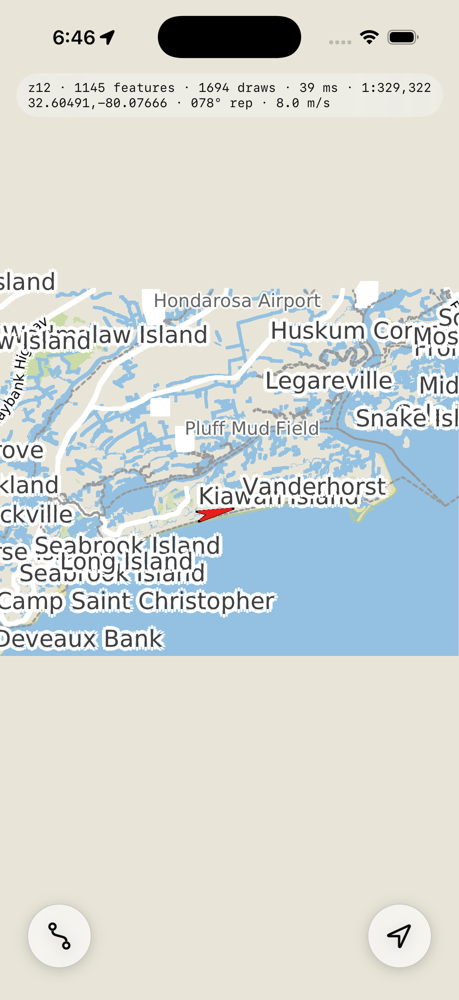

The requirement is one sentence with a comma in it: the ship is **shown, not followed**. So
`MovingMapOverlay` joins the stack at construction with `auto_center` and `auto_rotate` off,
and a running feed moves the chevron and never the map. Pressing a button to be followed is
P7, and the two were already separate here rather than being pulled apart there.

**The tick runs on the RENDER queue, and that is the session's one shape decision.** MM4 put
the camera on the overlay because an overlay is the only object that is both drawn per frame
and fed fixes — `OnDraw` recomputes the apron, `Tick` consumes it. So the overlay has to sit
on one side of P3's thread split, and it has to be the side that draws. What crosses the
boundary is still only values: a `PPFix` in, a `PPOwnship` out, and the fix's landing is
MM1's own locked `FixQueue`, so nothing new is a thread crossing.

That has a consequence worth stating where anybody looking for it will be: **the feed only
advances when a frame is asked for.** P3's loop pauses itself when the camera stops, and a
ship moving under a stationary camera is exactly the case that made P3's shortcut wrong — a
frame no longer depends only on the viewport. Hence a second flag, `contentDirty`, and the
two feeds' opposite clocks: a live receiver PUSHES (a fix wakes the loop, one frame is drawn,
it pauses again), while a `ScriptedSource` has no thread on purpose and must be POLLED, so
the demo — and only the demo — gets a 4 Hz timer. The link still pauses between the frames
that timer asks for.

**Every CoreLocation sentinel stops in `PPLocationFix.h`, on the mac.** CoreLocation says "I
do not know" with a negative number in five places, MM1's first rule is that every field of a
`PositionFix` carries its own validity, and the meeting of the two is a truth table — so it
is a pure C++ header with ten gtests under `port/apps/Pippin/test/`, and the mac build now
configures this directory for that one target. What is left on the phone is
`CLLocationManager`'s authorization dance, which is what cannot be tested anywhere else.
Three things it settles: `<= 0` would be wrong everywhere (a stationary bike reports speed 0,
due north is course 0), a negative `courseAccuracy` does NOT invalidate a course Apple says
is valid, and `horizontalAccuracy` becomes an HDOP by dividing by `RoadSnapSettings::
hdop_scale`, so when MM5 is switched on its search radius comes out as the metres the
receiver actually reported.

**The symbol-DPI gap is closed for the first overlay that shows it.** G3 built
`GeoDraw::symbol_dpi_scale` and nothing had ever set it, because an overlay does not know the
device. A shell does: Pippin passes `one iOS point / the viewport's mm-per-pixel`, which on
the default pitch is exactly the backing scale, so an authored pixel becomes a point and a
24-px symbol is 24 points on any screen. The ledger's own suggestion for the same gap is
0.32 mm, and that is the right reference for CHART symbology pinned against paper — an
ownship is the app's furniture and takes the app's unit. The two will want telling apart at
their sites when P5's route line arrives.

One thing that measurement caught: **`fv.north` does not fit the shape box.** `SetSizePx` is
documented as the full width on screen and that is true of `fv.ownship`, whose ring reaches
±1.0 of the box; the chevron is map furniture and `builtin.cpp` draws it at twice the box
along its axis, so 24 came out a 48-point arrow. The pack asks for 14.

**Both feeds, measured on the simulator.** `-PPDemoFeed YES` replays the bundled
`kiawah_cycle.gpx` — the real 28-minute ride — through `ReadGpxFile` →
`BuildScriptedTrackFromFixes` → `ScriptedSource`, which is the same path a recorded NMEA log
takes, so the moving map still does not know a second kind of track. A live receiver is
`xcrun simctl location booted start`. The two put a nice contrast on screen under
`-PPShowStats YES`:

| Feed | Readout | What it shows |
|---|---|---|
| demo GPX | `32.60460,-80.07762 · 065° der · 3.2 m/s` | the GPX carries no course, so `HeadingResolver` DERIVED one — in screen space |
| CoreLocation | `32.60475,-80.07758 · 078° rep · 8.0 m/s` | CoreLocation reports a course, so it is used as REPORTED, and the speed is the 8 m/s simctl was given |

That `der`/`rep` is MM1's asymmetry visible in one line: a reported course is a TRUE bearing
and a derived one is a SCREEN angle, preserved rather than reconciled.

Over 30 s of the demo ride at z14 the ship moved 32.60542,-80.07586 → 32.60642,-80.06999
while the frame stayed at **1:46,987, 2310 features, 1039 draws** — the same numbers twice,
which is the acceptance criterion stated as an equality: the map did not move.

Two things P4 leaves on the next session's desk. **A frame costs its whole vector render to
move one chevron** — 47–65 ms at z14 for a picture whose only change is a 28-point symbol —
because the overlay is composited into the same canvas pass as the base map. The retained
scene keeps the query at zero, so this is rasterizing, not querying; the way out is an
overlay pass over a cached base image, and P7 (which renders continuously) is where it will
start to matter. And **the demo's `time_scale` speeds up the schedule but not the recorded
speed**, so at 4x the readout says 3.0 m/s while the ship covers ground at twelve — correct
in both halves and confusing in the pair.

## The route, in C++ and not yet on screen (P5)

P5 is the one Pippin session with no simulator screenshot, because it built no iOS: it is
**`port/RouteKit/`**, three C++ classes and 48 mac gtests, and P6 is what puts them on the
phone. It is in the pack's link graph already — `pippin_core_deps` gained `fv_routekit` and
the merged archive went from 21 libraries to 22 — so P6 has nothing to wire up before it
can call it.

```
fv::RouteDoc       the .fvrte document, byte-compatible with route.py's
fv::RoutePlanner   graph + rule file + profile -> per-leg polylines
fv::RouteOverlay   an fv::Overlay: Persistence + HitTest, route.py's look
```

**Why it is not in fvkit, and this is the whole reason the module exists.** The ledger's
invariant, stated twice, is that fvkit does not link `port/Routing` — it is what keeps the
map engine out of `fvgraph`. A route overlay needs both. So RouteKit sits beside them and
links each, which is the same arrangement `pippin_core_deps` has had since P1 and the
reason that line already said P5 would join it.

**Byte-compatible is a measurement, not an intention.** A route Pippin saves has to open in
PythonView and back again, so `RouteDoc` reproduces `json.dump(doc, f, indent=2)`
exactly — insertion-ordered keys, `[]` on one line but a filled list on many, non-ASCII as
`\uXXXX` with surrogate pairs above the BMP, and floats as CPython's `repr`. The test reads
the `.fvrte` route.py wrote and re-emits it byte for byte; `PythonFloatRepr` was separately
fuzzed against CPython over 120,000 doubles, random bit patterns included, with no
mismatches. Reading is nlohmann's job, where being permissive is the right instinct.

**What P6 inherits.** `SetWaypoints` is the entire editing surface — wholesale replacement,
which is exactly what a sheet produces — and it DROPS the plan, because a stale road under a
moved marker reads as a bug in the router. So the re-route belongs behind the sheet's OK and
not on every keystroke. Two smaller things: the status line is drawn on the canvas at
`(10, 20)`, which is route.py's spot in a desktop window and under the notch on a phone, so
P6 either turns it off with `SetShowStatus(false)` and puts the words in SwiftUI or moves
it; and waypoint labels are ON by default (a label is a waypoint's identity in the
document), which means `PPMap` must have its default font set before a route draws at all —
the pack's DejaVu already covers this, and it is the same font the base map's labels use.

**The symbol-DPI reference, told apart.** P4 said the ownship's unit and chart symbology's
would want distinguishing the first time a second overlay needed one, and this is it.
`RouteOverlay::SetSymbolDpiScale` takes the app's unit exactly as the moving map does — a
route's diamonds are furniture, sized in the units the buttons are — and the hit test scales
with it, because a marker twice the size that stayed the same target is a thing a finger can
see and cannot press. The 0.32 mm reference stays where it belongs: chart symbology pinned
against paper, which is not this.

## The route, on the phone (P6)


P6 is the session that gives P5 its first caller. The whole flow is three taps —
Route, a stop from the fix or the crosshair, OK — and behind it are one new C++
class, two ObjC value types, and about two hundred lines of SwiftUI.

**`PPRouteStore` is pure C++ ON PURPOSE, and that is the session's shape decision.**
P4 put every CoreLocation sentinel in `PPLocationFix.h` so the mac could test the
truth table; P6 does the same with the route document's whole lifecycle. It owns the
`fv::RoutePlanner` and the `fv::RouteOverlay` — one lifetime, because the overlay
borrows the planner — and it has three verbs: `LoadAtLaunch`, `SetWaypoints`, `Clear`.
**15 gtests** run against the real `kiawah.fvroad`, which means P6's acceptance
criterion is a test rather than a thing to remember to try:

```
RouteStore.ARouteSurvivesARelaunchWITHItsRoads
```

That capitalised WITH is the point of the class. **`RouteOverlay::FileOpen` DROPS THE
PLAN**, correctly — P5's rule is that the road geometry is not in the document, because
it is derived from a graph and a rule file either of which can change under it — so
"reload at launch" is TWO steps. A shell that only reads the file gets the waypoints
joined by straight red great circles, which is the picture for a route nobody has
computed, and the user who routed yesterday reads it as the app having lost their
route. `LoadAtLaunch` opens *and* replans, and the difference is visible on screen.

**Persistence is the C++'s job, not Swift's.** `Documents/` is a Foundation question, so
Swift answers it once (`setRouteDocumentURL:`) and everything after — when to write, and
in what order relative to an edit — happens in `RouteStore`, because a write ordered from
the shell would race the next edit and could leave an older route on disk than the one on
screen. Every mutating call ends in a write, and **`Clear` DELETES the file** rather than
writing an empty one: an empty document reloads as an empty route, and of two spellings of
one state a phone should hold the one that is not a file.

**The plan runs on the render queue**, with everything else on `PPMap`. Measured on the
mac, a Kiawah plan is **single-digit milliseconds** (the whole `ARouteFollowsRoads` test,
graph load included, is 4 ms), so the sheet's spinner covers the async hop rather than a
wait. It does mean a plan is time the map is not being drawn — fine at an island's scale,
not at a continent's — and `PPRoute.planMilliseconds` reports it every time so the day it
stops being fine is a number and not a feeling. The way out, when wanted: a second
`fv::RoutePlanner` on a queue of its own plus a "here is a computed plan" setter on
`fv::RouteOverlay`, which needs a thread-safety decision on the router that no measurement
justifies yet.

**There is no `PPRoutePlanner` class, and the plan's architecture sketch named one.** The
sketch predates P3's threading contract. A public planner object would be a SECOND handle
to render-queue state, which is exactly the trap `PPMap.h` exists to close; what the
sketch was really asking for is "route planning reachable from Swift, off the main
thread", and that is `-[PPMap setRoute:...]` called on the render queue.

**Two smaller decisions, both visible on screen.** The overlay's on-canvas status line is
**off** (`SetShowStatus(false)`) — P5 flagged that (10, 20) is route.py's spot on a desktop
window and is underneath the Dynamic Island on a phone — and the words move to the sheet
instead, where "bicycle: 5.5 km, 22 min" sits in the **Stops section's footer**: the sheet
opens at the medium detent, and a section below the mode picker is a section below the
fold. And the route overlay is added to the stack **before** the moving map, because this
manager has no type registry, equal display orders stack newest-on-top, and a chevron
hidden under a route line is the one thing on this screen that must never be hidden.

**The draft is not the route**, which is what makes Cancel free. `RouteDraft` is what the
user is typing — allowed to be incomplete, half-picked and abandoned — and it is owned by
`MapScreen` rather than by the sheet, because **"Pick on map" has to dismiss the sheet**
and a draft owned by the sheet would be destroyed by the very gesture that needs it. The
crosshair is drawn in SwiftUI and does not move: the MAP does, so the pick is "what is
under the centre pixel", which `PPViewport` already answers exactly — half-pixel
convention and all (P3 measured 0.24 pt the one time that was assumed).

**Driven by real touches on the simulator.** Start from the demo feed's fix, End picked on
the map at the west end of the island, mode Cycle: the drawn path follows the road, the
document lands in `Documents/current.fvrte` in route.py's exact format, and a
`simctl terminate` + relaunch brings it back **with its roads**. Switching to Walk redraws
the same pair **solid** instead of dashed — P5's "the mode is visible in the line, not only
in a line of small text" — and Clear leaves `Documents/` empty.


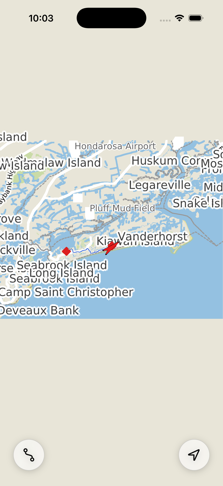

The two pictures above are the same two waypoints: dashed is the bicycle route, solid is
the walk. Nothing but the profile changed.

**Two things the first real-device run turned up** (Chris, 2026-08-19), neither a P6 defect —
they had been there since the map first drew: **roads and trails looked drawn with a blunt
crayon**, and **the app opened fitting the pack instead of filling the screen**. Both turned
out to be one mistake wearing two hats, and both are fixed — see [the units](#the-units-p12)
below, which is also where the measurement is.

What P6 leaves for later, none of it blocking: **a route's summary is only in the sheet**,
because OK computes and dismisses (the plan says so) and the ride numbers belong to P8's
stats bar — so after pressing OK the user sees the line on the map and not the distance;
**RouteKit is still not bound to pyfvw**, so the C++ and Python route overlays remain the
two copies §2b describes; and **the route has no editor** — v1 editing is `SetWaypoints`
wholesale, so a waypoint cannot be dragged on the map, only re-picked through the sheet.

## GPS mode (P7)


P7 is the session the app is named for: the button on the right turns the map into
a moving one. Everything that decides where to look was already built and tested —
MM2's camera, MM3's slew, MM5's road snapper, PR1–PR3's turning chart — so P7 is
almost entirely about **where the answers cross a queue** and what a rider is shown
while they do.

**The camera's answer rides in on the frame, and that is the session's shape
decision.** MM2's contract is that the camera never touches the map: `Tick` answers
a centre and a rotation, and the shell applies them. P4 put the tick on the RENDER
queue (an overlay is the only object both drawn per frame and fed fixes), while the
camera a shell drives is a `PPViewport` on the MAIN thread — so the answer has to
cross a boundary. `PPFrame` already crosses it, once per tick, carrying a value.
So the slew's `changed`/`center`/`rotation`/`active` go on the frame, and there is
no second channel, no lock, and no way for an answer to arrive without the frame it
was computed alongside.

Two rules on the applying side, both in `MapModel.applyCamera`: **the scale is the
shell's and is never overwritten** (the camera has an opinion about where to look
and none about how far out, so a pinch in flight survives), and **a live gesture
wins outright** — an update that lands mid-drag is dropped rather than fighting the
finger for the third of a second a slew lasts.

**The map is ASKED where it is, not told.** The slew interpolates from where it
believes the map to be, so anything that moved it without going through the slew —
a drag, a pinch, a centre clamped at the pack's edge, a dropped update — would make
the next fix animate from a place the map left some time ago, which reads as a
jump. `tickMovingMap` compares the projection it was handed against the last centre
it reported and re-bases (`ResetMap`) when they disagree. It is PR3's rotation
adoption (`Tick` asks `proj.Rotation()`) applied to the other half of the camera,
and it is what lets **a user pan in GPS mode without a mode fighting a finger**: the
pan is honoured, the slew re-bases, and the next fix pulls the map back — which is
MM2's apron doing its job.

**The zoom-out rule is arithmetic, and it is on the mac.** `PPCameraFit.h` is the
third pure-C++ header in PippinKit for the reason the first two exist (P4's
CoreLocation truth table, P6's route lifecycle): a phone is a bad place to measure
something whose failure mode is *the route start is 10% off the bottom edge*. Three
decisions are in there with their derivations, and the third was got wrong first
and measured second:

* **It widens and never narrows**, so entering GPS mode cannot throw away a zoom-in
  the rider chose — and "already in view" and "no route" become the same answer
  rather than two branches.
* **It fits a DISC, not a bounding box**, because the chart TURNS. A box that fits
  north-up does not fit at 45° (a turned viewport's box grows to `(w+h)/√2` on both
  axes), so a box fit would be correct until the rider turned a corner.
* **The ship is not in the middle of the screen.** MM2's discrete track-up branch
  is `DeltaXyTrackUp(W, H, angle, 0.0, 1/3)`, which puts the centre a third of the
  height AHEAD of the ship — so the ship is drawn at **(W/2, 5H/6)**, with five
  sixths of the screen in front of it and **one sixth behind**. A route's start is
  normally behind a rider, so the radius that fits is `min(W/2, H/6)`, which on a
  portrait phone is the SIXTH. The first cut of this file allowed 0.4 of the smaller
  side and put the start just off the bottom of the simulator; the fit is now 40%
  wider and the test that catches it is `CameraFit.TheRouteStartFitsBEHINDTheShip`.

It fires ONCE, on entry, in `MapModel.applyZoomOutRule` — the plan says "compute the
box, pick the enclosing scale, one slew", and a map that re-fitted every frame would
breathe in and out under a rider and fight every pinch.

**The snapper and the router are the same roads.** `RoadSnapper` needs an
`IRoadNetwork`, the port's implementation indexes a `RoadGraph`, and the route
planner has already loaded exactly that file — so `fv::RoutePlanner::graph()` now
hands out a `shared_ptr` and `pippin::RouteStore::EnsureRoadNetwork` indexes it a
second way (the router indexes junctions; a snap needs the arc geometry). One graph,
loaded at the first press of the button by whichever of the two asks first, and no
way for the two halves of the app to disagree about what the roads are.

**The filter is `kAll`, which is the opposite of the network's default**, and the
reason is that Pippin is a bicycle. `RoadGraphNetwork` defaults to what a car may
drive precisely so that a car does not snap to the cycleway beside the road; Kiawah's
parkway has one for its whole length and this app has no car profile at all, so the
filter that protects a driver would put this ship on the wrong ribbon of tarmac every
time. The reverse case — a rider on the road beside a parallel path — is what
`snap_min_confidence` (0.25) declines: two roads that close score within
`ambiguity_m` of each other and the overlay keeps the raw fix.

**What is on screen.** The button fills and tints (`location.fill`); a **ride bar**
appears with speed, and the route's distance and time when one is calculated. That
bar is **not P8's stats bar** — P8 builds `fvkit/nav/trip.h` (elapsed, odometer,
distance to go, ETA) and those are numbers about the RIDE, which nothing in the port
computes yet. What it does close is P6's own gap: the route summary used to exist
only inside the sheet, and OK dismissed it. P8 replaces the capsule's contents, not
its place on the screen. There is also a new **notice** channel on `MapModel`,
because `status` is not one — every finished frame overwrites `status`, so a sentence
put there has a frame's life expectancy. Pressing GPS with location denied is the
first thing this app has ever had to say at a moment the user is looking.

**Measured on the simulator, replaying `kiawah_cycle.gpx`.** Pinched in to 1:46,987
with the route's start off the west edge, pressing GPS widened to **1:116,820** and
brought start, ship and end all into a turned frame; the ship rides at 5H/6 pointing
up; `-PPShowStats YES` reads `020° rep · snap Surfsong Road` — **`rep` where it said
`der` before**, which is MM5's own mechanism visible in three letters: a snapped fix
carries the road's bearing, and `HeadingResolver` already prefers a reported heading
to anything it can derive. Pressing GPS again unwinds the chart to north-up in one
slew and leaves the map where the ride had taken it.

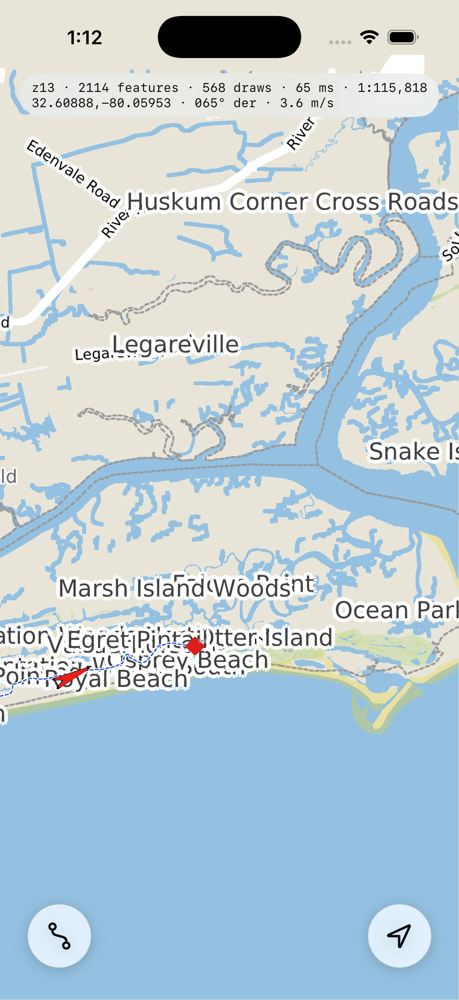

**Three things P7 leaves for later, all measured rather than suspected.**

* **The chart re-turns when the map RECENTRES, not on every fix** — MM2 puts the
  rotation on the same `CameraTarget` as the centre, and a ship inside its apron
  produces no target at all (`camera.cpp`, the `in_view && in_apron` early return).
  So a rider who turns a corner sees the chevron swing at once and the chart follow
  at the next recentre, which at 1:115,000 and 12 km/h is a minute or two. This is
  FalconView's behaviour kept verbatim rather than improved, and the one-key way out
  is `movingmap.continuous = true` in the pack — which `setGpsModeEnabled:` honours,
  and which costs what `camera_slew.h` says continuous mode costs: a retarget every
  fix restarts the ease, so the map lags by about one duration unless the duration is
  shortened or the easing set to `kLinear`. Nobody has measured that on a phone yet.
* **Entering GPS mode moves the map on the NEXT FIX, not on the press.** `force_` is
  a flag the camera reads when a fix arrives. At 1 Hz that is under a second, and a
  lunge on the press would have to guess a placement the camera is about to compute
  properly. The zoom-out, by contrast, is instantaneous — it is the shell's own
  camera — so the two halves of pressing the button do not arrive together.
* **A following frame still costs a whole vector render** (P4's finding, unchanged):
  63–84 ms at z13 with 2100 features, for a picture whose base map is identical and
  whose only change is a chevron and an offset. GPS mode is the first thing in this
  app that renders continuously, so this is where it starts to be felt — and the way
  out is still an overlay pass over a cached base image.

## The trip computer (P8)

Five numbers a rider wants while riding, in `fvkit/nav/trip.h` — headless, no UI, no clock of
its own. Every entry point that needs the time is HANDED it, which is what makes a 28-minute
ride testable in a millisecond and what lets the same object be driven by a wall clock on the
phone and by a fixture's timestamps on the mac.

**THE ANCHOR, which is the one idea worth reading before the code.** A GPS at a standstill does
not report the same point twice; it wanders a metre or two a second, and a naive odometer
summing every fix-to-fix step climbs at walking pace while the bike is locked to a rack. The
cure is a minimum-movement floor — but applied the obvious way it breaks the OTHER end of the
range, because a walker at 1.4 m/s never moves 2 m between two 1 Hz fixes and would be recorded
as never moving at all.

So the floor is measured against an ANCHOR that moves only when a step is counted. A walker's
steps accumulate against a stationary anchor until they cross the floor and are then counted
whole — 100 steps of 1.4 m comes out 140 m, exactly right — while a parked bike's jitter stays
bounded around the anchor and crosses it rarely. One mechanism, both ends of the range. The
derived speed rides on the same anchor, so the two numbers can never disagree about whether the
ship is moving: standing still, the numerator stays small while dt keeps growing and the speed
falls toward zero on its own.

**The real ride, pinned to the metre.** Over `testdata/kiawah_cycle.gpx` — 1705 points at 1 Hz,
1704 s — the odometer reads **6097.99 m** against the **6100.84 m** a naive fix-to-fix sum
gives. The floor costs 2.85 m over 6.1 km, which is the whole argument for it in one number: it
deletes the standstill jitter and almost none of the ride. Cross-checked against an independent
implementation of the same rule written outside this codebase.

**And that ride ENDS STOPPED** — 6.0 m in its last 60 seconds, the rider off the bike — so the
30 s average decays to 0.34 m/s and the ETA is correctly *withdrawn*. That is a test rather than
a loose bound, because a bar reading "arriving in 4 minutes" at somebody standing still is
exactly the failure `min_eta_speed_mps` exists to prevent. Every field carries its own validity
and the bar draws an en-dash for each false: `0 km/h` is a bike at a stop sign and `—` is a
receiver that has not said, and a rider glancing down deserves to be told which.

**Where it lives, and why not on the main thread.** `PPMap` owns the `TripComputer` and its
answer rides in on `PPFrame` as a `PPTrip` — P7's shape applied a second time. The reason is
that a computer on the main thread would see the live receiver and MISS the scripted replay,
which is the feed every acceptance run uses: a replay is polled inside the render tick and never
crosses the shell at all.

**THE TRIP IS FED FROM TWO PLACES, and the timestamp is what makes that safe.** A live
receiver's fixes are counted at `pushFix:`. `MovingMapTick` cannot serve them, because `Tick`
DRAINS ITS QUEUE IN A LOOP and reports only the LAST fix it consumed — so a delayed frame that
swallowed two fixes would have the trip chord straight across the first, under-counting a corner
and sampling the average once where it should have sampled twice. A scripted replay never
touches `pushFix:`, so the tick counts that one. A live fix reaches both paths and is refused
the second time by its own stamp. This came out of the review pass rather than the acceptance
run: the anchor hides it well enough that the bar looks right either way.

**The fix it is fed is the RAW one, never the snapped one** — the same rule P10 states for a
recorded GPX. A trip records what happened; the snapper's answer is a guess about which road it
happened on. That guess is right for drawing a ship and wrong for an odometer, where a run of
confident guesses alternating between a road and the cycleway beside it would add metres nobody
rode.

**The line the "distance to go" is measured along** is new: `RouteStore::RoutePath()`, the
planner's road geometry with the leg joints de-duplicated, not the waypoints — on Kiawah those
are three points with a 6 km ride between them. It is refreshed in `routeFromSnapshot:`, which
every route mutation funnels through (launch load, the sheet's OK, Clear), so a distance
measured along a route the rider has already replaced is a state this shape cannot reach.
Projection is onto the NEAREST segment and deliberately stateless; the note in `trip.cpp` says
what that costs on a route that doubles back, and why a progress ratchet would be worse.

**Measured on the simulator, replaying the ride:** `2:00 · 12 km/h · 1.7 km · 2.5 km · 3:19 PM`
— and 1.7 + 2.5 is the 4.2 km route, which is the same relation the mac test asserts at the
ride's halfway point.

27 gtests in `port/fvkit/nav/test/nav_trip_test.cpp`, plus two in `route_store_test.cpp` for the
planned line.

## The points (P9)

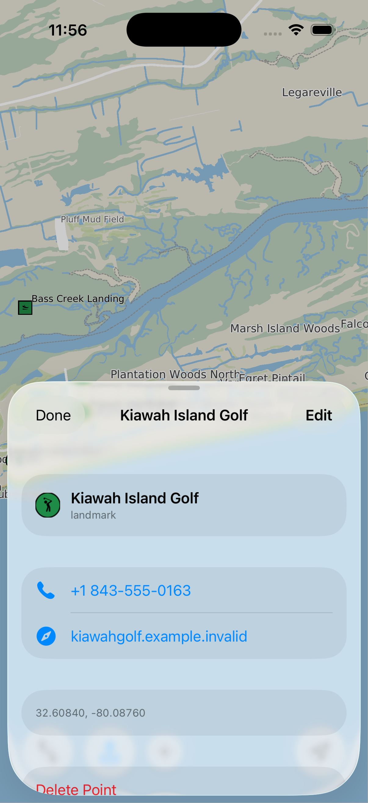

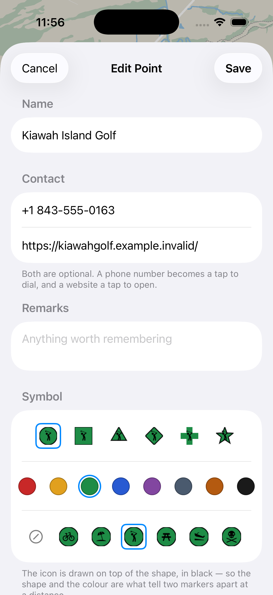

A `.fvpoints` document on the phone — drawn, tapped, edited, added to and deleted from. The
document format is `fv::PointOverlay`'s (A6), which is a real SQLite file with a schema somebody
else can write; what P9 added is a third column pair, a way to size a marker for a screen, and
the whole of the app around it.

**Tap a marker and it tells you what the place is and how to reach it.** Name, phone, website,
remarks — and each row is ABSENT when the field is empty rather than greyed out, which is the
opposite of the route sheet's "Current location". The two are different on purpose: a disabled
control says *this could work, but not yet*, which is true of a location fix and false of a
telephone number a place does not have. The phone and the website are SwiftUI `Link`s, so the
system's own handler puts up the phone app for a `tel:` and Safari for an `https:`, and the
long-press menu (copy the number, add to contacts) comes free.

**Schema 3 adds `phone` and `url`.** Two TEXT columns, unvalidated, carried verbatim: a document
is authored by `sqlite3` as often as by an app, and a reader that rejected `(843) 555 0100` or
`kiawahresort.com` would be enforcing a format nobody agreed to. Whatever DIALS and whatever
OPENS is the shell's question — `PPMapPoint.dialURL` strips a number down to what a switchboard
wants and keeps a leading `+`, and `.webURL` puts `https://` in front of a bare host. The one
thing the shell refuses is a link it cannot honour: text with no dot in it (a phone number typed
into the website box, say — which is exactly what the first simulator run did) is stored, shown
in the editor, and simply not offered as a tappable row.

**Reading an older document is per-COLUMN, not per-version.** The reader probes for each column
added after schema 1 and SELECTs a literal default for one that is missing, so schema 1, 2 and 3
all open through a single query — and so does a document interrupted between two of the
migration's `ALTER`s, which is a real file somebody could have on disk.

**A marker is sized in AUTHORED pixels, and the DPI gap is closed for this overlay.**
`PointOverlay::SetSymbolDpiScale` is the same call `RouteOverlay` has had since P5, and `PPMap`
sets it to `pixelsPerPoint` per tick — the P12 number. So a 22-px marker is 22 iOS points wide
on any screen, and the cull box, the label's type size and the HIT TEST all scale with it. That
last one is the point: a target a finger can see is only useful if it is a target a finger can
press. The tap tolerance itself is `points.hit_tolerance` in the pack (22 points, about a thumb)
and it is ADDED to the marker's drawn half-width, so a 22-pt marker is pressable 33 points from
its centre — Apple's 44-point target arrived at honestly rather than by padding a rectangle.

**The pack ships a set and the user owns a copy of it.** `stage_data.py` GENERATES
`kiawah.fvpoints` — the only item in the manifest that is written rather than copied, because a
`.fvpoints` file is a SQLite database and Python has sqlite3 — and `pippin::PointStore` copies it
into `Documents/points.fvpoints` on the first launch and never reads the bundle's copy again.
Two sources of truth for one map would mean an app update silently reverting somebody's edits.
The contact details in the shipped set are deliberately NOT real: these are real places on a real
island, and a demo file whose markers ring an actual business is a bad demo. The phones are in
the reserved 555 range and the hosts are `.invalid`; the first thing to do with the edit button
is replace them.

**And the pack's copy is kept once it exists** (store review, 2026-09-02). `stage_data.py`
generates `kiawah.fvpoints` only when the pack has none: the set that ships is that file opened
in a SQLite editor and corrected — the real telephone numbers, the real links — and `Data/` is
git-ignored, so a stage that rewrote it would destroy the only copy, silently, in the middle of
a build somebody ran for another reason. `--regen-points` is the deliberate way back to the
generated stand-in. Keep a copy of the edited set outside `Data/`; nothing else does.

**Every edit writes, and a failed write is not a refused edit.** `PPPointStore` is `PPRouteStore`
for points and follows its rules: the write is part of the same call as the mutation (a write
ordered by the shell would race the next edit), and when it fails the point stays on screen and
correct — what the user loses is the next launch, and they are told so in a notice rather than an
alert. One place it deliberately differs: **an empty set is WRITTEN rather than deleted.** The
route's document is removed when its last waypoint goes, because "no route" and "an empty route"
are the same state. Points are not like that — an absent document means *seed me*, so a user who
deleted every point would be handed all of them back.

**Two markers under one thumb: the nearer wins, with no question asked.** That is a phone
decision rather than a disagreement with A5's aggregating pick. The desktop pick session can ask
"which of these did you mean?" because it has a mouse, a context menu and a status bar; a rider
with one thumb gets the closest one and taps again if it was the wrong one.
`PointOverlay::HitTestPoint` still emits every hit for a shell that wants them.

**The screen.** A points button beside Route (`mappin.slash` when off, `mappin.and.ellipse`
tinted when on). `CircleButton` gained `activeSystemName` because of this button: appending
`.fill` to a symbol name is a GUESS about the SF Symbols catalogue, and `mappin.and.ellipse.fill`
does not resolve here, so the button went BLANK on the first run. The tap is a
`UITapGestureRecognizer` that must `require(toFail:)` the pan — a finger that moved a few pixels
while placing a marker is panning, not tapping. And placing or moving a point reuses
`PickOverlay` verbatim: P6's "one mechanism serves start, end and via" now serves a point as
well.

**Adding is the points button HELD DOWN** (Chris, 2026-08-20), where a small `+` beside it used
to be. A third round button, permanently on screen, for the least-used of three actions was the
wrong trade — and the thing being pressed is already the right thing: *the points button, held,
makes a point*. A hard press is the same gesture on this hardware (Haptic Touch **is** a long
press), so one recognizer serves both, and a taptic bump says it fired without asking a rider to
look down. It only works while the points are SHOWN — the rule the `+` had, because adding to a
hidden set would put a marker on the map nobody can see — and with them hidden the hold simply
degrades to the tap that shows them. Two details worth keeping:

- **A tap and a hold on one `Button` are not exclusive.** UIKit delivers the tap on touch-up
  whatever happened before it, so a press already handled as a hold would *also* toggle the
  points. The long press leaves a TIMESTAMP and the tap steps over it — a timestamp rather than a
  flag, because a hold that ends with the finger dragged off the button never delivers its tap,
  and a flag left set would eat the next real one.
- **A gesture with no button is a gesture nobody finds**, so the first time in a launch that the
  points come on, the app says how — once, in the same four-second notice everything else uses.

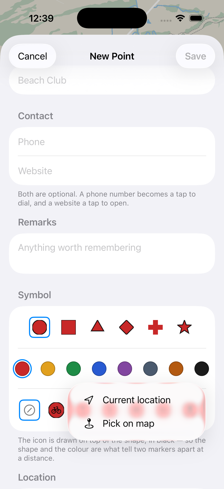

**One row asks "where?", for a waypoint and for a point alike.** `LocationRow` (in
`RouteSheet.swift`) is the route sheet's stop row, and the point editor's Location row is now the
same view: **Current location | Pick on map**, in that order, with Current location offered and
DISABLED when no fix has arrived rather than hidden — a control that vanishes is a control the
user goes looking for. The editor used to have a plain "Place on map" button and no way to use
the fix the phone already had, which is the wrong answer for the commonest add of all: a rider
marking where they are standing. It also means a NEW point opens the FORM first and takes its
place from inside it (Save stays disabled until it has one, exactly as the route's OK does with
an unset stop) instead of being marched out to the crosshair before it has a name.

And there are exactly **two places a coordinate is spelled for a user** — `LocationText.describe`
and `PickOverlay`'s confirm button — both shared by both flows, which is what made P11 ("the
pick button says WHERE, not what the numbers are") a change in two functions rather than four.
It landed the same day; [the pick button says where](#the-pick-button-says-where-p11) is what
came out.

**The icons are the document's own.** `points.symbol_id` is not a path into anybody's icon
directory — it is a foreign key into a `symbols` table *inside* the `.fvpoints` file, holding each
PNG as a blob. That is schema 2's whole point: the file opens **with its symbology** on a machine
that has never heard of the icon set. So `stage_data.py` reads forty-odd [maki](https://labs.mapbox.com/maki-icons/)
icons out of `testdata/GeoSymbol/makiPng` (CC0) and embeds them; nine of the ten shipped points
wear one, and the rest of the palette is there for the picker, because **a palette is not a
projection of the points** — a row nothing references is kept, saved and handed back.

A marker is drawn as a **badge**: the shape in the point's colour, with the icon stamped on top in
black at `kIconFractionOfBadge` = 0.62 of its width (pulled in that far so a diamond still reads
as a diamond). That fraction is why the marker size and the icon size are one number and not two:

| `MARKER_SIZE_PX` | glyph | |
|---|---|---|
| 12 | 7.4 pt | maki's 32-px artwork does not resolve |
| 22 | 13.6 pt | legible, small |
| 26 | 16.1 pt | about what maki is drawn at on a web map |

The editor's symbol picker is a horizontal scroller of badges — the first cell is "no icon", and
each cell draws the *actual marker* (chosen shape, chosen colour, that icon) rather than the bare
tile, because a black glyph on a white sheet looks nothing like one on a coloured badge. An
earlier version of this file claimed a picker would mean "rasterising a symbol through `CpuCanvas`
into a `UIImage` per cell" and treated that as the reason not to build one. **That was wrong**:
the document stores PNG *bytes* and `UIImage(data:)` takes exactly those, so nothing is
rasterised, nothing is re-encoded, and UIKit caches the decode.

**What P9 still owes**, listed in `port/pippin-plan.md`: the route sheet gaining a **Point name**
picker so a chosen point snaps a waypoint exactly. The document is in the app and
`MapModel.points` is already published, so it is a picker and a coordinate with no C++ under it.
Also still true, and now the only artwork gap: **no way to get NEW artwork into a document from
the app.** `fv::PointOverlay::AddSymbolFromPngFile` is bound and only `WriteSampleFile` and
`stage_data.py` put icons in a file, so the palette a document ships with is the palette it has —
the editor chooses among those icons and cannot add a forty-fourth.


## The compass, and the lag (P9)

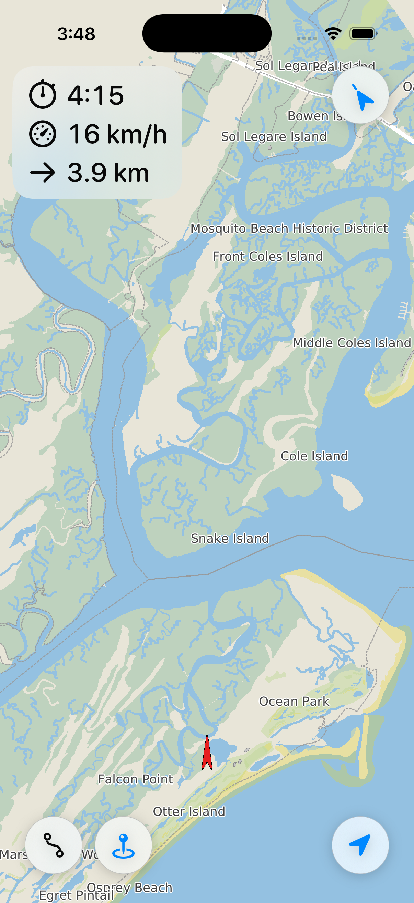
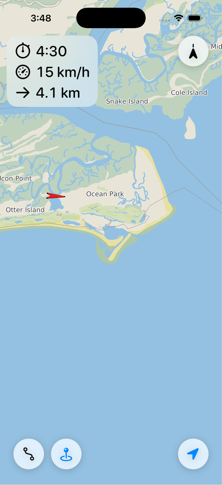

The compass sits top right and it is on screen **only when it has something to say**: the map is
following, or the user has turned the chart. Its needle points at NORTH — not at the heading —
which is what lets one control serve both modes: in course-up it swings as the rider turns, and
in north-up it sits still pointing up. A tap means the obvious thing in each case: **following**,
it is the auto-rotate switch (the requirement's "toggle on/off the auto-rotate feature");
**not following**, it is the way back from a two-finger twist, and it leaves the mode alone —
a twist is not a mode.

**Course-up and north-up differ in more than an angle**, and that is the substance of this half
(Chris, 2026-08-20: *"in course-up I want to continuously center and orient the map, without the
lag we have today; in north-up the current lag is good"*).

The lag had a name and a number. MM2's track-up apron is a `W/5 x 2H/5` box and the ship is
anchored at its lower edge, so a rider heading up the screen crosses **a third of a screen —
about a minute at bicycle speed on a riding scale — before either the map moves or the chart
turns.** (The rotation only changes on a recentre: `MovingMapCamera::Update` returns early
while the ship is inside the apron, so a corner taken mid-apron does not turn the chart at all.)
That apron is right for a chart being read and wrong for one being ridden, so course-up switches
it off: `CameraModes::continuous`, every fix, centre and rotation together. **North-up keeps the
apron untouched**, which is the behaviour Chris asked to keep.

Continuous centring costs exactly what MM3's slew header says it costs unless the animation is
retuned with it — a target arriving every fix restarts the ease every fix, so the map spends its
whole life in the slow opening of an animation and trails by about one duration. So the follow
slew is **linear**, and its duration is **one measured fix interval**:

| duration vs. the fix interval | what it looks like |
|---|---|
| shorter | the map lunges, then stands still — a stutter once a second |
| longer | still travelling toward fix N when N+1 retargets it: the lag, smaller hat |
| **equal** | the chart slides at the rider's own speed; the ship oscillates about its anchor by one fix of travel, a few points |

The interval is measured rather than set, because no constant is right for both a phone
reporting at 1 Hz and the demo feed replaying at `demo_time_scale` (4x by default).
`PPFollowCadence.h` is that measurement — a running average of the intervals between the
**ticks that saw a fix**, which is the honest quantity: `Tick` drains its queue in a loop, so on
a phone whose loop is slower than its feed the retargets really do arrive at the slower rate. A
gap (a tunnel, a pocket, a backgrounded app) resets it rather than being averaged in. Twelve
gtests on the mac, because its failure mode — a stutter or a trail — is invisible in a still.

**The one line that is not obvious** is in `PPMap`'s `applyRotationPin:`. North-up follow has to
pin the chart at north, because MM2 *preserves* whatever turn the chart has when `auto_rotate` is
off: a rider leaving course-up mid-ride would otherwise have the next fix retarget the slew at
the angle the unwind was passing through, freezing the chart half-turned and re-aiming it there
forever after. `SetRotationSupported(false)` takes the rotation away from the camera — but it
also does `slew_.Reset(center, 0)`, because it is written for a shell that could never rotate and
takes "unsupported" to mean the chart is already at north. This one can rotate and the chart is
still turned, so the slew alone is told where the map really is. Without that line the chart
**snaps** to north on the next fix instead of unwinding to it.


## Record and share (P10)

**A ride is a file that is complete before the call that added the last point returns.** That is
the whole design, and the rest follows from it. A phone records for three hours in a jersey
pocket and every way that ends badly ends the same way — the app killed in the background, the
battery flat, a force-quit at a traffic light — so a recorder that keeps the ride in RAM and
saves on Stop loses ALL of it in each of those cases. `fv::GpxRecorder` (`fvkit/nav/gpx_recorder.h`)
appends instead: it remembers where the FOOTER begins, seeks back to it for the next point,
writes the point, and writes the footer again. The footer's length never changes, so nothing has
to be truncated and the file on disk parses after every fix. A test reads it back mid-ride, six
times, without closing the recorder.

The writer underneath is `fvkit/nav/gpx.h`'s new half — GPX 1.1 only, four rules in the header.
The one worth knowing at this distance is that **a field with no validity is not written**:
`has_altitude` false means no `<ele>` at all, because `<ele>0</ele>` reads back as a valid
sea-level fix and would quietly turn "the receiver did not say" into "sea level". Speed is not
written at all — base GPX has nowhere to put it, and writing a vendor extension for a number the
reader DERIVES would give one quantity two sources of truth.

**Where it plugs in is one line, and P8 had already built the socket.** `PPMap`'s `feedTrip:`
was renamed `consumeRawFix:` and now feeds the recorder beside the trip computer, because it was
already exactly the right place: the one method both feeds pass through, taking the RAW fix
rather than the snapped one (a recording is evidence; the snap is this version of the snapper's
opinion about it), with a timestamp gate that turns a live fix arriving twice — once at
`pushFix:`, once through the tick that consumed it — into one point in the file.

**Recording does not require GPS mode**, which is a small departure from the plan. The two answer
different questions: GPS mode is *follow me* and recording is *keep this*, and a rider who wants
to see the whole island while the phone logs the ride is not doing anything strange. What it does
require is a feed, since a recorder with nothing to record writes an empty file and looks broken.

**The button sits above GPS in the lower-right column** (Chris, 2026-08-21 — it went beside the
points button first). That is the better split as well as the asked-for one: the right-hand
column is what the map DOES and what it KEEPS, the left-hand row is what the rider PUTS on the
map, and the two controls pressed mid-ride end up under the same thumb. **It follows the points
button's idiom exactly**: the tap is the common thing (start and stop, one press, cold hands at a
trailhead) and the HOLD is the occasional one (the Rides sheet — share, delete, the live point
count). It is red rather than the accent tint every other active
button uses, because it is the one control here whose active state means *something is being
written down*. The notice posted when a ride ends is where the hold is taught, exactly as the
points button teaches its own.

**Sharing a single point** (Chris asked for it in the same sentence) is two rows in the info
sheet and they are two different errands. "Open in Maps" is not a share at all — it is a `maps:`
URL, so the Maps app takes it outright rather than a browser having a first look. "Share" is a
sheet carrying TWO items: a `.gpx` file named after the point, and an `https://maps.apple.com`
link. The file is for a recipient with a mapping app; the link is for a recipient with a phone,
and it is the http form deliberately, since a `maps:` URL is a dead string to anybody not on an
Apple device. The exporter is `PPMap.writePoint(_:toGpxURL:)`, a CLASS method — it reads nothing
from the map, so it is the one thing on that class exempt from the render-queue rule and a share
button can call it where the finger is. Two conversions happen at the format edge: `.fvpoints`
stores elevation in FEET and `<ele>` is metres, and the remarks become the waypoint's `<desc>`.

**One thing worth not re-deriving: the demo feed records what the TICK saw.** A scripted replay
is polled inside `tickMovingMap`, and `MovingMapOverlay::Tick` drains its queue in a loop and
reports only the last fix it consumed — so a run of the demo through a stretch where the display
link was parked writes a point every several recorded seconds and a `<trkseg>` break where the
gap crossed 20 s. That is not true of a live receiver: those fixes arrive through `pushFix:`,
one call each, independent of the render loop, and none are lost. It is the same property P8
recorded for the trip computer, and it is visible in a recorded demo ride rather than inferred.

**The one bug this session found was P9's.** `CircleButton`'s tap-versus-hold guard was a
timestamp honoured for a second, and **a hold lasting longer than a second fell through to the
tap**. It went unnoticed while the fall-through merely toggled the points; the record button made
it stop the ride the rider was holding the button to look at. The flag is now cleared when a
press BEGINS — a zero-distance `DragGesture` is the only way SwiftUI spells "touch down" — which
closes that and the stale-flag leak the timestamp was avoiding, both.

## A place shared in (P14)

**P10 was the way out of the app; this is the way in.** In Apple Maps (or Google Maps, or
anything that shares a link to a place) the rider presses Share, picks **Pippin**, and the place
lands on the point overlay with the address in its remarks.

**Does a shared place carry a lat/lon at all?** That was the question the feature was conditional
on, and the answer has three parts:

| What was shared | What arrives | Coordinate? |
| --- | --- | --- |
| Apple Maps, iOS 18 / iOS 26 simulator | `maps.apple.com/place?address=…&coordinate=37.33,-122.01&name=…` | **Yes**, offline, plus the postal address |
| Apple Maps, iOS 26 on a device | `https://maps.apple/p/U8rE9v8n8iVZjr` | Only by following the redirects |
| Google Maps | `https://maps.app.goo.gl/…` | Only by following the redirects |
| A `geo:` URI, a vCard, a pasted pair | the numbers themselves | **Yes** |

The short links redirect THROUGH a URL that has the coordinate in it before landing on one that
does not, so `PlaceLink.resolve` watches every hop go past and keeps the first that parses. It is
undocumented and it will break one day; when it does the failure is a sentence on screen and a
share that did nothing, never a marker in the wrong place. **It is also the only network call
anywhere in Pippin**, and `PlaceLink.allowsNetworkLookup` is the one constant that removes it.

**There is a second target, and there has to be.** A share sheet lists app EXTENSIONS — no URL
scheme, no document type and no entitlement will get an app into Maps' share sheet. So
`PippinShare/` is an app extension (`org.peregrine.Pippin.Share`) embedded in the app, and it is
deliberately thin: it pulls a string out of an `NSItemProvider` and opens a URL. Everything about
what a place IS lives in `Pippin/PlaceLink.swift`, which both targets compile, because an
extension is the worst place in the system to debug logic.

**The handoff is `pippin://place?lat=…&lon=…&name=…&address=…`**, not an App Group container. Four
short fields fit in a URL, and a URL costs no entitlement on either target; what it costs instead
is opening the app from an extension, which is tried the supported way
(`NSExtensionContext.open`), then through the responder chain, and says so on screen if neither
works.

**`NSExtensionContext.open` DOES NOT OPEN THE APP, and it took a device to find out.** The log
says it in one line:

```
extension: opening pippin://place?lat=32.6095&lon=-80.0655&…
extension: open reported false
```

Its documentation has always said it is implemented for the Today extension point and no other,
and that is exactly true. **The call that works is the responder chain**: a share extension does
have a `UIApplication` in its process — what it does not have is `UIApplication.shared` — so
`openThroughResponderChain` walks up from the view until something casts to `UIApplication` and
asks that to open the URL. Two things about it are load-bearing and were each broken once while
getting here: it must be the **modern three-argument `open`** (a version sending the deprecated
one-argument `openURL:` through `perform` logged "sent it" and did nothing — something else in an
extension's responder chain answers to that selector and swallows it), and the **cast** is what
tells the application apart from whatever else claims to know the word. This is also why the
extension is NOT built `APPLICATION_EXTENSION_API_ONLY`: that flag forbids naming the type, and
the type is the mechanism.

**And the result is observed rather than believed.** Neither call answers "did Pippin come
forward". When another app launches, the app hosting the share sheet resigns active, and an
extension is told so — `NSExtensionHostWillResignActive` is the one signal in that process that
means Pippin is on screen. Without it inside two and a half seconds the card says so. The first
version dismissed the sheet on `open`'s cheerful `false`-that-read-as-success, and what the user
got was a share sheet that flickered shut having done nothing: the worst failure a feature can
have, because it is indistinguishable from a feature that was never built.

**TWO COPIES OF PIPPIN BREAK THE HANDOFF.** If an older build is still on the phone under a
different bundle id (`org.peregrine.Pippin.<team-id>` was one, from an Xcode install that
uniqued the identifier), then two apps claim the `pippin` URL scheme and which one iOS launches
is undefined — and two rows called Pippin appear in every share sheet. Delete the old icon.

**`PlaceLink` is Foundation-only so it runs on the mac** — `test/place_link_test.swift`, 56 checks
over real share URLs, in ctest as `pippin_place_link`:

```sh
ctest --test-dir build -R place_link
```

The case worth knowing about: **a Google `/maps/place/…` URL has two coordinate pairs in it and
they are different places.** `@32.6051,-80.0777,17z` is where the camera was; `!3d…!4d…` in the
`data` blob is the place. Read them in the wrong order and the marker lands a screenful away. The
parser also refuses `q=0,0` — Apple's own spelling of "no coordinate, search for the words".

**What the app does with it.** `MapModel.acceptSharedPlace` adds the point on the render queue and
the info sheet opens on it once the selection has been published. The marker is the app's own
default circle at the size the rest of the set uses — a special "imported" look would brand a
shared point as second class forever — and where it came from goes in the `category` column
instead. The same place shared twice is one point (15 m apart counts as the same place), the
address becomes the remarks, a place outside the pack is saved with a notice rather than refused,
and in GPS mode the map is not recentred: a rider following their own position should not have the
screen taken away from them because a friend sent a restaurant.

## The battery: the screen, the frames nobody sees, and the receiver nobody reads (P15–P17)

Three changes off Chris's rides, and the first two pull in opposite directions on purpose: one
keeps the screen alive, the next stops paying for pictures, the third stops paying for fixes.

**P15 — Auto-Lock.** The phone hit its lock screen mid-ride, because nothing in the tree had ever
touched `isIdleTimerDisabled`. It is data loss rather than an annoyance: Pippin holds WhenInUse
and declares no `UIBackgroundModes`, so a lock backgrounds the scene, iOS suspends the process,
CoreLocation stops, and a recording in flight gets a hole in it with nothing in the file saying
so. `MapModel.updateIdleTimer()` sets the flag to `gpsMode || isRecording`, hung off a `didSet` on
both so a mode added later cannot forget it. It suppresses the IDLE countdown only — a deliberate
side-button press still locks the phone, and the flag binds only while Pippin is frontmost, so it
can neither hold another app's screen on nor outlive its own time in front.

**P16 — do not render for a ship nobody can see.** Every fix used to call `setContentDirty()`
unconditionally, and with no raster cache under it (`PPMap` rasterizes vector tiles per frame)
that is a real decode-and-draw for a chevron that may be nowhere near the screen. Now, when
nothing is following, nothing is recording and the ownship is outside the viewport **grown by the
symbol's own reach**, the frame is allowed to stand still.

```
receive(_ fix:)  ──►  renderQueue.async { renderer.push(fix) }   ← always, every fix
                 └─►  RenderGate.shouldRender(…)  ──►  setContentDirty()   ← only if it shows
```

The fix itself is never thinned — the trip computer, the recorder and the heading resolver are all
below that first line and none of them may miss one. What is gated is the *picture*.

Three things in it are not obvious.

* **The test runs on every fix even when the render does not.** Projecting one point is free next
  to a render, and it is the only thing that notices the ship coming back. Skipping the test along
  with the render is how a moving map goes permanently blind.
* **The departure gets a frame.** `visible || wasVisible`: without that one bit of state the last
  drawn frame keeps a stale chevron half on the edge of the screen for as long as the rider keeps
  riding away from it.
* **The margin is the symbol's reach, not its half-width.** `fv.north` draws at twice its shape
  box along its axis, so a 14-point chevron is 28 points long and reaches 14 points from its
  centre whichever way it points. `PPMap.ownshipSymbolRadiusInPoints` is that number.

`RenderGate` is CoreGraphics-only so both of its real failure modes — the blind map and the pinned
chevron, neither of which shows up in a screenshot — are cases in a table rather than something to
try in the simulator:

```sh
ctest --test-dir build -R render_gate
```

**Know the ceiling.** This optimises one state: foreground, not following, not recording, ownship
off-screen, screen still on — the "browsing the map, planning a route" state. It is bounded by
Auto-Lock and by the rider's own attention, and the hours-long cases were already zero (P15). The
raster cache is P18, and it is built — see below.

**P17 — a receiver nobody is reading.** `stopFeed()` has no call sites, so from `onAppear` until
the app leaves the foreground `CLLocationManager` ran at `BestForNavigation` with no distance
filter and no automatic pause — the most expensive thing CoreLocation offers — whether or not
anybody was following it. Pippin open on a table cost about what following costs, minus the screen.

**Dropping `BestForNavigation` is not the lever.** `desiredAccuracy` is a hint, and every tier from
`Best` down through `HundredMeters` keeps the GNSS chip powered. The step change is at
`ThreeKilometers`, where iOS can answer from cell and wifi. So there are exactly two named
configurations, not a dial:

| | `desiredAccuracy` | `distanceFilter` | auto-pause |
|---|---|---|---|
| `PPLocationAccuracyModeNavigation` | `BestForNavigation` | none | `NO` |
| `PPLocationAccuracyModeCoarse` | `ThreeKilometers` | 100 m | `YES` |

`LocationPolicy` chooses between them, and it is a type rather than an `if` because of the hazard:

* **Two thresholds, not one.** A ship parked near the viewport edge would cross a single threshold
  on every fix, and each restart has a warm-up cost that can exceed leaving it alone. Full accuracy
  is RESTORED inside the viewport grown by a quarter of itself and DROPPED only outside the
  viewport grown by a whole one. In the band between them nothing happens.
* **The camera is a second input, and the more important one.** Coarse means a still phone
  delivers almost nothing, so the thing that notices the map being panned back over the ship is
  `viewport`'s own `didSet` — one projection, off the last fix, with nothing new needing to arrive.
  The ship went off screen because the user panned away from it; the transition that brings it
  back is the same kind.
* **Full accuracy goes UP FRONT.** A warm start is seconds and a cold one thirty, so
  `setGpsMode(true)` and `startRecording()` call `demandFullAccuracy()` before anything else they
  do. What HOLDS it there afterwards is `following || recording`, not the demand — and a press
  that is refused correctly falls back on the next fix.
* **Everything that cannot be answered is full accuracy**, exactly as `RenderGate` renders.

```sh
ctest --test-dir build -R location_policy    # 44 checks, the flap among them
```

A tier change moves no pixel, which is the point of it, so `-PPShowStats YES` appends `· coarse`
to the readout. All four transitions were measured on the simulator through a real
`CLLocationManager`: a fix on Kiawah reads no tier, the same phone 27 km west reads `· coarse`,
the fix set back clears it, and three pans west — **the phone never moving** — bring it back.

## The raster cache, and the two layers (P18)

**Before this, a frame cost its whole vector render to move one chevron.** One canvas, cleared
with the style's background, the whole vector base map rasterized into it, the overlays
composited into the same pass. P4 measured it and wrote down the way out; P7 measured it again
and wrote down the same way out. This is it.

**A frame is now two layers.**

* The **base map** is drawn into a surface LARGER than the screen — a guard band — and KEPT.
* The **overlay** (route, points, ownship) is drawn every frame, at the live camera, into its own
  screen-sized surface cleared to TRANSPARENT.
* `MapScreen` stacks them, each under its own preview transform, and clips to the screen.

**THERE IS NO BLITTER, AND THAT IS THE DESIGN.** The plan expected a guard band to need one, and
ruled bands out because a blit cannot follow course-up's continuous rotation. But `MapScreen` has
been scaling, turning and offsetting the last frame since P3 — on the GPU, with the offset asked
of the projection so it has no drift — so the blit was already written and the only thing missing
was pixels for it to eat. Two layers is that same function called twice against two viewports.
Rotation and scale are free, so course-up is served like every other mode.

The overlay needs no band, because it is redrawn every frame: its own preview transform is only
the milliseconds it took to draw.

### What decides a hit

`PPBaseCoverage.h` — pure C++, header-only, and gtested on the mac like `PPCameraFit.h`:

1. **the scale, exactly.** Both the tile source and the style engine pick a zoom level from the
   scale, so a base reused across a zoom is a picture the style never asked for.
   `VectorScene::CanServe` refuses for the same reason. **A pinch therefore misses every frame**,
   which is what it did before P18 too.
2. **the turn, the short way round, within a cap.** A QUALITY limit and not a coverage one — the
   band holds the pixels for a much bigger angle, but every degree is resampled.
3. **the four corners.** The live surface's corners, through the live projection into the ground
   and back through the band's, must land inside the band. Both transforms are affine, so four
   corners settle a rectangle exactly: no sampling, no margin fraction to tune, eight
   multiply-adds a frame.

```sh
ctest --test-dir build -R BaseCoverage        # 11 cases
ctest --test-dir build -R fvkit               # includes the 5 CpuCanvasLayer cases
```

### The four things worth not re-deriving

**1. The live-render budget had to be rewritten, or the whole session cancels itself.** P3's rule
is "if the last frame took longer than 40 ms, run the gesture on the preview". That was a fair
guess at the next frame's cost when every frame drew the whole map. It is not one now, and left
alone it is fatal in a way nothing in the code shows: the first frame of a pan at a wide view
costs 70 ms, the budget then refuses every frame for the rest of the gesture, **so the band is
never built**, and the cache is never asked a question it could have answered. Measured before
the fix: **0 hits in 2 frames over a two-second drag.** The test now asks what the frame will
actually cost — would the cache serve it (then it is an overlay pass whatever the last one cost),
and if not, is this the gesture's FIRST base draw (then it is the investment that builds the
band, and it is allowed even at a wide view). That is why `PPViewport` exposes
`covers(_:maxTurnDegrees:)`: the shell has to ask the cache's own question before starting a frame.

**2. The settle is what makes the cache free rather than merely cheap.** A composited base is
resampled by the compositor whenever the transform is not the identity — so a map left at rest on
a cache hit is permanently, slightly soft, and a map somebody is READING is the one thing on this
screen that must be exact. The moment the loop would pause it draws once more with the cache
refused **and no band**. No band, because that makes the result provably exact rather than
approximately so — same size as the screen, zero offset, `MapScreen` marks the transform live and
turns filtering off — and because it hands the band's memory back while nothing is moving. It
fires only when what is on screen is actually resampled: **a fix under a camera that has not moved
is served under the IDENTITY transform**, which is the most valuable hit the cache has and needs
no settle at all.

**3. The band is a per-frame decision.** The plan's warning that "too generous a band makes the
miss case worse than no band at all" is right, and the answer is that a band is paid for on every
miss and earns its keep only on hits — so it is not asked for where every frame is known in
advance to miss. That is a pinch, and the first frame of a launch (nothing to serve from, and the
cold-start view is the widest and most expensive one the app ever draws). The test is "has the
scale moved since the last frame", so a zoom the camera did by itself is covered too.

**4. A canvas that is a LAYER needs different blending, and the fix is provably free.**
`CpuCanvas::BlendPixel` weighted the source by its own alpha against a destination that
contributes nothing when it is transparent — which drags every antialiased edge toward the
cleared colour, so a half-covered white glyph over transparent black comes out mid-grey and
CoreGraphics, told the buffer is `kCGImageAlphaLast`, draws exactly that grey. Symbols and text
would have picked up a dark fringe. The destination is now weighted by its own alpha and divided
back out; **the opaque case is its own branch and is byte-identical**, which is what keeps every
pinned golden in the tree pinned. This is the one change P18 made outside Pippin.

### What it costs

Memory. At `base_cache_band_margin = 0.25` the base canvas is 2.25x the screen's pixels — 28 MB
at 1206x2622 — and its CGImage is a second copy, beside a screen-sized overlay canvas and its
copy. The settle drops the band back to screen size whenever nothing is moving, and a memory
warning drops the cache outright. Both keys live in `pippin.ini` under `[display]`;
`base_cache_band_margin = 0` turns the BAND off without turning the CACHE off, because a camera
that has not moved is still served.

### The stats line says which

`-PPShowStats YES` now reads, e.g.:

```
z12 · 1187 features · 862 draws · 8/25 ms · 2115/2373 cached @8 · 1:131,716
```

`8/25 ms` is an 8 ms overlay pass over a base map that cost 25; a base map that was NOT drawn
reads `8/– ms`. The feature and draw counts belong to the BASE, so on a hit they describe the
cached frame — last-drawn numbers, not last-frame ones, which is what the dash is there to read
them against. **The running tally is cumulative on purpose**: a hit and a miss look identical on
screen (that is the point of the session), and the settle overwrites the last hit's numbers within
a frame of the map stopping, so a screenshot could essentially never catch one.

### And the editor, which was the reason for asking

Content never invalidates the base. A route replanning, a point being edited and the ownship
moving are all overlay changes, and the overlay is redrawn every frame regardless — so **a
dragged route point costs one overlay pass, 8–11 ms measured, and not a vector render.** The
affordability question is answered; binding the drag gesture is a session of its own.

## The snap: a pick lands ON the thing it is aimed at (P19)

**The rule.** If the crosshair overlaps a feature some overlay is drawing, the pick takes that
feature's exact coordinate instead of the centre pixel's. The confirm button names it — `Use
Ruddy Turnstone` — and the crosshair's ring grows and takes the accent colour, so the state is
legible without reading the button.

**It is not a points feature, and the shape of the call is the evidence.** `PPMap`'s
`snapTarget(near:in:tolerance:)` asks the overlay STACK, never the point store. Any overlay that
implements `fv::app::SnapTo` is a snap source from the moment it is added; the method did not
change when the second implementer arrived and will not change for the third.

| layer | what it does |
|---|---|
| `fv::app::SnapTo` (`capabilities.h`) | the capability. `SnapToPoint(proj, p, tolerance_px, out)` — FalconView's `test_snap_to`/`do_snap_to` folded into one call |
| `Overlay::AsSnapTo()` | the discovery, by virtual accessor and never `dynamic_cast` (R2) |
| `PointOverlay::SnapToPoint` | a point's surveyed position; `description` is its name |
| `RouteOverlay::SnapToPoint` | a waypoint's position; `description` is `"<route>: <label>"` |
| `fv::app::SnapCandidates` | the stack walk, shell-free, ranked nearest-first |
| `PPMap snapTarget(near:in:tolerance:)` | points in, surface pixels converted here, nearest returned as `PPSnapTarget` |
| `MapModel.pickSnap` / `.pickCoordinate` | published state, and the one coordinate every call site reads |

**Both overlays answer over their own `HitTestPoint`** rather than beside it. That is deliberate:
one reach rule means a snap and a hit can never disagree about what the finger is over, and the
dpi scale — the knob most likely to break that — is what the test pins.

**`SnapCandidates` is a free function, not a method,** because `PickSession` needs an `AppShell`
to run its chooser dialog, and a phone would have to implement eleven pure virtuals to construct
a session for a question it is never going to ask. Nearest wins with no ambiguity question, which
is the bargain `point(near:in:tolerance:)` already struck for taps: the desktop asks "which of
these did you mean?" because it has a mouse and a dialog; a rider with one thumb gets the closest
one and drags again if it was wrong.

**The snap and the road name ride the same render-queue hop.** They are one fact about one
crosshair, and a second async trip would let them land in different frames — which is how a
readout and the coordinate under it drift apart.

**`pick.snap_tolerance` is 12 points, and it is a MARGIN rather than the whole reach.** The
marker's own drawn half-width is added first, so a 26-point marker is caught from about 25 points
out — roughly when the crosshair's ring touches it. It shipped at 30 on the reasoning that a pick
wants a wider catch than a tap, and the simulator said otherwise: at 30 it snapped to a marker
**28 points away and plainly beside the crosshair**, which is not what *overlaps* means. A tap can
afford more because the FINGERTIP is the blunt instrument; here the map is steered under a
crosshair the rider can place exactly. 0 switches snapping off.

**An invisible overlay is not a snap target**, and that falls out of the aggregation rather than
being decided anywhere: switch the points off and the crosshair stops snapping to them, because a
coordinate that jumped to something the rider cannot see is indistinguishable from a lost pick.

**The acceptance criterion, off the simulator.** Start picked over the point `Bufflehead Dr`; the
route document then held `32.6095000000, -80.0655000000`, identical to ten decimal places to that
row in `points.fvpoints`. End, picked the ordinary way, holds `32.5956007934, -80.1096644372` —
the un-projection of a pixel, which is the noise a snap exists to remove.

## Search, and the route dialog redesigned around it (P20)

**The ask, in Chris's words**: the route dialog opens on a search entry; picking a result puts the
place in the destination and the rider's current location in the start; from there the dialog is
the form it has always been; and the `⋯` that edits one stop gains a search above *Current
location* and *Pick on map*.

**Nothing here is a search engine.** `fv::app::SearchSession` has walked the overlay stack asking
everything that answers `AsSearch()` since S1–S4, a month before this session, and Pippin had
never called it once. What P20 is: a bridge (`PPSearch.{h,mm}`, `PPMap searchFor:inViewport:`),
two decisions of the app's own in `PPSearchRules.h`, a second camera fit, and the dialog.

### A shell can only search what is in the stack

Two of Pippin's searchable things were not overlays: the chart, which it draws through
`VectorRenderer`, and `kiawah.fvroad`, which the router plans on. Both are now wrapped —
`VectorMapOverlay` and `RoadGraphOverlay` — and held **NOT VISIBLE**, which is `search.h`'s own
arrangement rather than a dodge: search ignores visibility by default precisely so a shell can
hold an overlay purely to be asked a question. They are built on the FIRST SEARCH, because the
road one reads Kiawah's graph and most launches never search; and **the graph is shared from the
planner, never loaded twice** — `RoadGraphOverlay::EnsureGraph` would read the file itself, and
this app would then hold the network twice.

### The whole document and the whole road network, not the part on screen

**The query carries no area at all**, and that is what "search everything" means here. The first
cut of this session put the viewport on the `SearchQuery` so that the chart would have something
to scan — and an area on the query is a **cut on every provider in the stack**. It quietly shrank
the two that never needed one: a `.fvpoints` document is a few dozen rows, and
`RoadGraphOverlay` tests each *distinct name* once against the graph's own name table (its own
comment: *"without one every node is visited, which a text query can afford because of the table
above"*). Both answer over the whole island for nothing. Chris caught it on the first ride
through the feature.

So the viewport is **lent to the chart alone** — `VectorMapOverlay::SetSearchFallbackArea`, the
one line of fvkit this session added. A text query that arrives with no area of its own is run
over that window instead of over nothing; a query that brings its own area is untouched, a
spatial-only query is untouched, and **an indexed pack never reaches it**, because tier 2 answers
globally first and a window would be a scope the shell had no business imposing. 7 gtests in
`vector_map_overlay_test.cpp`.

`search.chart_in_view_only` (`pippin.ini`, true) is whether the chart gets that window. There is
no key for confining the points or the roads, because there is no reason to want one. And
**turning it off does less than it looks like it should**: with no window and no name index the
chart simply contributes nothing, and the answers are the points and the roads. `fvnames build`
over the staged pack is the one line in `stage_data.py` that would make the chart global too, and
nothing has needed it yet.

There is no scope switch in the app. A desktop's Find box offers one because a desktop user is
exploring a pack; a rider planning a route wants what is near them without answering a question
about scope first. **`near` is still always set**, and after this change it is the only thing
making a global answer read as a local one: the session ranks by match quality first and uses
distance to break the tie.

### The two rules that fail invisibly

`PPSearchRules.h` is the fifth pure-C++ header in this directory, after `PPLocationFix.h`,
`PPCameraFit.h`, `PPBaseCoverage.h` and the two stores, and it is here for their reason: a row
classified wrong looks exactly like a chart that spelled its layer differently, and a duplicate
that was not caught looks exactly like a pack holding two Ruddy Turnstones. Neither is visible in
a screenshot of a list. **15 gtests.**

**The word.** A three-word vocabulary: **Point** for the rider's own `.fvpoints`, **Road** for the
routing graph and the chart's `transportation*` layers, **POI** for everything else the chart
names. The provider's own `detail` — `transportation_name · residential` — is right for a shell
whose user is reading a chart schema and wrong for a thumb. **Which provider answered is decided
by pointer identity** against the overlays `PPMap` itself created, never by parsing that string.

Since 2026-08-30 the word is **drawn rather than spelled**: a row is a symbol and a name, which
scans faster and takes no width from the name. Point is `mappin.and.ellipse` — the same glyph the
points button itself wears, so the symbol in the list and the button that puts them on the map are
one thing. POI is the map marker everybody knows, which is `drop.fill` turned upside down: round
on top, pointed at the bottom, and in the same optical family as the pin rather than a second
hand-drawn shape. Road is drawn (`RoadSquiggle`), because SF Symbols has no small squiggle that
reads as a street — the nearest is the curve on the Route button, which would say *route*.

**The word did not go away, it moved to the accessibility label.** A shape carries nothing to
VoiceOver, so `PPSearchKindWord` is still the one definition of the vocabulary, still what the mac
test asserts on, and still what a row is read out as: *"Ruddy Turnstone, Road, 825 m"*.

**Two goes at the squiggle**, and the first is worth keeping as a note. A cubic per segment has
two control points and it is easy — I did it — to send them back on themselves; at seventeen
points that reads as an integral sign standing up, not a road. It is two QUADRATICS now, one
control each, which cannot double back: three points, two bends thrown opposite ways, leaning wide
rather than tall. 2.4 points of stroke is what it takes to carry the same visual mass as the
filled teardrop beside it.

**The duplicate.** The chart and the graph both answer "Ruddy Turnstone", because they are two
recordings of one street; PythonView shows both tagged by overlay and is right to, and a phone
shows one. **The survivor is whichever ranked higher, never "the chart's"** — with the scope key
off, the graph's row is the only row there is, and a rule that preferred the chart would have
quietly deleted the answer. Same name is not enough to call two rows one thing (Kiawah has one
Ruddy Turnstone; the world has ten thousand Main Streets), so the test is name AND place, and
"place" is two tests: **bounds overlap first**, because two recordings of one long road are
anchored kilometres apart, with the centre distance (`search.duplicate_radius_m`, 250 m) as the
fallback for the degenerate boxes a point answers with.

### Framing is a second fit rule, not the first one with a flag

`ScaleToFitBounds` joins `ScaleToShow` in `PPCameraFit.h` and differs in three ways, each of
which is the requirement rather than an inconsistency. It **narrows as well as widening** — this
IS "take me there", where the zoom-out rule fires on a button press about something else and may
never throw away a zoom the rider chose. **A degenerate box only re-centres**, because no scale
fits a dimensionless thing and a point's honest bounds is `ll == ur`. And it **aims above the
middle** (`search.frame_top_bias`, 0.18), because the sheet that asked the question is still on
screen — allowed for in the FIT as well as in the pan, so a road pushed up does not end up half
off the top. `search.frame_min_scale` (1:2,500) is the floor: a forty-metre cul-de-sac fitted
exactly to a phone is about 1:300, which is a street with no map around it. **7 gtests.**

### What the box opens on, and how big

Both phases open at the **medium detent**. The search box was `.large` for a while, on the
reasoning that a keyboard was about to take half the phone — but a box that opens **pre-filled**
has already answered the question and raises no keyboard at all, so what large bought was a
full-screen sheet over the map the rider is choosing a destination on. `.large` is one drag away.

It opens on **the last thing successfully searched for**, and on the pack's own
`search.initial_text` ("Boardwalk" — Kiawah's numbered beach boardwalks, which are in the road
graph and spread along the whole island) until there has been one. The seed is a pack key because
the right word is a fact about the data; the memory is a `UserDefault` because where the rider has
been is a fact about the install.

Two behaviours make the pre-fill worth having rather than something to delete every time. **The
keyboard only comes up when the box is empty** — pre-filled, the rows are already there to tap.
And **the field selects all when it is tapped**, so the first thing typed replaces the term; SwiftUI
has no spelling for that, so it is `UITextField.textDidBeginEditingNotification` and a
`selectAll(nil)` one runloop later.

**Only a search that found something is remembered**, and only past the cancellation check — which
is a bug the simulator caught. Recording the term inside `MapModel.search(for:)` looked right and
was not: typing "heron" runs a query for every prefix, and the ones the next keystroke cancels
have still reached the C++ and still come back. The box reopened reading **"Hero"**. The term is
now recorded where a result is *accepted*, which is the only place that knows anybody saw it.

### Three things the simulator corrected

1. **`.presentationDetents` applied per branch does not resize a live sheet.** The search box came
   up at the medium detent — a text field with two rows of list under it and a keyboard over both
   — because the sheet had been presented on the *other* branch. A sheet has one presentation, so
   it now carries one set of detents and a `selection` binding the phase drives.
2. **A stop chosen by name was being renamed to the road under it.** P11's rule is exactly right
   for a coordinate picked off a crosshair and exactly wrong for one the rider typed most of:
   searching *Marsh Observation Tower* and being answered `cycleway` is the app forgetting what it
   was just told. `RouteStop` now carries the chosen name — **display only**, because the
   document's waypoint labels stay positional (`fv::RouteDoc` selects and deletes by label) — and
   every other way of filling the row clears it. The precedence is P19's, one step on:
   **snap > chosen name > road > numbers.**
3. **Clear Route is one tap and always on screen.** It was a labelled row below the mode picker
   from P6, which is below the fold at the medium detent — one tap in principle, a scroll plus a
   tap in a rider's hand. It is a toolbar item now, it appears only when there is a route, and
   **it does not dismiss**: clearing is almost always the first half of starting a different one,
   so the sheet returns to the search box on an empty draft.

### What is deliberately not in it

**The route's own waypoints are dropped from the answers.** `fv::RouteOverlay` is a search
provider and answers "Start", "End", "Via 1" — a useful answer in a shell that can select a
waypoint, and noise in the dialog that is asking where the next stop should go. **The seam's
`CancelFlag` is not bound**: `.task(id:)` cancels the debounce on the next keystroke, and every
measured query over this pack comes back in milliseconds; a shell over a continent is where the
flag earns its place. And **the search does not open the found thing** — no info sheet, no
selection in the document — so `PPSearchResult` carries no overlay pointer and no feature id,
which is `PPSnapTarget`'s note for `PPSnapTarget`'s reason.

### Measured on the simulator

"marsh" over the Kiawah view: *Marsh Edge Lane — Road, 825 m*; *Marsh Observation Tower — POI,
1.3 km*; *Marsh Island Woods — POI, 1.4 km*; *Marsh Elder Court — Road*; *Marsh Cove Road —
Road*; *Marsh Cottage Lane — Road*. Nearest first, no road listed twice, the chart and the graph
agreeing silently. "marsh obs" — a token prefix — narrowed it to the one row. Choosing it framed
the map behind the sheet, filled End with **Marsh Observation Tower** and Start from the
receiver's own fix, and OK planned: *stops 1 and 2 are not connected*, which is the honest answer
for an observation tower across the marsh. Opening `⋯` on Start showed **Search / Current
location / Pick on map** in that order.

**And the global half, pinched all the way in** — a screen showing about a hundred metres of
Gadwall Lane and nothing else. "bufflehead" answered *Bufflehead Drive — Road, 386 m* and
*Bufflehead Dr — Point, 434 m*: two rows rather than one, because the kind differs and a marker
the rider dropped on a street is a different answer from the street. "heron" answered *Night
Heron Park — Point, 3.0 km* and *Blue Heron Pond Road — Road, 3.4 km*, from the far end of the
island.

## Dragging a route point (P21)

**The ask, in Chris's words**: *"a long press on the routepoint to start the edit then drag to
where it should be and release. I'm not sure how well this will play with dragging the map so I
might try it and then change my mind."*

**No editor was written.** `fv::RouteEditSession` has had `BeginDrag`/`DragTo`/`EndDrag` since
RouteKit transcribed route.py, and its own header says who they are for: *"a phone has its own
recognizers and no key at all, so it drives `BeginDrag/DragTo/EndDrag` and the named commands
directly."* This session is the phone that finally does. What it adds is three things the C++
editor cannot know about, and one recognizer.

### The two halves a session cannot do: the replan and the write

`RouteEditSession::MoveTo` calls `RouteOverlay::SetWaypoints`, which **drops the plan** — honestly,
because a road line computed for a waypoint that has since moved joins somewhere the route is not.
So a drag driven straight into the session leaves the whole route as straight red legs, and
nothing on disk. `pippin::RouteStore` supplies both: `EndWaypointDrag` replans and persists, and
**a press that grabbed and let go without moving writes nothing at all** — a document rewritten on
every touch is a document whose mtime lies about when the rider last changed their route.

**The legs follow the roads under the finger, and the budget for that is measured rather than
assumed.** Kiawah plans in a few milliseconds, so re-following on every move costs about what
P18's overlay pass costs and shows the rider what they are going to get. A bigger graph would not,
and a drag that stutters is worse than one that shows straight lines — so `PlanNow` is timed (it
already was, for `last_plan_ms()`) and the **first** move that overruns
`routing.drag_replan_budget_ms` turns live following off **for the rest of that drag**, never
retried three pixels later. It comes back on the next drag, because the cost is a property of
where the route is rather than of the app. The release replans regardless.

### The arbitration, which is Chris's actual question

A waypoint being dragged and a chart being panned are two readings of one finger, and both
happening is the failure the whole design has to avoid. The obvious answer — `pan.require(toFail:
hold)` — is the wrong one: it puts half a second in front of the commonest gesture in the app.
What actually separates them is that **they are already mutually exclusive in time**. A long press
needs the finger to stay put for `minimumPressDuration`; a pan needs it to move. By the time the
press fires, the pan has either begun (and the press failed) or has not begun at all. So the press
simply refuses the pan afterwards, in `gestureRecognizerShouldBegin`.

**Pinch and rotate are refused too, and deliberately as well as the pan**: `DragTo` resolves a
*pixel* through the projection of the frame it is on, so a map zooming or turning under a
stationary finger changes what that pixel means without the finger ever moving — the waypoint
would drift while the rider held still, which is the one thing a placement gesture must never do.

**The one race, and why `onHoldBegan` has a completion handler.** Whether the press grabbed
anything is a question for the render queue — a hit test against the projection the frame was
drawn with — so the answer arrives a hop later, and in between a finger that moves is a pan nobody
has ruled out yet. The rule is optimistic in the harmless direction: the pan is allowed to begin,
and a grab that comes back positive **cancels** it (`isEnabled` off and on). A pan that took a few
points of map with it and then stopped is a much smaller wrong than half a second of dead map on
every press that grabbed nothing.

### The acknowledgement is a halo the app already knew how to draw

A long press that grabs something and looks identical to one that missed is a gesture nobody
trusts. G4 has drawn a selected waypoint with a halo of its own silhouette since the draw plan, so
`BeginWaypointDrag` **selects** the waypoint it takes hold of and clears it on release — the
acknowledgement at no cost in new drawing code. The other half is a medium impact haptic, because
on a phone in a jersey pocket the thing that says "I have it" is a tap on the hand.

### The bug only the simulator could find

`fv::RouteOverlay` keeps its **own** manager back-pointer (`SetManager`) — an overlay does not
otherwise know its stack — and `OverlayManager::Add` does not set it. `PPMap` never had, because
until this session nothing in Pippin asked the overlay a question that needed its stack. The
editor's snap goes through `RouteEditSession::ResolvePixel` → `fv::app::SnapCandidates(*manager,
…)`, and with a null manager it silently does not snap: the drag works, and every dropped waypoint
is the un-projection of a pixel. It showed up as a waypoint dropped *exactly on top of* the
**Kiawah Island Golf** marker landing eleven metres from it. One line in `buildRoute` fixes it.

**The acceptance criterion, off the simulator.** Start dragged onto the `Bufflehead Dr` marker
left `32.6095, -80.0655` in `current.fvrte` — the point's surveyed coordinate to the last digit,
against the seventeen significant figures an un-projected pixel writes. That is P19's criterion
again, now for a moved waypoint rather than a placed crosshair.

### Measured on the simulator

`-PPShowStats YES`, dragging the Start ten steps across the island:

```
before   z13 · 976 features · 496 draws · 11/35 ms · 0/1 cached
after    z13 · 976 features · 496 draws · 20/— ms · 12/13 cached
```

**The base map was never redrawn** — `496 draws` on both sides, and `—` for the base time. Twelve
of the thirteen frames were served from P18's cached base at 20 ms of overlay pass each, which is
exactly what P18's own note predicted: *"content never invalidates the base, which is the editor's
door: a dragged route point costs one overlay pass."* The door, opened.

**And the map still pans from a waypoint.** A 0.35 s swipe starting on the diamond moved the chart
100 points and left the route untouched relative to it.

### The dials

Three keys under `[routing]` in `pippin.ini`, and the first is the one worth turning:

| key | default | what it decides |
|---|---|---|
| `drag_hold_seconds` | 0.5 | how long the press is held before it grabs — the whole negotiation with panning |
| `drag_hit_tolerance` | 22 | how far beyond the diamond's ink a press still grabs it, in points (a thumb, not the crosshair's 12) |
| `drag_replan_budget_ms` | 30 | how long a move's replan may take before the rest of that drag shows straight legs; 0 never follows live |

The snap radius is **not** a fourth: a waypoint drops with `[pick] snap_tolerance`, the same number
the crosshair uses, because "how near does a place have to be to something exact before it takes
that thing's coordinate" is one question and two answers is how a route ends up with waypoints
that look snapped and are not.

## The menu, and the four things behind it (P22)

**The ask, in Chris's words**: *"a pop-out menu accessed from a button just above the route button
(use 3 horizontal lines as the symbol) … 1) a symbol size setting … which you can probably do by
changing the pixel/mm setting or the symbol sizes like the `[` and `]` in pythonView … 2) a miles
/ kilometer button … 3) an 'export ride track' that brings up the same dialog as if the user long
pressed on the record button … 4) a 'report a problem' button. Just a placeholder for now."*

Every control this app had before today is one a rider presses **while riding**: route, points,
record, GPS, the compass. These four are the other kind — decisions made once, sitting down — and
five more 56-point circles on a map is what a bicycle screen cannot afford. So they go behind one
button, three lines, above the route button. The left-hand cluster is a column now: settings on
top, the two things a rider puts *on* the map in the row below, still level with GPS.

### It is a `Menu`, and that is the cheap part

A SwiftUI `Menu` is anchored to the control that opened it, dismisses on the next tap anywhere,
and costs `MapScreen` **no state at all**. A `Picker` inside one renders as its own submenu
showing the current value — "Symbol Size ▸ Medium" is the control and the readout in one row,
where a settings sheet would want a row for each. `.pickerStyle(.menu)` is load-bearing: left to
itself SwiftUI flattens a picker into an *unheaded* section of the parent menu, and "Small /
Medium / Large" with no title above it is a list of sizes of nothing.

### The symbol size IS the device DPI, and nothing else

PythonView's pan viewer has two independent knobs and this is the second one: `-`/`=` is the map
scale, `[`/`]` is **feature zoom** — symbology grows, map extent fixed. A pinch is already the
first knob, so the menu wants the second.

The implementation is one multiplication. A GL style authors every width in CSS pixels and
`OsmStyleEngine` scales all of them by `device_dpi / 96` — line widths, text, halos, icon scale,
an area pattern's pitch — so `PPMap.symbolZoom` multiplies the DPI the renderer is told about and
**one number moves all of it together**. The tile level comes from `display.mm_per_pixel` (the
point's own pitch, set separately in the same block) and the geometry comes from the viewport, so
the map keeps showing exactly the same ground at exactly the same generalization. Verified on
screen: Small, Medium and Large at the same camera are the same coastline three weights.

**`SetSymbolScale` is deliberately not set alongside it**, unlike the GeoSym demo's pair
(`r.set_symbol_scale(f); r.set_device_dpi(96*f)`). GeoSym has no DPI in its symbol path, so there
the two are one knob spelled twice. For a GL style the engine has *already* multiplied the icon's
scale by the DPI factor and `VectorRenderer` multiplies again by `symbol_scale_` — setting both
would give point symbols the square of what the lines and the text got.

Setting it **drops the cached base map**, because P18's coverage test asks only about the camera
and those pixels were rasterized at the old size. That is the whole of `setSymbolZoom:`.

**The overlays do not follow it yet**, per Chris — *"eventually I think we might need to pass this
setting to overlays like points and routes … but for now just the map is ok."* The route, the
points and the ownship draw through `GeoDraw`, which has a `SetSymbolScale` of its own; that is
where it goes, and `symbolZoom` is the number to hand it.

| `[display]` key | default | what it is |
| --- | --- | --- |
| `symbol_zoom_steps` | `1.0, 1.35, 1.75` | the sizes the menu offers, smallest first. The first is the map as authored. Any number of steps is legal; the names run out after three and the menu prints the multiplier |

The **index** is what is remembered across launches, not the factor: a rider who chose "Large"
wants the largest size the map offers, and a stored 1.75 that a retuned pack no longer contains
would silently fall back to Small.

### Miles or kilometres is a display preference and lives with the formatting

Everything underneath — the trip computer, the router, the search — deals in metres and always
will. So `DistanceUnits` is an enum beside the formatting, and the app's copy of it is a
singleton (`DisplayUnits.shared`) rather than a value on `MapModel`. The reason is a sheet
boundary: the ride bar owns the model, but the **search rows** and the **route sheet** are
presented in `.sheet`s, which inherit none of `MapScreen`'s environment — the file already
installs `describePlace` and `searchPlaces` on every presentation by hand for exactly that reason,
and a third environment key to carry one enum would cost more than the enum.

Four readouts changed: the ride bar's speed, odometer and distance-to-go, and the search row's
distance. **A fifth needed more care.** The route sheet's sentence — "bicycle: 11.1 km, 45 min" —
is written by `fv::RoutePlanner::StatusLine`, in the shared C++, and it is a transcription of
route.py that every shell reads. A display preference belonging to one iPhone has no business in
it. So the sheet **rebuilds the head** from the numbers `PPRoute` already carries and takes only
the *tail* from the core's sentence, split at its own `" min"` — which keeps the planner's
warnings (a leg that fell back to a straight line, a rule file that would not load) verbatim. A
status line with no `" min"` in it is not a plan at all ("no route", "off the road network") and is
passed through untouched; that is why the split is on the head's end rather than on the first
comma.

Under a tenth of a mile the app says feet, the way it says metres under a kilometre: "0.06 mi" is a
number nobody can picture.

### Export Ride Track is the long press, given a name

It opens the same `RideSheet` the record button's hold opens — no second path, no second sheet.
The hold is faster once you know it; a menu is where a person looks for the thing they cannot
find, and a gesture nobody discovers is a feature nobody has.

### Report a Problem says what it is not

The eventual feature is a rider marking an error **on the map** — a path that is not there, a gate
that is, a name that is wrong — which needs somewhere to put the report and a way to get it off
the phone, and neither exists. A menu item that silently did nothing would be worse than no menu
item, so the placeholder says so in one line and shows the one thing a report would carry: the
map's own centre, to five decimals.

## The drift question, settled

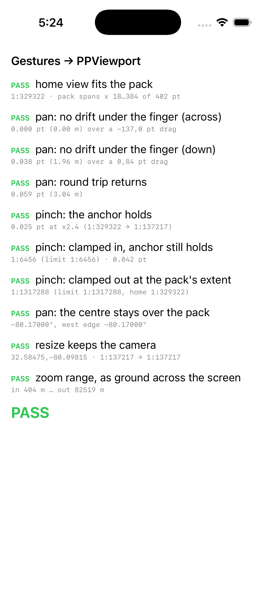

"No drift between the finger and the map" is a number, so it is measured and the measurement
stays in the tree, exactly as `PPPixelProbe` does — **`#if DEBUG` since the store review**, so
it is one launch argument away in any development build and absent from a Release one:

```sh
xcrun simctl launch booted org.peregrine.Pippin --args -PPViewportProbe YES
```

It caught a real one. A pan is defined as "the position under the centre pixel moves by the
drag", and the centre pixel of a `MapProjection` is at **`((w-1)/2, (h-1)/2)`** — FalconView's
pixel-CENTRE convention — where the first cut of the pan assumed `w/2`. Half a pixel of
disagreement is a constant offset on every pan, and it measured 0.24 pt. `PPViewport` now
**asks** the projection where its centre is (`pointForGeo:` of the current centre) instead of
assuming, and an east-west drag is exact to the last digit.

What is left is not a defect and cannot be removed: re-centring an equal-arc projection
changes its degrees-per-pixel with the cosine of the new centre latitude, so a drag with a
north-south component rescales the frame very slightly under the finger — **0.038 pt over an
84 pt drag**, with the pinch anchor holding to 0.025 pt. Measured on an iPhone 17 Pro at the
startup scale.

The probe cannot press the screen — everything from `MapModel.pan(by:)` down is what it
covers, and `-PPGestureDemo YES` drives the same calls the recognizers make, on a timer.
The recognizers themselves were exercised by hand in the simulator: a drag moves the island
under the finger and a two-finger spread zooms about the fingers, both at the numbers in the
table below.

**What a real pinch to z14 makes obvious: every creek is labelled three and four times.** That
is the ledger's standing "no label collision or de-duplication" gap (§2b) and not Pippin's —
a name repeats once per tile it appears in — but a phone zoomed into the marsh is the most
legible demonstration of it in the project so far.

`display.mm_per_pixel` defaults to `25.4 / (163 × displayScale)` — Apple's baseline point
density times the backing scale — so the style engines' millimetre widths come out physically
sized on a 3x screen instead of three times too thin. The pack can override the key.

## The pixel question, settled

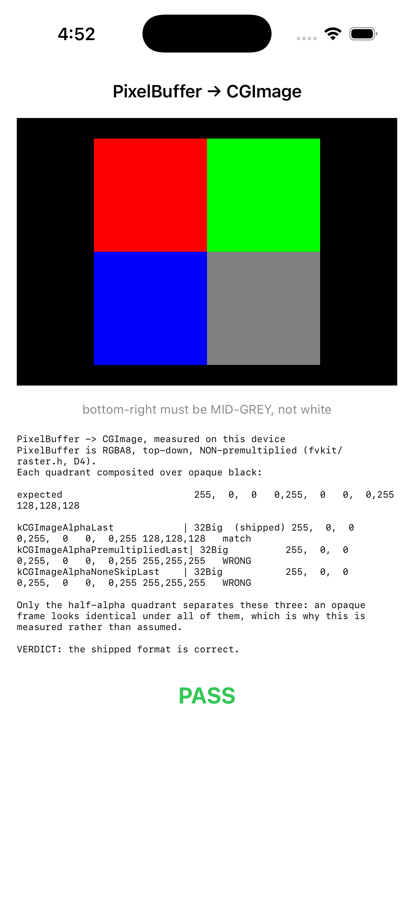

`fv::PixelBuffer` is RGBA8, top-down, **non-premultiplied** (D4, and `cpu_canvas.cpp` says so
at both blend sites). The CoreGraphics twin is:

```
kCGImageAlphaLast | kCGBitmapByteOrder32Big,  8 bpc, 32 bpp, sRGB
```

`32Big` makes the bytes come out in component order on a little-endian phone (`32Little` would
give A,B,G,R); `AlphaLast` is the half that is possible to get wrong, because **an opaque frame
looks identical under all three candidate formats** — the bug would have waited for the first
translucent overlay, somewhere around P5. Measured over black, source (255,255,255,128) reads
back 128,128,128 under `AlphaLast` and 255,255,255 under both `PremultipliedLast` and
`NoneSkipLast`. Top-down needs no flip anywhere: a `CGContext`'s bottom-up user space and
`CGContextDrawImage`'s flip cancel exactly.

The measurement stays in the tree as `PPPixelProbe` and re-runs on any development build in
one launch argument (`#if DEBUG`, like every probe — see BUILDING.md's pre-upload checks):

```sh
xcrun simctl launch booted org.peregrine.Pippin --args -PPPixelProbe YES
```

The frame costs one `memcpy` per frame (the provider needs its own copy, because `CpuCanvas`
reuses its buffer) — ~12 MB on a 3x phone. P3 left it alone on purpose: it now happens on the
render queue rather than the main thread, and it is what makes a finished frame safe to hand
across it. Double-buffering would remove the copy and the safety together.

## The units (P12)

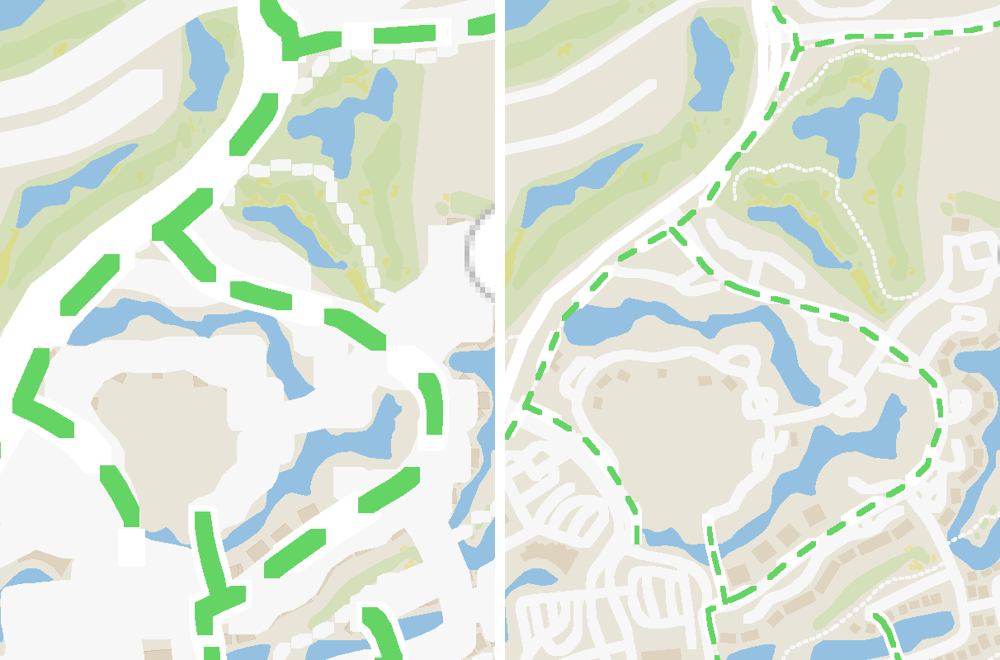

Same pack, same road, same scale, same phone: the left half is what P1–P8 drew and the right
half is what P12 draws. Chris called the left one "as if drawn with a blunt crayon" the first
time he saw it on a real iPhone, and the arithmetic behind it is worth reading once, because
the mistake is one every shell that renders a GL style on a phone is invited to make.

**A pixel in authored artwork is not a pixel on the screen.** A GL style's `line-width` is in
CSS pixels — 1/96 inch by the spec — and `OsmStyleEngine` honours that by scaling every width by
`ctx.device_dpi / 96`. Hand it the screen's TRUE dpi and it will faithfully draw a 1-px casing
1/96 of an inch wide, which on a desktop monitor is one pixel and on a 3x phone is five. Pippin
handed it `25.4 / mmPerPixel` = **489 dpi**, so every road was **5.09x** its authored width.
The zoom relation had the same error in the other direction: derived over the surface pixel, it
told the style and the tile source they were 1.58 levels further in than the view actually was,
so the map drew z14 detail at a z12.4 view — with 5x strokes on it.

**Measured before anything was changed**, which the ledger insisted on because a constant
adjusted until it looks right is a constant nobody can defend later. One road, one scale, three
conventions (the probe is `width_probe.cpp`, thrown away with the session — the numbers are the
artefact):

| A minor road at 1:25,000 | Zoom styled at | Drawn | Physically |
|---|---|---|---|
| the desktop shell (0.25 mm/px, 101.6 dpi) | z14.36 | 3 px | **0.750 mm** |
| the phone, P1–P8 | z16.63 | 36 px | **1.870 mm** |
| the phone, P12 | z15.05 | 11 px | **0.571 mm** |

**The fix is a sentence, and P4 had already written it for symbols: an authored pixel is one
iOS POINT.** That is the unit the ownship is sized in (`symbol_dpi_scale`, P4), the unit
`PPViewport`'s zoom limits have been written in since P3 ("one tile pixel per POINT is the
density a phone map is authored at"), and the unit MapLibre itself renders a GL style in on a
phone. So `PPViewport` grew one accessor, `mmPerPoint` = `mmPerPixel * displayScale`, and
`PPMap::renderViewport` now hands out two different numbers where it used to hand out one:

| Consumer | Gets | Because |
|---|---|---|
| `MapProjection` (already set on the viewport) | the SURFACE pixel | it is placing geometry on a real screen |
| `OsmVectorSource` / `OsmStyleEngine` zoom | `mmPerPoint` | the pyramid is authored per point |
| `VectorRenderer::SetDeviceDpi` | `96 * pixelsPerPoint` | "how many device pixels is an authored pixel" |
| `MovingMapOverlay` / `RouteOverlay` symbols | `pixelsPerPoint` | the same sentence, unchanged since P4 |

Two consequences worth knowing. **Nothing in the core changed**, so no OSM golden moved and
the desktop shell is untouched — this was always the shell's arithmetic. And
**`display.mm_per_pixel` no longer bisects line weight**: the pixels-per-point ratio is the
backing scale whatever the pitch is, so the override now moves the physical size of the result
and the zoom, which is what a pitch override should do and all it should do.


The other half of the same session is the picture above: **the app opens filling the screen
with data** rather than fitting the pack into it. See the startup-view note below for the
geometry, and `-[PPViewport homeScaleFilling:]` for the two-line implementation — `min` where
contain takes `max`. P3's viewport probe had been asserting the OLD rule ("the pack fits inside
the width") and passing happily while the phone showed a third of a screen of map between two
bands of background; it asks the new question now, on both axes, and prints the span it
measured so the next person can see it rather than trust it.

## The pick button says where (P11)

A lat/lon is the one thing a rider on a bike cannot check. So the confirm button under the
crosshair, and the Location row in both sheets, name the nearest thing the rider could actually
ride on: **Use Treeduck Court**, **Use cycleway**, or **No usable path** when there is nothing in
range. It landed in both flows at once because P9 had already made the two spellings one function
each (`LocationText` and `PickOverlay.readout`, in `RouteSheet.swift`), which is what Chris asked
for when he asked for the row to be shared.

**"Usable" means what the ROUTER means, and that is the whole difficulty.** The snap index is
built at `RoadSnapFilter::kAll` — it has to be, or the ship would never snap to the cycleway it
is riding on — so the NEAREST candidate is very often a road the selected profile refuses, and a
button naming it would promise a road the very next replan routes around. The case is on the
fixture and it is Kiawah's own: **Kiawah Island Parkway carries `bicycle=no` for its whole
length** and the island put a cycleway beside it instead. Standing on the parkway, the button
reads "Use cycleway" (8 m away) for a rider and "Use Kiawah Island Parkway" for a car.

The way that is made true rather than approximated: `Router::ArcUsable` became the free
`fv::routing::ArcUsable` and the member now calls it, and the `RouteOptions` it is asked with come
from `RoutePlanner::BuildOptions` — public since this session — rather than being rebuilt beside
it. Same rule file, same profile lookup, same poll, one function. A `private` arc still counts as
usable, because O5b prices a private road rather than deleting it and on a gated island the
private roads ARE the street network.

**"No usable path" is a label and not a block.** The button stays enabled and the pick lands: a
rider aiming at a beach, a car park or the middle of the marsh means it. A pack with no `.fvroad`
says the same thing, and correctly — neither the open sea nor a phone with no roads on it has a
road on it.

**A row is not a crosshair**, and it differs in two ways that are easy to get wrong:

* it does **not remember**. `PPRouteStore::DescribePoint` takes a `remember` flag, false for a
  sheet. The crosshair keeps the road it named last while a different one is within
  `routing.pick_stay_bonus_m` (10 m) of it, because at a junction — or on a road with a cycleway
  beside it — the nearest of the two flips as the map drifts a pixel, and a button blinking
  between "Flyaway Drive" and "cycleway" while it is being read is worse than either. A row
  looking up a stop a mile away would hand that memory a head start somewhere else entirely.
* it falls back to the **numbers**, not to "No usable path". That label is right about a place
  somebody is still choosing and says nothing at all about a place they have already chosen. A
  stop dropped in the Atlantic reads `32.58707, -80.07005`, which is at least a fact.

`routing.pick_radius_m` (50 m) is how far the button looks, and it is deliberately not the
snapper's `max_radius_m`: 60 m there is a GPS error budget, and this is a thumb. Both keys are in
`pippin.ini` because the right values differ between an island of cul-de-sacs and a city grid.

Ten gtests on the mac, in `test/route_store_test.cpp`, and every coordinate in them was read out
of `kiawah.fvroad` itself rather than picked off a map — including the hysteresis pair, which is
Turtle Beach Lane and the cycleway 3 m beside it and needs two calls to say anything at all.

## Five small things, from riding it (P13)

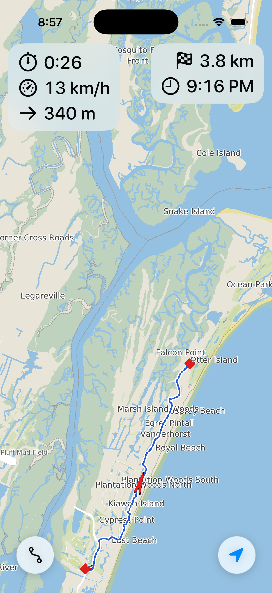

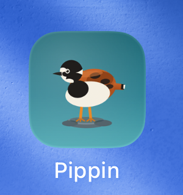

A session with no new machinery in it: five changes Chris asked for after the first rides, all
of them about what the phone LOOKS like rather than what it computes.

**Two more zoom levels in.** `kOverzoomLevels` 3 → 5 in `PPViewport.mm`, so the near limit is
1:1,614 instead of 1:6,456 — about 100 m across a phone. Nothing is read past the pyramid; the
z14 tiles are simply drawn bigger, which is what overzoom means and why the last two levels
cost nothing but a coarser-looking map. Measured on the simulator at the limit: `z14 · 23
features · 12 draws · 104 ms · 1:1,614`.

**The route line, doubled.** `fv_route_overlay.cpp` draws 6 px over a 4 px casing where it drew
3 over 2. The widths are DEVICE pixels: 3 of them is 3 points on a desktop and ONE point on a
3x phone, which is why a line that looked right in the mac tests disappeared under the map on
the bike. The uncalculated great-circle legs went 2 → 4 with it.

**The ride bar is twice the size, in two clusters.** 13 pt was a number to read sitting down;
26 pt is one to read at arm's length on a moving bike. Five readouts at that size do not fit
across a phone in one row, so they split the way the ride does — upper LEFT is what has
happened (elapsed, speed, odometer) and upper RIGHT is what is left of it (distance to go,
arrival time), the right cluster appearing only when there is a route to go along. Each stacks
vertically, so neither cluster's width depends on the other's.

**The app has an icon.** A ruddy turnstone, Chris's artwork, in `port/apps/Pippin/art/` as both
the SVG and the 1024 PNG rendered from it. The artwork draws its own rounded rectangle and iOS
does not want one — the system applies the superellipse mask itself, and a pre-rounded icon is
either masked twice or shows black where the alpha is. So `art/make_icon.py` paints the square
the artwork's own background gradient would have covered, composites the bird over it, and
drops the alpha; the opaque result is what `Pippin/Assets.xcassets/AppIcon.appiconset` holds.
Re-run the script after changing the artwork.

**A new `style.json`.** Chris's edits to `port/Osm/styles/style.json` — marsh and park fills, a
boardwalk with its own casing, landuse reordered — are now committed, which is all Pippin needs
to pick them up: `stage_data.py` copies that exact file into the pack. It loads clean through
`OsmStyleEngine` at 70 layers, and the boardwalks are visible on the phone at 1:12,196.

**And the marsh is a marsh.** 2026-08-30: `marsh_pattern`, a second fill layer over the flat one,
stamping S-52's own `MARSHES1` tuft — the chart symbol for a marsh, HPGL and CHBRN colour lifted
verbatim from `testdata/enc/chartsymbols.xml` by `port/Osm/tools/make_marsh_pattern.py`, which
also pastes the 32 px tile into `symbols/osm-liberty-topo.{png,json}`. The tile carries TWO tufts,
one at its corner and one at its centre, because S-52 fills this pattern staggered while the OSM
path tiles on a plain grid: baking the half-step into the artwork buys the chart's diagonal
lattice with no engine change. It is its own layer because `fill-pattern` may not be a zoom
function, and gating it (z12 up) needs a layer of its own; the flat fill underneath still carries
z6–12 and still fades to half alpha at z16, where the tufts take over the reading. Around Kiawah
that is most of what you can see from the road.

## What the simulator measures

1206x2622 px at 3x, a Debug build of the app over a RelWithDebInfo core. Labels draw with
haloes and are crisp at 3x. `-PPShowStats YES` puts the line on screen.

**Re-measured after P12** (iPhone 17 simulator, 2026-08-19), because the pitch fix moves both
halves of every row: a given 1:N now reads a tile level 1.58 lower, so a frame carries the
features that level was generalized for, and the opening view is a different view entirely.

| Frame | Cost |
|---|---|
| startup (the cover view), 1:96,161, z13, 977 features | 74 ms cold, 53–68 ms after |
| a pan at the same scale, 400 draws | 68 ms |
| the route-fit view on entering GPS mode, 1:123,512, z13, 2311 features | 59 ms |
| riding scale, track-up, 1:15,950, z14, 419 features | 11 ms |

The row that matters to a rider is the last one: at the scale somebody actually rides at, a
frame is 11 ms. The wide views are the expensive ones and they are the ones nobody is moving
during. It is still **driven by actual touches** in the simulator (`swipe` and a two-finger
path), which is the half of P3 the probe cannot reach.

**Re-measured after P18** (2026-08-25). Every row above is now what a base MISS costs, and most
frames are not one:

| | Before | After |
|---|---|---|
| a two-second drag at 1:96,161 | 2 frames drawn, the rest carried by the preview | **23 frames, 20 of them cache hits at 15 ms** — and the pan renders live instead of previewed |
| the demo ride following, z12, 1:131,716 | every frame a full vector render | **2115 of 2373 frames served, 8 ms each**; the misses cost 25–33 ms |
| the cold-start view, 1:96,161, z13 | 74 ms | 44 ms base + 11 ms overlay, deliberately unbanded |

The live-render budget still stands but no longer means what it did — see P18's first
"worth not re-deriving" above, which is the bug that reading it the old way produces.

For the record, the P2–P8 numbers this table replaces, all taken under the old convention:
startup 1:329,322 z12 1145 features 23–34 ms; a pan at 1:102,112 z13 578 features 14 ms; 1309
features in frame 43 ms; a pinch to 1:90,093 z14 3827 features 110 ms. The 3827-feature frame
is the one P12 makes unreachable: that view is z13 now, which is what the phone should have
been drawing all along.

**The startup view COVERS the screen rather than fitting the pack** (P12; until then it fitted,
and a portrait phone showed bands of style background above and below the map). `home_bounds`
is 0.20° of longitude by 0.12° of latitude — a landscape box — and a phone held upright is the
opposite shape, so something has to give: what gives now is the island's long axis, which runs
off the sides at 1:96,161 on a 3x phone and comes back with one pinch. The zoom-OUT limit is
still derived from the CONTAIN fit, so nothing was taken away from the pinch that brings it
back — 1:1,317,288, unchanged.

## The data pack

Offline by construction — v1 has no network code at all, so everything the app reads is inside
the bundle. `stage_data.py` assembles it and `pippin.ini` names every piece by a
**bundle-relative** path (an absolute path is a path that exists on one computer and no phone).

```sh
python3 port/apps/Pippin/stage_data.py           # stage port/apps/Pippin/Data/
python3 port/apps/Pippin/stage_data.py --check   # verify a staged pack
python3 port/apps/Pippin/stage_data.py --release # the pack that ships
```

**`--release` is the pack an archive gets**, and the difference is one row: the 407 KB demo
ride, which is reachable only from `-PPDemoFeed` and therefore not reachable at all in a
Release build (the flag and every probe are `#if DEBUG`). It also REMOVES the file from a pack
staged without the flag earlier, so the two cannot quietly coexist. 3.6 MB against 4.0 MB.

`Data/` is git-ignored: it is ~3 MB of build artifacts cut out of git-ignored `testdata/`, and
it is reproducible from what IS tracked. The manifest lives in the script, and every path
`pippin.ini` names is checked to exist after staging — a settings key pointing at nothing is
the failure mode a phone reports as a blank map at 3 pm on a bike.

| In the pack | Made by |
|---|---|
| `kiawah.mbtiles` (1.9 MB, 119 tiles, z0–z14) | `port/tools/mbtiles_cut.py`, a bbox cut of `testdata/OSM/mbtiles/us-south.mbtiles` |
| `kiawah.fvroad` (206 KB) | `fvgraph build` over the four `testdata/OSM/map*.osm` extracts, **honouring access** |
| `style.json` + `symbols/osm-liberty-topo.{png,json}` | `port/Osm/styles/`, CyclOSM and the sheet its `sprite` names |
| `peregrine-osm.json` | `port/Osm/styles/`, the port's own plainer look |
| `route-weights.json` | `port/Routing/rules/`, where `foot` and `bicycle` come from |
| `kiawah_cycle.gpx` (407 KB) | `testdata/`, the real 28-minute ride P4's demo feed replays — **development packs only**, see `--release` |
| `kiawah.fvpoints` (24 KB) | **written by `stage_data.py` itself** — see below |
| `fonts/DejaVuSans.ttf` + `LICENSE_DEJAVU` | copied from a matplotlib install by `stage_data.py` |
| `pippin.ini` | this directory |

Four things to know about the pack:

* **`kiawah.fvpoints` is GENERATED, and it is the only row above that is.** A `.fvpoints`
  document IS a SQLite database — that is the whole reason A6 chose the format — so Python's own
  `sqlite3` writes it with no tool of ours and no C++ in the loop. The alternative was staging a
  binary out of `testdata/`, which would put a generated artifact in a manifest of real data and
  give nobody anywhere to edit the set. The cost is a SECOND copy of the schema, in another
  language, and the authority is `point_overlay.cpp`'s `kSchema`: if they ever disagree, the C++
  is right. That is tolerable only because the reader on the other side is defensive by design —
  it probes for each column and defaults a missing one — and it is checked, by
  `PointStore.ThePacksOwnSetOpensThroughTheRealReader` in the mac test bed, which opens the file
  this script wrote with the reader that runs on the phone. **The contact details in it are
  deliberately fake**: real places, reserved 555 numbers and `.invalid` hosts, because a demo
  file whose markers ring an actual business is a bad demo. It also EMBEDS the artwork — the
  `ICONS` list names maki file stems in `testdata/GeoSymbol/makiPng` (CC0, so redistribution is
  free) and each one's PNG bytes go into the document's `symbols` table. Forty-odd rather than
  all 216, because the store copies the seed into `Documents/` — so every byte is on the phone
  twice — and because forty is a picker somebody can scroll without a search field. Adding one
  is adding a line; an icon the directory does not have is reported and skipped, and the points
  that wanted it keep their shapes.

* **The style is CyclOSM and it DOES carry a sprite sheet.** `pippin.ini`'s `osm.style` selects
  `style.json`, whose `sprite` is `symbols/osm-liberty-topo` — a value the engine resolves
  against *the directory of the style file it read*, which in the pack is the pack root. So the
  sheet is staged as `symbols/osm-liberty-topo.png` **and** `.json`: `PngSymbolLibrary` opens
  the pair, and half a pair is no sheet. Nothing else would catch a missing one — a style whose
  derived sprite base will not open is deliberately *not* an error in `OsmStyleEngine` (a style
  published without its sheet still draws, just iconless), so `stage_data.py` reads the staged
  style's own `sprite` and checks the pair itself. The `glyphs` key is a `{{ }}` template and is
  ignored: labels come from `pippin.font`. `peregrine-osm.json` is staged too — the plainer
  look, and the name `PPMap` falls back to if `osm.style` ever goes missing.
* **The mbtiles cut is byte-exact.** Tiles are copied whole, so a frame drawn from the cut is
  pixel-identical to the same frame drawn from `us-south` — pinned on the mac by
  `OsmRender.KiawahCutMatchesSource`, at two scales, against the source rather than against a
  hash (a hash would need re-pinning every time us-south is re-cut).
* **The label font is DejaVu Sans**, which P1 left open. `CpuCanvas::SetDefaultFont` wants a
  TTF on the filesystem and iOS gives an app no readable path to a system face, so the pack has
  to carry its own. DejaVu is under the Bitstream Vera licence — redistribution is permitted as
  long as the notice travels with the font, so `LICENSE_DEJAVU` is staged beside it and is a
  required manifest row, not a courtesy. The file keeps its own name: renaming is the one thing
  that licence has an opinion about. `fonts/` is git-ignored like `Data/`, and `stage_data.py`
  sources the face from a copy already on the machine (matplotlib ships one) rather than from
  the network; with none it says what to download and stops.

## The cross-build

```sh
cmake --preset ios        && cmake --build build-ios -j       # device, arm64
cmake --preset ios-sim    && cmake --build build-ios-sim -j   # simulator
```

`FVW_IOS` is *set*, not asked for, when the toolchain says iOS, so nobody can configure an iOS
build and forget the flag. It turns off everything with a host in it — tests (a device runs no
ctest), the CLI tools (`fvrender`/`fvpack`/`fvgraph` MAKE the data a phone reads), and pyfvw
(no CPython in a bundle) — and adds this directory.

The product is **`build-ios/port/apps/Pippin/libpippin_core.a`**: 66 MB, one archive, 22 static
libraries merged by `xcrun libtool -static`. The Xcode target links that one file instead of
naming fifteen libraries in a dependency order that nothing would check. The link-line
arguments that are *not* in the archive are written beside it in `pippin_core_link_flags.txt`
(`-lsqlite3 -lz -framework CoreFoundation`) — SQLite is the iOS SDK's own, and there is no
UIKit and no Foundation, because nothing below PippinKit is allowed to know iOS exists.
PippinKit's own link line adds `CoreGraphics` and `Foundation`, which is where iOS starts.

`pippin_core_deps` is the INTERFACE target for anything inside this build that wants to link
the core the CMake way. **Routing is linked beside fvkit, never under it** — the ledger's
invariant is that fvkit does not link `port/Routing`, and the app layer is the one that is
allowed to have both — and since P5 the list says so: `fv_routekit` is on it, for exactly
that reason.

**Xcode does not build the core.** A "Check the Peregrine core" script phase verifies the
archive and the staged pack exist and prints the command that makes each; running CMake from
inside an Xcode build is the kind of magic that works until it silently does not.

## The link check (P1)

A merged archive proves nothing about unresolved symbols, so P1 links a real iOS executable
and calls the seams. It is still the fastest way to test the core on the phone's SDK without
the app:

```sh
xcrun simctl spawn booted build-ios-sim/port/apps/Pippin/pippin_link_check \
    "$PWD/port/apps/Pippin/Data" /tmp/kiawah.png
```

Run 2026-08-18: the pack opens, the walk and cycle routes from Ruddy Turnstone to the beach
club are both found (2.16 km, 1553 s on foot and 519 s by bike), and a 390x750 phone-shaped
frame of Kiawah draws at z14 — 978 features, 880 draws. For the device build the link is the
whole of it; nothing here runs a test, because **the mac is the test bed for every line of this
C++**.


## Simulator build/run/Testing cheatsheet ##

*The procedure, in order and without the reasoning, is [BUILDING.md](BUILDING.md). What follows
is the same commands with the reasons attached, and the traps written out.*

### Running it in the simulator

The one-button way: open port/apps/Pippin/Pippin.xcodeproj in Xcode, pick an iPhone simulator, press Run. A build phase checks the core archive and the data pack first and fails with the exact command to type if either is missing.

### From the terminal, three steps — the first two only when their inputs changed:

```sh
python3 port/apps/Pippin/stage_data.py
```
```sh
cmake --preset ios-sim && cmake --build build-ios-sim -j
```
```sh
xcodebuild -project port/apps/Pippin/Pippin.xcodeproj -scheme Pippin -sdk iphonesimulator -destination 'platform=iOS Simulator,name=iPhone 17 Pro' build
```

Then install and launch what that built:

```sh
xcrun simctl install booted ~/Library/Developer/Xcode/DerivedData/Pippin-*/Build/Products/Debug-iphonesimulator/Pippin.app && xcrun simctl launch booted org.peregrine.Pippin
```

The launch arguments, each one a screen. **All of them are `#if DEBUG`** (store review,
2026-09-02): a Release build reads none of them and contains none of the screens, so these work
in a development build and are simply not there in an archive.

```sh
xcrun simctl launch booted org.peregrine.Pippin --args -PPShowStats YES
```

`-PPShowStats YES` puts the frame cost on the map, and since P4 the ownship's position,
stamped angle and speed under it. `-PPViewportProbe YES` runs P3's nine gesture checks.
`-PPPixelProbe YES` runs P2's alpha measurement. `-PPGestureDemo YES` drags and pinches on a
timer without a finger. `-PPDemoFeed YES` replays the bundled Kiawah ride instead of asking
the phone where it is — which is how the ownship is seen on a device nowhere near the island,
and how the simulator shows something moving without a location scheme.

To drive the LIVE path in the simulator instead, give CoreLocation a ride of its own:

```sh
xcrun simctl location booted start --speed=8 32.6045,-80.0790 32.6055,-80.0740 32.6062,-80.0690
```

**One caveat on the install command above, and it is worth reading before it costs you an
hour.** `xcodebuild` with no `-derivedDataPath` writes to `~/Library/Developer/Xcode/DerivedData/Pippin-*`,
NOT to `build-xcode/`. A `build-xcode/` left behind by an earlier session that DID pass
`-derivedDataPath` will still be sitting there with a stale `Pippin.app` in it, and
`simctl install` of that path succeeds and runs old code — a build that says BUILD SUCCEEDED
followed by a simulator that behaves like last week. P8 lost a while to exactly that. Either
install from the DerivedData glob (as above), or pass `-derivedDataPath build-xcode` to
`xcodebuild` so the two agree; check `ls -la` on the binary's timestamp when in doubt.

## Onto a real iPhone

The device path differs from the simulator's in exactly three places: the core is the **arm64
device** archive rather than the simulator one, the app has to be **signed**, and the phone has
to be **willing to run it**. Everything else — the data pack, the launch arguments, the
one-button Xcode route — is the same.

First-time phone setup, once per device:

* Plug the phone in (or pair it over Wi-Fi in Xcode's Devices window), unlock it, and answer
  **Trust This Computer**.
* Turn on **Settings → Privacy & Security → Developer Mode** and let the phone restart. iOS 16+
  will not launch a sideloaded build without it, and the error you get without it says nothing
  useful.
* The target is signed **Automatic** with bundle id `org.peregrine.Pippin`. The team comes from
  `PP_DEVELOPMENT_TEAM` in the git-ignored `local/Local.xcconfig`, so the tracked project names
  none; Signing & Capabilities in Xcode and `DEVELOPMENT_TEAM=` on the `xcodebuild` line are the
  other two ways to supply it. A different Apple ID means changing the bundle id as well,
  because a bundle id has to be unique to the account that signs it.
* `IPHONEOS_DEPLOYMENT_TARGET` is **17.0** and `TARGETED_DEVICE_FAMILY` is 1: iPhone only,
  portrait only.

### The one-button way

Open `port/apps/Pippin/Pippin.xcodeproj`, pick the phone in the destination menu, press Run.
The "Check the Peregrine core" phase switches on `$PLATFORM_NAME`, so on a device destination it
looks for **`build-ios/`** rather than `build-ios-sim/` and fails with the preset that makes it.
So build that first, whenever the C++ changed:

```sh
python3 port/apps/Pippin/stage_data.py
```
```sh
cmake --preset ios && cmake --build build-ios -j
```

On the very first launch of a build signed with a personal (free) Apple ID the phone refuses it
until you approve the profile: **Settings → General → VPN & Device Management → Developer App →
Trust**. A paid team profile skips this.

### The route onto the phone (Chris, 2026-08-21: use this one)

**Five commands, and the last two are the ones that matter.** Clear the profile
cache, build the device core, archive, export a `.ipa`, install it:

```sh
rm -f ~/Library/Developer/Xcode/UserData/Provisioning\ Profiles/*.mobileprovision
```
```sh
cmake --preset ios && cmake --build build-ios -j
```
```sh
xcodebuild -project port/apps/Pippin/Pippin.xcodeproj -scheme Pippin -sdk iphoneos -destination 'generic/platform=iOS' -configuration Release -allowProvisioningUpdates -archivePath build-xcode/Pippin.xcarchive archive
```
```sh
xcodebuild -exportArchive -archivePath build-xcode/Pippin.xcarchive -exportOptionsPlist port/apps/Pippin/ExportOptions.plist -exportPath build-xcode/ipa
```
```sh
xcrun devicectl device install app --device "$IPHONE" build-xcode/ipa/Pippin.ipa
```

The core build is only needed when the C++ changed, and the export needs the
archive that the command above it makes — the last two on their own will happily
re-export a week-old `.xcarchive` and install last week's app. The `rm` and
`-allowProvisioningUpdates` go together: the first makes automatic signing issue
a fresh seven-day profile instead of reusing a part-spent one, and the second is
what lets xcodebuild reach Apple to issue it. Neither is optional on a re-sign.

**NOT a re-signing tool, which is the reason this is written down.** Those
apps — the ones that automatically extend a sideloaded build before its profile
expires — **rewrite the bundle identifier**, and an app under a rewritten id is
a SECOND app: it gets its own `Documents/` (so its points, route and recorded
rides are invisible to the real one), and it claims the `pippin` URL scheme
alongside it, which makes the share extension's handoff a coin toss over which
app iOS launches. `org.peregrine.Pippin.<team-id>` is exactly
that, and it cost an afternoon of P14 debugging.

**The seven-day clock is what those tools exist to solve, and the answer here is
to re-run the five commands.** See "Packaging a .ipa" below for why a free Apple
ID's profile expires in a week, what a paid account changes, and why the install
must come from the `.ipa` rather than from `build-xcode/Build/Products/`.

### From the terminal, without the .ipa

Build, signing as it goes — `-allowProvisioningUpdates` is what lets automatic signing create or
refresh the profile without the Xcode UI:

```sh
xcodebuild -project port/apps/Pippin/Pippin.xcodeproj -scheme Pippin -sdk iphoneos -destination 'generic/platform=iOS' -derivedDataPath build-xcode -allowProvisioningUpdates build
```

`generic/platform=iOS` is the "Any iOS Device" destination — it builds arm64 for whatever phone
you later install to, so the build does not need the phone plugged in. (`xcodebuild -project
port/apps/Pippin/Pippin.xcodeproj -scheme Pippin -showdestinations` lists the connected one by id
if you would rather name it.)

Find the phone, then install and launch on it. `devicectl` is Xcode 15+ and replaces the old
`ios-deploy`; `--device` takes the identifier, the UDID, or the name from the listing — the
identifier is the one to use, because a phone's name usually has an apostrophe in it:

```sh
xcrun devicectl list devices
```
```sh
export IPHONE=<the Identifier column from that listing>
```
```sh
xcrun devicectl device install app --device "$IPHONE" build-xcode/Build/Products/Debug-iphoneos/Pippin.app
```
```sh
xcrun devicectl device process launch --device "$IPHONE" org.peregrine.Pippin
```

Launch arguments go **after** the bundle id and reach the app the same way `simctl launch --args`
does, so every screen the simulator cheatsheet lists is reachable on the phone. `--console` keeps
the process attached and prints its stdout, which is the device equivalent of watching the
Xcode console:

```sh
xcrun devicectl device process launch --console --device "$IPHONE" org.peregrine.Pippin -PPShowStats YES
```

**Pass `-derivedDataPath build-xcode` here and mean it.** The stale-build trap described just
above is worse on a device, because `devicectl install` of an old `.app` is silent and the phone
then runs last week's code with today's expectations. One derived-data path for both SDKs, and
`ls -la` on `build-xcode/Build/Products/Debug-iphoneos/Pippin.app/Pippin` when the phone does
something the simulator does not.

### Packaging a .ipa

An `.ipa` is a signed `Payload/Pippin.app` in a zip, and `xcodebuild` makes one in two steps:
**archive**, then **export**. Both use the **Release** configuration, which is the reason the
step before them matters.

**Build the DEVICE core first.** The archive is `iphoneos`, so the "Check the Peregrine core"
phase looks for `build-ios/` — and a `build-ios/` left over from before a core change links
against yesterday's symbols and fails somewhere confusing (this is how P14 found that `build-ios`
had never been rebuilt since P10 added `GpxRecorder`):

```sh
python3 port/apps/Pippin/stage_data.py && cmake --preset ios && cmake --build build-ios -j
```

**Clear the cached profiles first.** Automatic signing reuses a cached profile that has not
expired *yet*, so an archive can ship a profile that is already days old and dies days early —
on 2026-08-27 that is exactly what had happened: the app's profile was issued on the 19th and the
extension's on the 21st from a single archive, and the app stopped launching a day before the
extension's profile ran out. Deleting the cache makes both reissue together with a full week:

```sh
rm -f ~/Library/Developer/Xcode/UserData/Provisioning\ Profiles/*.mobileprovision
```

Archive. **`-allowProvisioningUpdates` is not optional here** — with no cached profile, xcodebuild
has to reach Apple to mint one, and without the flag it fails instead of asking:

```sh
xcodebuild -project port/apps/Pippin/Pippin.xcodeproj -scheme Pippin -sdk iphoneos -destination 'generic/platform=iOS' -configuration Release -allowProvisioningUpdates -archivePath build-xcode/Pippin.xcarchive archive
```

Export, using the options file kept beside the project:

```sh
xcodebuild -exportArchive -archivePath build-xcode/Pippin.xcarchive -exportOptionsPlist port/apps/Pippin/ExportOptions.plist -exportPath build-xcode/ipa
```

That writes `build-xcode/ipa/Pippin.ipa` — about 3.7 MB, most of it the Kiawah pack — beside a
`Packaging.log` and a `DistributionSummary.plist` worth reading when something is signed wrong.

Install it:

```sh
xcrun devicectl device install app --device "$IPHONE" build-xcode/ipa/Pippin.ipa
```

`devicectl` takes the `.ipa` directly, so there is no need to unzip it. Apple Configurator (drag
it onto the device) and any of the sideloading tools take the same file.

**Install from the `.ipa` or the `.xcarchive`, NEVER from `build-xcode/Build/Products/`.** That
directory belongs to "From the terminal, without the .ipa" above, and it does not get rebuilt by
an archive — so it keeps whatever profile it was signed with, indefinitely. Installing yesterday's
`Debug-iphoneos/Pippin.app` after a perfectly good re-signing reports the failure against the
*app*, which sends you looking at the archive you just fixed:

```
ERROR: Unable to Install "Pippin" (IXUserPresentableErrorDomain error 14)
       Failed to install embedded profile for org.peregrine.Pippin : 0xe8008011
       (This provisioning profile has expired.)
```

Read the profile rather than guessing which bundle is current — `-D` decodes the CMS wrapper, and
the extension carries its own, so check both:

```sh
security cms -D -i build-xcode/Pippin.xcarchive/Products/Applications/Pippin.app/embedded.mobileprovision | plutil -extract ExpirationDate raw -
```
```sh
security cms -D -i build-xcode/Pippin.xcarchive/Products/Applications/Pippin.app/PlugIns/PippinShare.appex/embedded.mobileprovision | plutil -extract ExpirationDate raw -
```

(The `.ipa` is a zip, so it has to be unzipped before the same check works on it; the `.xcarchive`
is a directory and holds the identical bundle.)

**THE SEVEN-DAY CLOCK.** The signing identity on this mac is `Apple Development` under a FREE
Apple ID, and a free team's provisioning profile expires **one week** after it is issued. When it
does, the app stops launching and the phone says nothing that explains why. Re-run the commands
above — cache removal included, or the reissue may be short — and reinstall; the app's documents
(`points.fvpoints`, the route, `trips/`) live in `Documents/` and survive a reinstall over the
top. A paid Apple Developer account is what buys a year instead of a week, and with it the other
two export methods.

No date is written down here on purpose: it would be wrong within the week. Ask the bundle with
the `security cms` command above. Note that the **certificate** is a separate thing with a
separate life — `security find-identity -v -p codesigning` names it, and it is good for a year —
so an expiry a week out is always the profile, never the identity.

**`method` is `debugging` and cannot be anything else today.** That is Xcode 15.3+'s name for the
old `development`: signed with a development identity, installable only on devices already listed
in the profile. `release-testing` (ad-hoc, for other people's phones) and `app-store-connect`
(TestFlight) both need a **distribution** certificate, which a free account does not have — so
they fail at export rather than at install, which at least is quick.

**The share extension has its own bundle id and its own profile.** `org.peregrine.Pippin.Share`
(P14) is a second App ID, registered under the same team, and both are embedded in the `.ipa`.
Nothing has to be done about it by hand — automatic signing creates it on the first build — but
it is worth knowing two things: a free account is rate-limited on new App IDs (10 in 7 days), and
if the extension ever fails to sign, the app still installs and simply does not appear in other
apps' share sheets.

**An UNSIGNED .ipa, for the sideloading tools that re-sign it themselves** (AltStore, Sideloadly)
is just the app in a folder called `Payload`, zipped:

```sh
mkdir -p build-xcode/Payload && cp -R build-xcode/Build/Products/Release-iphoneos/Pippin.app build-xcode/Payload/ && (cd build-xcode && zip -qry Pippin-unsigned.ipa Payload)
```

That is only useful as input to something that signs it; iOS will not install it as it stands.

### What the phone can and cannot show you

**GPS is real and the pack is Kiawah**, so unless you are on the island the live path draws an
ownship the map has no data under. That is what `-PPDemoFeed YES` is for — it replays the bundled
28-minute ride and is how P4 through P8 were seen on a phone that never left the mainland. There
is no `simctl location` equivalent for a device; the alternatives are the demo feed, or being
there.

```sh
xcrun devicectl device process launch --device "$IPHONE" org.peregrine.Pippin -PPDemoFeed YES
```

CoreLocation asks for **When In Use** on first launch (the string is in the pbxproj's
`INFOPLIST_KEY_NSLocationWhenInUseUsageDescription`), and a denial sticks until it is changed in
Settings → Pippin. There is no background mode: the app is a thing you look at while riding, and
iOS suspends it when you do not.

Things worth doing on a device that the simulator cannot answer: line weight and label size
against a real 460-ppi screen at arm's length (see the two findings from the first device run
above), frame cost on the phone's own thermals rather than a mac's, and whether the map is
readable in sunlight.
