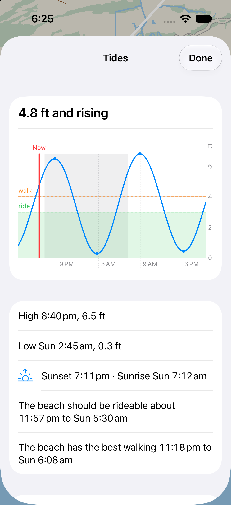
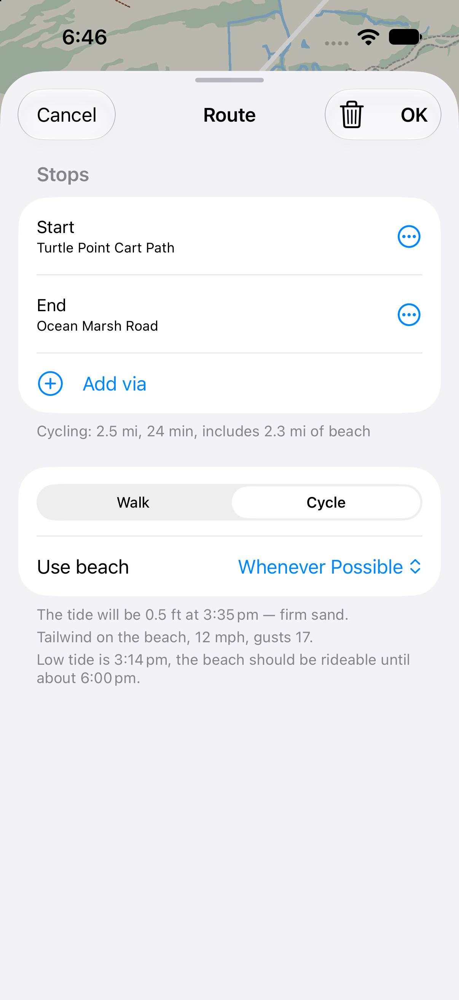

# Tides, sun and wind

How Pippin knows the tide, the daylight and the wind on the beach, and what to change to
point it at a different beach. The Kiawah pack is the worked example throughout.

Pippin uses these four sources:

| Topic | Source | Online? | Where it shows |
|---|---|---|---|
| Tide | NOAA CO-OPS high/low predictions, fetched at build time | No, it ships in the pack | Tide card; the beach verdict in the route sheet; the route planner's tide gate |
| Sunrise/sunset | Computed on the phone (NOAA solar method) | No | Tide card: a sun line, and nights shaded on the chart |
| Wind | National Weather Service, `api.weather.gov` | Yes, on demand, cached for an hour | Tide card; the route sheet's beach line |
| Beach geometry | OSM `natural=coastline`, turned into arcs by `fvgraph build --beach` | No | The router: the "Use beach" choice |




## The pieces

Each layer only calls the one below it. As everywhere in Pippin, nothing below PippinKit
knows about iOS.

| Layer | File | What it does |
|---|---|---|
| Build tool | `port/tools/fetch_tides.py` | Fetches NOAA hi/lo predictions for one station and writes a `tides.json` |
| Pack | `stage_data.py` (`Item(... "tides.json")`, `check_tides`) | Copies the table into the pack, checks its station id against `pippin.ini`, and warns when less than a year is left |
| Core | `port/include/fvkit/nav/tide.h`, `fvkit/nav/tide.cpp` | `TideTable`: height, trend, extremes, and the windows below a height, all from the table |
| Core | `fvkit/nav/beach.h`, `beach.cpp` | `BeachTideVerdicts`: good / marginal / poor / unknown for each timed beach stretch |
| Core | `fvkit/nav/sun.h`, `sun.cpp` | `SunEvents`: sunrise and sunset for a position over a time span |
| Core | `fvkit/nav/wind.h`, `wind.cpp` | `WindForecast` parses an NWS gridpoint document. Also computes tailwind, onshore wind and the seaward-normal geometry |
| Routing | `fv_route_planner.cpp` (`BeachTideGate`), `PPRouteStore` | Replans without the beach when a stretch is poor, and can keep the beach when the tide is unknown |
| Bridge | `PippinKit/PPMap.mm` (`loadTides`, `loadWindSettings`), `PPTide`, `PPWind` | Reads `[tides]`, `[beach]` and `[wind]`, and passes the table to the route store |
| App | `WindFeed.swift` | Fetches from NWS (`/points` and then the grid), keeps an on-disk cache, and works offline |
| App | `TideText.swift`, `WindText.swift` | All the wording and units. Foundation only, so both are tested on the mac |
| App | `TideCard.swift`, `RouteSheet.swift` | The card and the sheet's beach footer |

Tests: `fvkit/nav/test/nav_tide_test.cpp` (checks the interpolation against NOAA's 6-minute
predictions), `nav_beach_test.cpp`, `nav_sun_test.cpp` (against USNO), `nav_wind_test.cpp`
(uses the committed fixture `data/nws-chs-82-68-2026-09-26.json`), the tide-gate cases in
`route_planner_test.cpp` and `route_store_test.cpp`, and `test/tide_text_test.swift`.

## How the data flows

```
fetch_tides.py ──▶ testdata/tides/<station>.json ──stage_data.py──▶ Data/tides.json
                                                                      │
PPMap.loadTides ◀─────────── pippin.ini [tides] file, [beach] limits ─┘
   ├─▶ TideTable ──▶ RouteStore::SetTide ──▶ RoutePlanner's BeachTideGate
   └─▶ PPTide ──▶ TideCard (curve, extremes, beach windows, sun at the station)

pippin.ini [wind] lat/lon ──▶ PPWindSettings ──▶ WindFeed
   GET /points/{lat},{lon} ──▶ properties.forecastGridData (saved in UserDefaults)
   GET the grid URL ──▶ WindForecast::Parse ──▶ TideCard, RouteSheet
```

Some behaviour worth knowing before changing anything:

- **Both the tide and the wind are optional.** If `[tides] file` is missing or does not load,
  the error is logged and there is no Tides menu item. If `[wind] lat`/`lon` is missing,
  there is no wind anywhere. Neither one stops the map from loading.
- **The sun is computed at the tide station's `lat`/`lon`** (`PPTide.sunEvents`). A pack with
  no tide table has no sun line either.
- **The wind request sends a fixed point from the pack and never the rider's position.** The
  privacy manifest depends on this. Keep it that way when adding another provider.
- **Nothing is extrapolated.** If a time falls outside the table, the tide is reported as
  unknown. The card warns 60 days before the table ends. After it ends, beach routes are still
  offered but come with a warning (`BeachTideGate::keep_unknown`, on by default).
- **The prediction is the astronomical tide only.** Wind set-up and storm surge are not
  modelled. The card says so, and a strong onshore wind is flagged. The wind does not change
  the tide verdict or the ETA.

## `tides.json`

`fv::nav::TideTable` reads this format and nothing else. `fetch_tides.py` is one way to write
it; any other source can write the same file. This is the start of Kiawah's:

```json
{
 "format": "peregrine-tides/1",
 "source": "NOAA CO-OPS tide predictions (public domain)",
 "fetched": "2026-09-25",
 "station": {
  "id": "8667062", "name": "KIAWAH BRIDGE, KIAWAH RIVER",
  "lat": 32.6033, "lon": -80.1317,
  "type": "subordinate", "reference_id": "8665530",
  "offsets": {"high_time_min": 14, "low_time_min": 6,
              "high_height": 1.07, "low_height": 0.89, "height_type": "R"}
 },
 "datum": "MLLW",
 "units": "m",
 "valid_from": 1767225600,
 "valid_until": 1924992000,
 "extremes": [
  [1767060900, -0.108, "L"],
  [1767084240, 1.812, "H"],
  ...
 ]
}
```

The table is rejected when any of these checks fail:

- `units` must be `"m"`.
- `valid_until` must be later than `valid_from`. Both are Unix seconds, UTC.
- `extremes` must be `[unix_s, height_m, "H"|"L"]` rows in time order, alternating H and L,
  and each high must be above the lows on either side of it.
- The first extreme must be at or before `valid_from`, and the last at or after
  `valid_until`. `fetch_tides.py` pads the span by two days on each side for this reason.

`datum` is shown on the card as it is ("Heights above MLLW"). All the thresholds in `[beach]`
are measured from this datum. `station.lat`/`lon` are only used for the sun.
`station.id` must match `[tides] station`, which `stage_data.py` checks. `type`, `offsets`,
`source` and `fetched` are there for people to read; the loader ignores them.

Between two extremes the curve follows NOAA's cosine interpolation, so it passes exactly
through every high and low. Measured against NOAA's own 6-minute series at Charleston, the
error is at most 0.137 m (RMS 0.051 m). That is roughly 6 minutes on a ride-window edge,
and inside `exit_margin_s`.

## Settings (`pippin.ini`)

| Key | Kiawah | Meaning |
|---|---|---|
| `[tides] file` | `tides.json` | Table path, relative to the pack. Leave it out to turn the tide off |
| `[tides] station` | `8667062` | Must equal `station.id` in the file |
| `[beach] rideable_below_m` | 0.91 | Above this height, a cycling stretch is **poor** and the planner drops the beach |
| `[beach] good_below_m` | 0.76 | At or below this height, the sand is firm (**good**). Between the two it is **marginal** |
| `[beach] walk_good_below_m` | 1.22 | Easy walking at or below this height. Above it the walk continues with a warning |
| `[beach] walk_passable_below_m` | unset | Unset means a walk keeps the beach at any tide. Set it to drop the beach for walkers |
| `[beach] exit_margin_s` | 600 | How long after leaving a stretch the water must still stay passable |
| `[beach] faces_deg` | 167 | The direction the beach faces out to sea, in degrees true. Decides which side is the sea |
| `[wind] lat`, `lon` | 32.6062, -80.0645 | The forecast point on the beach. Leave them out to turn the wind off |
| `[wind] onshore_warn_mps` | 7 | A sustained onshore component at or above this warns that the water may run higher than predicted |
| `[wind] headwind_warn_mps` | 5 | A headwind at or above this along a beach stretch is named in the route sheet |

All heights are in metres above the table's datum, and all speeds are in m/s. The app converts
to feet and mph for display when the rider has chosen miles.

## Moving to another US beach

1. **Choose a tide station.** Use NOAA's Tides & Currents map
   (tidesandcurrents.noaa.gov → Tide Predictions). Pick the station whose water behaves like
   your beach. On an open coast, the nearest ocean-facing station usually beats a closer one
   up a river or sound, because timing can differ by an hour or more. Harmonic (reference) and
   subordinate stations both work: `fetch_tides.py` records which kind the station is and,
   for a subordinate, its offsets.

2. **Fetch five years of predictions:**

   ```bash
   python3 port/tools/fetch_tides.py 8720218 2026-2030 testdata/tides/8720218.json
   ```

   The example is Mayport, FL. The script makes one request per year, and each extreme goes on
   its own line so that two fetches diff cleanly. The script needs the network; staging does
   not. Add `--samples` if you want NOAA's 6-minute series for an interpolation test. NOAA
   only publishes that series for harmonic stations.

3. **Point the pack at the new table.** Two edits are needed:
   - In `stage_data.py`, change the `Item("testdata/tides/8667062.json", "tides.json", …)`
     source path.
   - In `pippin.ini`, set `[tides] station` to the new id.

4. **Set the beach thresholds from local knowledge.** Kiawah's numbers are specific to a wide,
   flat, hard-packed beach with a range of about 2 m. They do not carry over to other beaches.
   A narrow or steep beach may be unrideable well below mid-tide. Start conservatively: set
   `rideable_below_m` a little above mean low water, set `good_below_m` 0.15 m or so under it,
   and then adjust after riding the beach at a known height. The card draws both lines, so a
   single ride with the card open is enough to calibrate. Work in the table's datum (MLLW for
   NOAA), not in "feet above low tide".

5. **Set `[beach] faces_deg`.** This is the bearing from the sand straight out to sea: 90 for
   a beach facing east, 180 for one facing south. It only has to be good enough to pick the
   correct side of each stretch, so a curving beach is fine.

6. **Set `[wind] lat`/`lon`** to a point on the sand, in the middle of the stretch that riders
   use. NWS forecasts on a grid of about 2.5 km, and the app sends four decimals. To confirm
   that the point is covered, check that
   `https://api.weather.gov/points/<lat>,<lon>` returns a `forecastGridData` URL. A point
   offshore, or one in a cell NWS treats as marine, may not return one.

7. **Put the beach in the road graph.** The router can only put a route on the sand if the
   graph has beach arcs. Build the graph from an OSM extract that includes
   `natural=coastline`, using `fvgraph build --beach`. `fvgraph info` then prints a beach
   line. Without beach arcs, the "Use beach" row is hidden and the tide only appears on the
   card.

8. **Stage and check the pack.** `python3 port/apps/Pippin/stage_data.py` prints the station
   name, the number of extremes and the days of coverage left. It fails if the station id does
   not match. In a DEBUG build, `-PPDepartAt <epoch>` evaluates the tide at a fixed time, so
   you can check a low-water and a high-water screenshot against NOAA's printed table.

9. **Refresh the table before it runs out.** `stage_data.py` starts warning when less than a
   year is left, and the card warns 60 days before the end. To refresh, re-run step 2 with a
   later span and ship a new build.

Other US waters:

- **Alaska, Hawaii, Puerto Rico and the Pacific territories** are covered by NOAA
  predictions. NWS covers the states and most territories. Check each point with step 6.
- **The Great Lakes** have no tide predictions. Leave `[tides]` out: the tide card, the
  tide gate and the sun line all disappear, and beach routes are offered with a "no tide
  table" warning. The wind keeps working. If the sun line is wanted without tides, `SunEvents`
  needs a position that does not come from the tide station.
- **Places with a large range** (Maine, Alaska, parts of Washington) can have minutes of
  difference that matter more. The cosine curve is exact at the extremes and least accurate
  near mid-tide, which is where a threshold is usually crossed. Tighten `exit_margin_s`
  accordingly, or measure the error at the new station with `--samples` and
  `nav_tide_test.cpp`.

## Other countries

The core is not tied to NOAA or NWS: `TideTable` reads the neutral `peregrine-tides/1` file,
and `SunEvents` works anywhere between the polar circles. The US-specific parts are the two
fetchers and three strings.

### Tides

Write a fetcher that emits `peregrine-tides/1` from the national hydrographic office's
predictions. Model it on `fetch_tides.py`. The core needs no changes as long as the file:

- has heights in metres, converted if necessary, and times as UTC Unix seconds;
- names the datum the heights are measured from. Most countries use chart datum or LAT, not
  MLLW, so re-derive the `[beach]` thresholds in that datum;
- alternates high and low waters. Some places (parts of the English Channel, the Solent)
  have double high or double low waters, and a hi/lo series there may break the alternation
  or hide a stand of the tide. Do not remove extremes to make the file load. In those places
  the cosine curve is the wrong model, and the harmonic engine deferred as TD5 in
  `port/pippin-plan.md` is the right one;
- covers the whole span with the two-day padding.

Before choosing a source, check its licence. NOAA's predictions are public domain, but many
hydrographic offices license their predictions, or allow only a few days per request, or do
not allow redistribution inside an app. A multi-year table shipped in the bundle counts as
redistribution. Where no source allows it, the alternative is published harmonic constituents
plus a harmonic engine (TD5), which produces the table from the constituents.

Update the card's footnote in `TideCard.swift`, which says "NOAA station \(id)", to credit the
actual source.

### Wind

NWS covers only the US. `WindForecast::Parse` reads the NWS gridpoint shape:

```json
{"properties": {
  "updateTime": "2026-09-26T10:12:00+00:00",
  "windSpeed":     {"uom": "wmoUnit:km_h-1", "values": [{"validTime": "2026-09-26T12:00:00+00:00/PT1H", "value": 18.5}]},
  "windGust":      {"uom": "wmoUnit:km_h-1", "values": [...]},
  "windDirection": {"uom": "wmoUnit:degree_(angle)", "values": [...]}}}
```

Speeds may be in km/h or m/s. Directions are in degrees true, giving the direction the wind
blows from. `windGust` and `updateTime` are optional.

There are two ways to support another provider:

1. **Adapt in the shell (recommended).** In `WindFeed.fetch`, request the other provider and
   rewrite its hourly arrays into the shape above. Each hour becomes
   `"<ISO time>/PT1H"`, and speed uses `"uom": "wmoUnit:m_s-1"` if it is already in m/s. The
   core, the cache and every piece of wording stay as they are. Global forecast APIs such as
   Open-Meteo or MET Norway's Locationforecast return hourly speed, direction and gust at a
   point, which maps directly onto this shape. Check each one's terms, attribution and
   User-Agent rules.
2. **Add a parser in the core.** Add a second `Parse…` method on `WindForecast` that fills the
   same series. This is the better choice when the adapter would be more than a reshape, for
   example when a provider reports u/v components rather than a speed and direction.

Whichever you choose:

- Keep requesting the fixed `[wind]` point. Do not send the rider's position.
- Replace the NWS-specific parts of `WindFeed`: the two-step `/points` → `forecastGridData`
  lookup, the `PPWindGrid-…` UserDefaults key, and the `User-Agent`, which NWS requires.
- Update `WindText.source` ("Wind: National Weather Service forecast") to credit the new
  provider.
- Update the App Store privacy details if the new host collects anything.
  `PrivacyInfo.xcprivacy` already declares the cache file and the UserDefaults key.

### Display

Times are shown in the phone's time zone and locale (`TideText.clock`). Heights and speeds
follow the rider's miles/kilometres choice. No other locale work is needed; the wording is
English-only, as is the rest of the app.

## Known limits

- The wind is shown and warned about but does not change the tide verdict or the ETA.
- Darkness does not affect the beach verdict. The card shades nights but the route sheet
  does not mention them.
- The planner's tide gate can return a beach-free replan that failed without saying why, and
  the gate is skipped on the per-pair fallback. Both are listed as open in `port/PORTING.md`.
